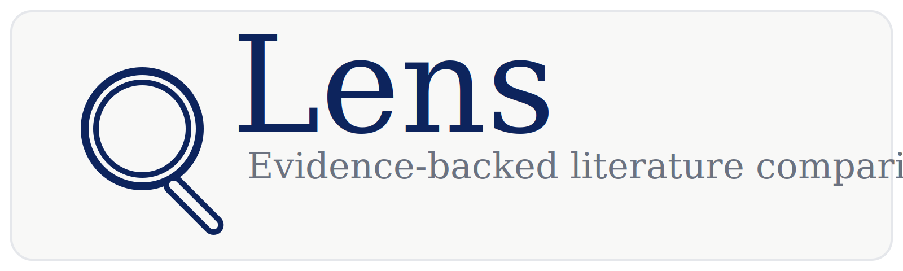
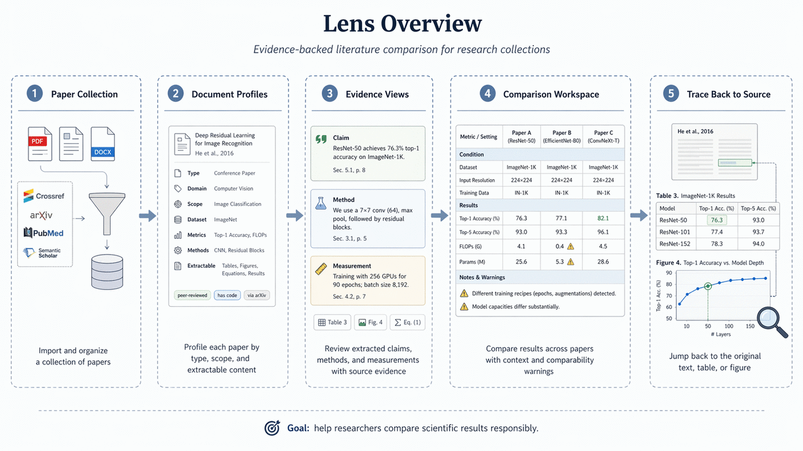
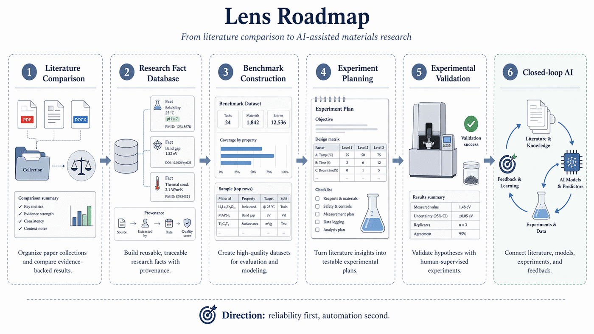

# Lens

  

Lens is an evidence-driven literature comparison workspace for research
collections.

It helps researchers turn a set of papers into reviewable document profiles,
evidence views, and comparison tables, so that results can be compared with
their original context instead of being reduced to unsupported summaries.

Lens is designed for research workflows where the main question is not only:

> "What does this paper say?"

but also:

> "Which results are actually comparable, under what conditions, and with what evidence?"

  

---

## Why Lens Exists

Scientific literature contains many useful results, but those results are often
difficult to compare directly.

In materials science and other experimental fields, a reported value is rarely
meaningful by itself. It depends on the material system, synthesis route,
processing parameters, test method, sample state, baseline, and many other
conditions.

For example, two papers may both report a tensile strength, residual stress,
conductivity, capacity, catalytic activity, or bandgap, but the results may
not be comparable if the sample preparation, test conditions, or baseline
definitions are different.

Lens is built to make this problem explicit.

It focuses on:

- organizing paper collections
- extracting research facts with source evidence
- exposing missing experimental context
- helping users review whether results are comparable
- preserving traceback from comparison views back to the original paper

Lens is not meant to be a generic paper chatbot. Its goal is to support
evidence-backed research comparison.

---

## What Lens Helps Users Do

Lens v1 focuses on collection-level literature comparison.

A typical user workflow is:

1. Create or import a paper collection.
2. Inspect document profiles for each paper.
3. Review extracted evidence and source-grounded facts.
4. Compare reported results across papers.
5. Check missing conditions, baselines, and comparability warnings.
6. Trace each comparison item back to the original text, table, figure, or
   source location.

The main user-facing surfaces are:

### Document Profiles

Document profiles summarize what kind of paper a document is and what types of
information it may contain.

They help users quickly understand whether a paper is experimental,
computational, review-like, method-focused, benchmark-like, or mixed.

### Evidence Views

Evidence views show extracted claims, methods, measurements, and observations
together with their source evidence.

They are intended to help users audit the system's output rather than blindly
trust an AI-generated summary.

### Comparison Views

Comparison views organize results across a collection.

They are designed to show not only values, but also the material context,
process conditions, test conditions, baselines, uncertainty, and warnings that
affect comparability.

---

## Core Principles

### Evidence First

Every important extracted fact should be traceable to source evidence.

Lens should prefer fewer high-confidence, reviewable facts over broad but
speculative coverage.

### Comparison Over Summarization

Lens is not optimized for producing fluent summaries.

It is optimized for helping researchers decide whether results from different
papers can be compared responsibly.

### Collection First

The primary unit of work is a paper collection, not a single isolated document.

A single paper can contain useful facts, but the value of Lens appears when
those facts are placed into a collection-level comparison workflow.

### Reviewable By Humans

Lens should support human review, correction, and judgment.

The system should make uncertainty visible rather than hide it behind
confident-sounding prose.

### Domain-Aware, But Extensible

Lens is designed with materials research in mind, but the broader pattern can
apply to other experimental and technical research domains where evidence,
conditions, baselines, and comparability matter.

---

## Current Scope

Lens v1 focuses on the foundation of an evidence-backed literature comparison
workflow.

The current product direction includes:

- paper collection management
- document-level profiling
- evidence-grounded extraction
- comparison-oriented result organization
- source traceback
- comparability warnings
- user-reviewable comparison tables

Lens v1 does not aim to be a fully autonomous research scientist, a universal
knowledge graph, or a complete scientific database.

Those may become downstream directions, but the current foundation is a
reliable comparison workspace.

---

## Materials Science Focus

Lens is especially useful for materials research because materials results are
highly context-dependent.

A reported property often depends on:

- material composition
- phase or microstructure
- synthesis or fabrication route
- processing parameters
- post-treatment
- sample geometry
- test method
- test environment
- baseline or control condition
- measurement direction
- reporting convention

For example, in metal additive manufacturing, values such as density, porosity,
residual stress, hardness, yield strength, elongation, fatigue life, and
surface roughness cannot be interpreted without process and test context.

Lens aims to make these dependencies explicit in the comparison workflow.

---

## Example Use Cases

### Literature Comparison For A Research Project

A researcher collects 20-50 papers on a material system and wants to compare
reported properties without manually building a spreadsheet from scratch.

Lens helps extract candidate facts, organize them into comparison views, and
expose which rows need human review.

### Materials Parameter Landscape Review

A researcher wants to understand how processing parameters relate to measured
properties across a literature corpus.

Lens can help organize process-property evidence while preserving links to the
original papers.

### Research Planning

A researcher wants to identify which experimental conditions have already been
tested and where the literature has gaps.

Lens can help reveal missing baselines, underexplored parameter ranges, and
inconsistent test conditions.

### Evidence-Backed Technical Review

A team preparing a review, proposal, or internal technical report needs a
traceable comparison table rather than a loose narrative summary.

Lens helps keep each comparison item connected to its evidence.

---

## Future Directions

Lens is being developed as a foundation for evidence-backed research
automation.

The following directions are not all part of the initial v1 scope, but they
describe the longer-term system vision.

  

---

### 1. Research Fact Database

A long-term goal is to build reusable, evidence-backed research fact databases
from paper collections.

In materials science, this could support structured databases for:

- material systems
- synthesis and processing routes
- experimental parameters
- characterization methods
- measured properties
- baselines and controls
- uncertainty and comparability annotations
- source evidence and provenance

The database should not be a simple table of values.

It should preserve enough context to answer questions such as:

- What exactly was measured?
- Under what conditions?
- Compared against what baseline?
- Was the value directly reported or derived?
- Is this result comparable with another result?
- Where is the source evidence?

For materials applications, this direction could eventually support
domain-specific databases for areas such as:

- metal additive manufacturing
- battery materials
- catalysts
- semiconductors
- polymers
- ceramics
- two-dimensional materials
- photovoltaic and optoelectronic materials

The key requirement is that database entries remain evidence-backed and
reviewable.

---

### 2. Benchmark Construction

Lens can support the construction of research benchmarks from literature.

Many scientific AI benchmarks suffer from unclear provenance, inconsistent
labels, missing experimental context, or weak links to the original source.

Lens aims to help build benchmarks where each data point includes:

- source paper
- source evidence
- material identity
- experimental or computational conditions
- target property
- value and unit
- uncertainty or range if available
- baseline definition
- data quality flags
- comparability status

For materials AI, this could support benchmark datasets for tasks such as:

- property prediction
- process-property modeling
- synthesis condition recommendation
- structure-property relation learning
- experiment outcome prediction
- literature-grounded model evaluation

The benchmark direction should be developed carefully.

A benchmark is only useful if the labels are trustworthy, the conditions are
explicit, and the evaluation task reflects a real research problem.

Lens can help by making benchmark construction more transparent and auditable.

---

### 3. Automated Materials Experiment Validation

In the longer term, Lens could connect literature-derived evidence with
experimental validation workflows.

The goal is not to let AI blindly run experiments, but to help researchers
design validation plans based on what the literature already supports.

A possible workflow is:

1. Extract candidate material-process-property relationships from the
   literature.
2. Identify the experimental conditions behind those claims.
3. Detect missing controls, weak baselines, or inconsistent measurements.
4. Select hypotheses that are worth validating.
5. Generate a proposed validation experiment plan.
6. Track new experimental results against literature expectations.
7. Update the evidence base with validated or contradicted outcomes.

For example, in metal additive manufacturing, Lens could help identify process
windows reported to reduce porosity or residual stress, then organize a
validation plan that specifies:

- alloy
- powder state
- machine/process type
- laser power
- scan speed
- hatch spacing
- layer thickness
- build orientation
- post-processing
- characterization method
- mechanical test conditions
- expected outcome
- comparison baseline
- safety and feasibility constraints

The system should remain human-supervised.

Automated validation is valuable only when the proposed experiment is
technically feasible, safe, measurable, and tied to a clear hypothesis.

---

### 4. Experimental Plan Construction

Lens can also become a planning assistant for experimental materials research.

Given a research goal and a literature collection, the system could help
construct candidate experimental plans by combining:

- prior literature evidence
- known parameter ranges
- reported failure cases
- relevant baselines
- standard characterization methods
- domain constraints
- available equipment
- cost and time limits

The output should not be a generic protocol.

A useful experimental plan should include:

- research objective
- hypothesis
- material system
- sample preparation route
- parameter matrix
- control groups
- measurement methods
- expected signals
- decision criteria
- risk factors
- required metadata
- data management plan

For AI-assisted materials research, this is especially important because model
recommendations are often not experimentally actionable unless they are
translated into concrete, testable, and measurable plans.

Lens can provide the literature-grounded context needed for that translation.

---

### 5. Closed-Loop AI For Materials Research

A longer-term direction is to connect literature extraction, benchmark
construction, experiment planning, and validation into a semi-automated
research loop.

A possible loop is:

1. Mine the literature for evidence-backed facts.
2. Build or update a structured research database.
3. Train or evaluate predictive models.
4. Suggest candidate experiments.
5. Run human-reviewed or automated experiments.
6. Compare results with literature and model predictions.
7. Update the database and model.
8. Repeat.

This direction requires strong safeguards:

- high-quality provenance
- domain-specific schemas
- uncertainty tracking
- human approval
- experimental safety checks
- reproducibility standards
- clear separation between reported, derived, inferred, and validated facts

Lens should approach this direction incrementally.

The foundation must be reliable evidence and comparison infrastructure before
full closed-loop automation becomes credible.

---

## What Lens Is Not

Lens is not a replacement for expert judgment.

It is not intended to decide scientific truth automatically.

It is not a generic summarization bot.

It is not a complete materials database by default.

It is not a fully autonomous laboratory system.

Lens is a research infrastructure layer that helps users organize, compare,
audit, and reuse literature-grounded evidence.

---

## Project Direction

The near-term direction is to make Lens reliable for evidence-backed comparison
inside research collections.

The medium-term direction is to support domain-specific extraction and
comparison workflows, especially for materials science.

The long-term direction is to become a foundation for research fact databases,
benchmark construction, experimental validation, and AI-assisted materials
discovery workflows.

The priority is reliability before automation.

Lens should first make literature evidence trustworthy and reviewable. More
advanced automation should build on that foundation, not bypass it.

---

## Documentation

For user-facing documentation, start here:

- [`docs/README.md`](docs/README.md)

For product scope and artifact contracts, see:

- `docs/contracts/`

For architecture and implementation details, see:

- `docs/architecture/`
- `backend/docs/`
- `frontend/docs/`

For backend and frontend setup, see:

- [`backend/README.md`](backend/README.md)
- [`frontend/README.md`](frontend/README.md)

---

## Development Status

Lens is under active development.

The project is still evolving, and some interfaces, artifacts, and workflows
may change as the system is tested on real research collections.

The most important development goal is to keep the product direction stable
while allowing the internal implementation to improve.

---

## Guiding Statement

Lens exists to help researchers compare scientific results responsibly.

A result should not be separated from its evidence, conditions, baseline, and
uncertainty.

The goal is not just to extract more facts.

The goal is to make research comparison more reliable.
