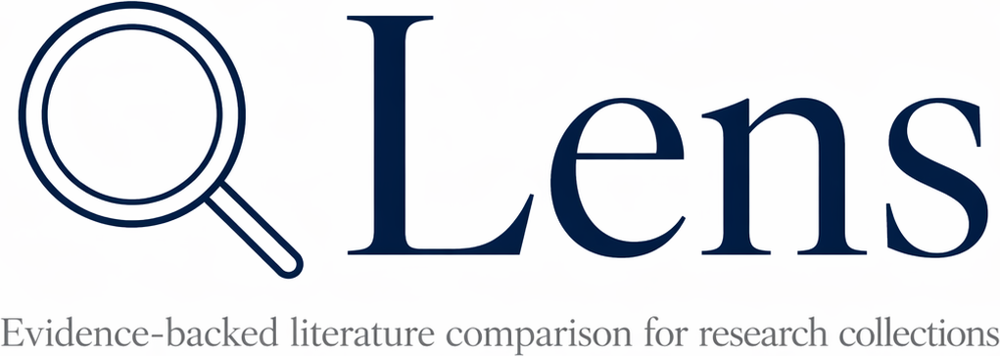

# Lens

  

Lens is an evidence-driven literature comparison workspace for research
collections.

It helps researchers turn a set of papers into reviewable document profiles,
evidence views, and comparison tables, so results stay connected to their
original context instead of being flattened into unsupported summaries.

Lens is built for workflows where the key question is not only:

> "What does this paper say?"

but also:

> "Which results are actually comparable, under what conditions, and with what evidence?"

  

## At A Glance

- Turn a paper collection into document profiles, evidence views, and
  comparison tables.
- Keep source traceback, missing context, baselines, and comparability warnings
  visible.
- Support evidence-backed collection review instead of generic paper-chat
  workflows.
- Start with materials research, but apply the same pattern to other
  experimental and technical domains.

## Why Lens Exists

Scientific literature contains many useful results, but those results are often
difficult to compare directly.

In materials science and other experimental fields, a reported value is rarely
meaningful by itself. It depends on the material system, synthesis route,
processing parameters, test method, sample state, baseline, and other
conditions that determine whether a result can be trusted and compared.

Two papers may both report tensile strength, residual stress, conductivity,
capacity, catalytic activity, or bandgap, yet still fail to support a fair
comparison because the preparation route, test setup, or baseline definition is
different.

Lens makes this problem explicit. It organizes paper collections around
evidence, conditions, and reviewable comparison rather than fluent but opaque
summary text.

## What Lens Helps Users Do

Lens v1 focuses on collection-level literature comparison.

A typical workflow is:

1. Create or import a paper collection.
2. Inspect document profiles for each paper.
3. Review extracted evidence and source-grounded facts.
4. Compare reported results across papers.
5. Check missing conditions, baselines, and comparability warnings.
6. Trace each comparison item back to the original text, table, figure, or
   source location.

The main user-facing surfaces are:

- Document profiles:
  summarize what kind of paper a document is and what kinds of information it
  may contain.
- Evidence views:
  show extracted claims, methods, measurements, and observations together with
  their source evidence.
- Comparison views:
  organize results across a collection while keeping material context, process
  conditions, test conditions, baselines, uncertainty, and warnings visible.

## Current Scope

Lens v1 focuses on the foundation of an evidence-backed literature comparison
workflow.

In scope today:

- paper collection management
- document-level profiling
- evidence-grounded extraction
- comparison-oriented result organization
- source traceback
- comparability warnings
- user-reviewable comparison tables

Out of scope for the current landing-page promise:

- a fully autonomous research scientist
- a generic paper chatbot
- a universal knowledge graph
- a complete scientific database by default
- unsupervised experiment execution

The current product direction is a reliable comparison workspace first.

## Example Use Cases

- Literature comparison for a research project:
  compare 20-50 papers without building a spreadsheet from scratch.
- Materials parameter landscape review:
  organize process-property evidence across a literature corpus while preserving
  links to the original papers.
- Research planning:
  identify missing baselines, underexplored parameter ranges, and inconsistent
  test conditions before deciding what to test next.
- Evidence-backed technical review:
  build a traceable comparison table for a review, proposal, or internal
  technical report.

## Materials Science Focus

Lens is especially useful for materials research because reported properties
are highly context-dependent.

A result often depends on:

- material composition
- phase or microstructure
- synthesis or fabrication route
- processing parameters
- post-treatment
- sample geometry
- test method
- test environment
- baseline or control condition
- measurement direction
- reporting convention

For example, in metal additive manufacturing, values such as density, porosity,
residual stress, hardness, yield strength, elongation, fatigue life, and
surface roughness cannot be interpreted responsibly without process and test
context.

Materials science is the first proving domain, not the only possible one.

## Core Principles

- Evidence first:
  important extracted facts should stay traceable to source evidence.
- Comparison over summarization:
  Lens is optimized for responsible comparison, not fluent narrative output.
- Collection first:
  the primary unit of work is a paper collection, not an isolated document.
- Reviewable by humans:
  uncertainty should stay visible instead of being hidden behind confident
  prose.
- Domain-aware, but extensible:
  the first schemas are shaped by materials research, but the broader pattern
  applies beyond one field.

## Future Directions

Lens is being developed as a foundation for evidence-backed research
automation.

  

Longer-term directions include:

- evidence-backed research fact databases built from paper collections
- benchmark construction with explicit provenance, conditions, and quality
  flags
- literature-grounded experiment planning and validation support
- human-supervised research automation loops built on traceable evidence

This README stays focused on the repository landing-page view. Detailed
long-term contracts, architecture, and research direction should live in
`docs/`.

## Documentation

Start here for the governed doc map:

- [`docs/README.md`](docs/README.md)

Product scope and shared contracts:

- `docs/contracts/`

Architecture and implementation details:

- `docs/architecture/`
- `backend/docs/`
- `frontend/docs/`

Backend and frontend setup:

- [`backend/README.md`](backend/README.md)
- [`frontend/README.md`](frontend/README.md)

## Development Status

Lens is under active development. Interfaces, artifacts, and workflows may
still evolve as the system is tested on real research collections.

The priority is reliability before automation: Lens should first make
literature evidence trustworthy and reviewable. More advanced automation should
build on that foundation, not bypass it.
