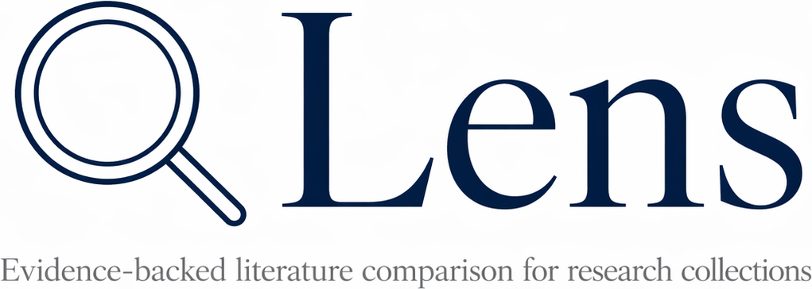
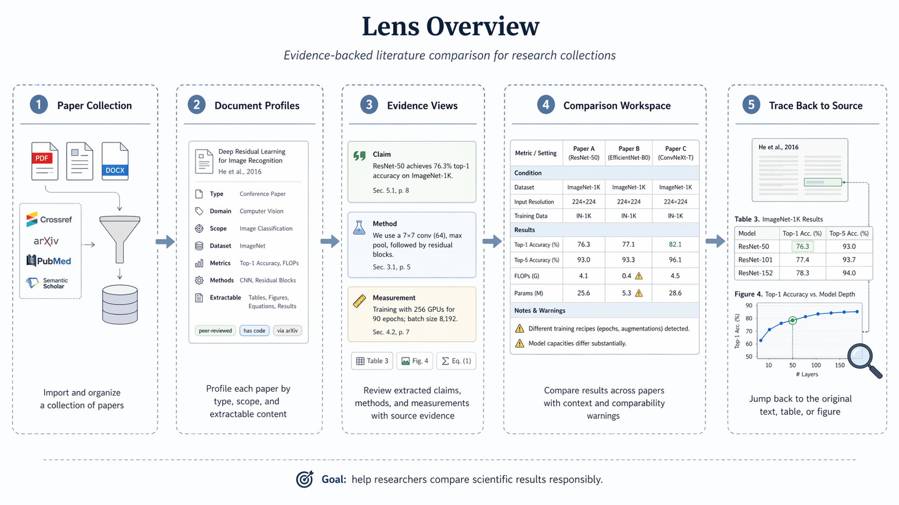
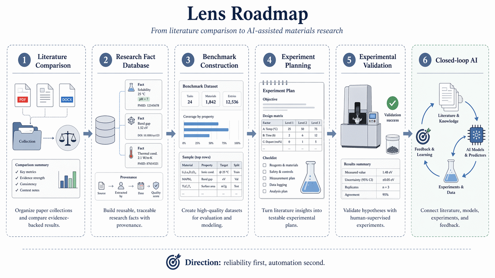

# Lens

<p align="center">
  
</p>

Lens is an evidence-first research system in development.

Its current product is a collection-bound workspace for reconstructing,
grounding, and comparing scientific evidence. Its long-term direction is an
autonomous research loop that can move from a research goal through evidence,
hypotheses, experiments, and updated decisions.

It helps researchers turn a set of papers into reviewable document profiles,
evidence views, and comparison tables, so results stay connected to their
original context instead of being flattened into unsupported summaries.

Today, Lens is built for workflows where the key question is not only:

> "What does this paper say?"

but also:

> "Which results are actually comparable, under what conditions, and with what evidence?"

The longer-term question is:

> "What does the system know, what remains uncertain, and what action would
> most reduce the uncertainty around the research goal?"

<p align="center">
  
</p>

---

## Why Lens Exists

Scientific literature contains many useful results, but those results are often
difficult to compare directly.

In materials science and other experimental fields, a reported value is rarely
meaningful by itself. It depends on the material system, synthesis route,
processing parameters, test method, sample state, baseline, and many other
conditions.

For example, two papers may both report a tensile strength, residual stress,
conductivity, capacity, catalytic activity, or bandgap, but the results may
not be comparable if the sample preparation, test conditions, or baseline
definitions are different.

Lens is built to make this problem explicit.

It focuses on:

- organizing paper collections
- extracting research facts with source evidence
- exposing missing experimental context
- helping users review whether results are comparable
- preserving traceback from comparison views back to the original paper

Lens is not meant to be a generic paper chatbot, a science news feed, a broad
scientific search portal, or a marketplace of domain tools. Its product center
is the research state that connects source evidence to decisions. Search,
external tools, simulations, and experiments are inputs or execution
dependencies around that state.

## What Lens Helps Users Do

Lens v1 focuses on collection-level literature comparison.

A typical user workflow is:

1. Create or import a paper collection.
2. Inspect document profiles for each paper.
3. Review extracted evidence and source-grounded facts.
4. Compare reported results across papers.
5. Check missing conditions, baselines, and comparability warnings.
6. Trace each comparison item back to the original text, table, figure, or
   source location.

The main user-facing surfaces are:

### Document Profiles

Document profiles summarize what kind of paper a document is and what types of
information it may contain.

They help users quickly understand whether a paper is experimental,
computational, review-like, method-focused, benchmark-like, or mixed.

### Evidence Views

Evidence views show extracted claims, methods, measurements, and observations
together with their source evidence.

They are intended to help users audit the system's output rather than blindly
trust an AI-generated summary.

### Comparison Views

Comparison views organize results across a collection.

They are designed to show not only values, but also the material context,
process conditions, test conditions, baselines, uncertainty, and warnings that
affect comparability.

## Current Scope And Long-Term Vision

Lens v1 is the evidence and comparison foundation for a future autonomous
research loop. It is not yet an autonomous scientist.

The current product direction includes:

- paper collection management
- document-level profiling
- evidence-grounded extraction
- comparison-oriented result organization
- source traceback
- comparability warnings
- user-reviewable comparison tables

The boundary is deliberate:

- **Current product:** a collection-bound, reviewable workflow for Source,
  Evidence, comparability, and Finding.
- **Long-term vision:** a system that receives a research goal, constraints, and
  available resources, then maintains research state and selects the next
  useful action.
- **Current limitation:** hypothesis generation, experiment selection, external
  execution, and autonomous continuation remain future capabilities. Human
  review and authorization remain required while those boundaries are built.

## Example Use Cases

### Literature Comparison For A Research Project

A researcher collects 20-50 papers on a material system and wants to compare
reported properties without manually building a spreadsheet from scratch.

Lens helps extract candidate facts, organize them into comparison views, and
expose which rows need human review.

### Materials Parameter Landscape Review

A researcher wants to understand how processing parameters relate to measured
properties across a literature corpus.

Lens can help organize process-property evidence while preserving links to the
original papers.

### Research Planning

A researcher wants to identify which experimental conditions have already been
tested and where the literature has gaps.

Lens can help reveal missing baselines, underexplored parameter ranges, and
inconsistent test conditions.

### Evidence-Backed Technical Review

A team preparing a review, proposal, or internal technical report needs a
traceable comparison table rather than a loose narrative summary.

Lens helps keep each comparison item connected to its evidence.

## Materials Science Focus

Lens is especially useful for materials research because materials results are
highly context-dependent.

A reported property often depends on:

- material composition
- phase or microstructure
- synthesis or fabrication route
- processing parameters
- post-treatment
- sample geometry
- test method
- test environment
- baseline or control condition
- measurement direction
- reporting convention

For example, in metal additive manufacturing, values such as density, porosity,
residual stress, hardness, yield strength, elongation, fatigue life, and
surface roughness cannot be interpreted without process and test context.

Lens aims to make these dependencies explicit in the comparison workflow.

## Core Principles

### Evidence First

Every important extracted fact should be traceable to source evidence.

Lens should prefer fewer high-confidence, reviewable facts over broad but
speculative coverage.

### Comparison Over Summarization

Lens is not optimized for producing fluent summaries.

It is optimized for helping researchers decide whether results from different
papers can be compared responsibly.

### Collection First

The primary unit of work is a paper collection, not a single isolated document.

A single paper can contain useful facts, but the value of Lens appears when
those facts are placed into a collection-level comparison workflow.

### Reviewable By Humans

Lens should support human review, correction, and judgment.

The system should make uncertainty visible rather than hide it behind
confident-sounding prose.

### Domain-Aware, But Extensible

Lens is designed with materials research in mind, but the broader pattern can
apply to other experimental and technical research domains where evidence,
conditions, baselines, and comparability matter.

## Research System Direction

The roadmap is one research loop, not a list of unrelated product categories.
Lens is being developed toward an autonomous research system, with the current
Evidence and comparison layer serving as its first reliable state boundary.

<p align="center">
  
</p>

```text
Research goal + constraints + resources
                |
                v
        Define the research question
                |
                v
 Literature -> Source -> Evidence -> Scientific state
                                      |
                                      v
                              Identify knowledge gaps
                                      |
                                      v
                                  Hypothesis
                                      |
                                      v
                         Select the next useful experiment
                                      |
                                      v
              Simulation / software / laboratory / human execution
                                      |
                                      v
                         Observation -> Evidence -> State update
                                      |
                                      +------> next action
```

The long-term objective is not to produce a report and stop. It is to keep a
research objective moving until the goal is resolved, the hypothesis space is
exhausted, the evidence is sufficient, the budget is exhausted, or no useful
next experiment remains. This is a future direction, not a claim about the
current v1 implementation.

The following directions describe the long-term system vision. They are not
claims about current v1 capabilities.

### 1. Reusable Research State

The research loop needs reusable, evidence-backed state rather than a flat
collection of summaries. Paper collections are the first source of that state.

In materials science, this could support structured databases for:

- material systems
- synthesis and processing routes
- experimental parameters
- characterization methods
- measured properties
- baselines and controls
- uncertainty and comparability annotations
- source evidence and provenance

The database should not be a simple table of values.

It should preserve enough context to answer questions such as:

- What exactly was measured?
- Under what conditions?
- Compared against what baseline?
- Was the value directly reported or derived?
- Is this result comparable with another result?
- Where is the source evidence?

For materials applications, this direction could eventually support
domain-specific databases for areas such as:

- metal additive manufacturing
- battery materials
- catalysts
- semiconductors
- polymers
- ceramics
- two-dimensional materials
- photovoltaic and optoelectronic materials

The key requirement is that every state update remains evidence-backed,
reviewable, and replaceable when new observations contradict it. This is an
internal substrate for the research loop, not a general scientific data portal.

### 2. Evaluation And Benchmark Assets

The research loop needs evaluation and benchmark assets for testing extraction,
grounding, comparability, hypothesis, and decision behavior.

Many scientific AI benchmarks suffer from unclear provenance, inconsistent
labels, missing experimental context, or weak links to the original source.

Lens aims to help build benchmarks where each data point includes:

- source paper
- source evidence
- material identity
- experimental or computational conditions
- target property
- value and unit
- uncertainty or range if available
- baseline definition
- data quality flags
- comparability status

For the materials proving vertical, this could support evaluation tasks such as:

- property prediction
- process-property modeling
- synthesis condition recommendation
- structure-property relation learning
- experiment outcome prediction
- literature-grounded model evaluation

The benchmark direction should be developed carefully.

A benchmark is only useful if the labels are trustworthy, the conditions are
explicit, and the evaluation task reflects a real research problem.

These assets are evaluation infrastructure, not a separate benchmark marketplace.
Their value comes from transparent provenance, explicit conditions, and a task
that represents a real research decision.

### 3. Hypothesis And Experiment Loop

In the longer term, Lens could connect literature-derived evidence with a
hypothesis and experiment loop.

The goal is to identify the knowledge gap blocking the research objective,
generate hypotheses connected to existing Evidence, and select the next useful
experiment under cost, time, risk, and resource constraints. External tools,
simulations, laboratories, and human operators may execute that experiment;
Lens owns the research state around it.

A possible workflow is:

1. Extract candidate material-process-property relationships from the
   literature.
2. Identify the experimental conditions behind those claims.
3. Detect missing controls, weak baselines, or inconsistent measurements.
4. Select hypotheses that are worth validating.
5. Generate a proposed validation experiment plan.
6. Track new experimental results against literature expectations.
7. Update the evidence base with validated or contradicted outcomes.

For example, in metal additive manufacturing, Lens could help identify process
windows reported to reduce porosity or residual stress, then organize a
validation plan that specifies:

- alloy
- powder state
- machine/process type
- laser power
- scan speed
- hatch spacing
- layer thickness
- build orientation
- post-processing
- characterization method
- mechanical test conditions
- expected outcome
- comparison baseline
- safety and feasibility constraints

The system should remain human-supervised.

Automated validation is valuable only when the proposed experiment is
technically feasible, safe, measurable, and tied to a clear hypothesis.

### 4. Experiment Candidate Generation

An experiment candidate is an intermediate research object, not a generic
protocol or a separate laboratory platform.

That direction should mirror how experienced materials researchers work rather
than falling back to generic protocol generation.

In practice, that means helping the user:

- identify the materials problem and target decision
- reconstruct sample variants and the real controlled variables in a paper
- extract process parameters, post-processing, test conditions, and baselines
- connect structure and defect evidence to property outcomes
- judge what is actually comparable and what is missing or weak
- propose the next experiment matrix, control groups, characterization chain,
  and decision criteria

Given a research goal and a literature collection, the system could construct
candidate experiments by combining:

- prior literature evidence
- known parameter ranges
- reported failure cases
- relevant baselines
- standard characterization methods
- domain constraints
- available equipment
- cost and time limits

The output should not be a generic protocol.

A useful experimental plan should include:

- research objective
- hypothesis
- material system
- sample variants and controlled variables
- sample preparation route
- parameter matrix
- control groups
- baselines and comparison target
- measurement methods
- characterization methods
- expected signals
- expected mechanism or evidence chain
- decision criteria
- risk factors
- required metadata
- data management plan

For AI-assisted materials research, this is especially important because model
recommendations are often not experimentally actionable unless they are
translated into concrete, testable, and measurable plans.

Lens can provide the literature-grounded context and uncertainty record needed
for that translation.

### 5. Autonomous Research Loop

A longer-term direction is to connect literature extraction, evidence state,
hypothesis generation, experiment selection, execution, and validation into an
autonomous research loop.

A possible loop is:

1. Receive a research goal, constraints, and available resources.
2. Build or update the current world model from evidence-backed facts.
3. Identify the knowledge gap blocking the objective.
4. Generate hypotheses connected to existing Evidence.
5. Select the experiment with the highest expected information value within the
   available budget and safety constraints.
6. Execute through simulation, scientific software, a laboratory, or a human
   operator.
7. Convert observations into source-grounded Evidence and update the state.
8. Repeat until the objective is achieved, the hypothesis space is exhausted,
   the evidence is sufficient, the budget is exhausted, or no useful next
   experiment remains.

This direction requires strong safeguards:

- high-quality provenance
- domain-specific schemas
- uncertainty tracking
- human approval
- experimental safety checks
- reproducibility standards
- clear separation between reported, derived, inferred, and validated facts

Lens should approach this direction incrementally.

The foundation must be reliable evidence and comparison infrastructure before
closed-loop autonomy becomes credible. Lens is not claiming that this loop is
already complete.

### Product Boundary

Lens does not aim to be a general-purpose science portal, news feed, universal
search engine, tool marketplace, or generic project-management workspace.
Those systems may provide inputs or execution services around Lens. Lens owns
the research state that connects evidence to hypotheses, experiments, and
decisions.

This boundary keeps the current product focused while leaving room to build
toward an Autonomous Research OS without presenting a broad platform before
the underlying research loop is reliable.

## Documentation

For user-facing documentation, start here:

- [`docs/README.md`](docs/README.md)

For product scope and artifact contracts, see:

- `docs/contracts/`

For architecture and implementation details, see:

- `docs/architecture/`
- `backend/docs/`
- `frontend/docs/`

For backend and frontend setup, see:

- [`backend/README.md`](backend/README.md)
- [`frontend/README.md`](frontend/README.md)

For self-hosted deployment with published Docker images, see:

- [`deploy/README.md`](deploy/README.md)

## Development Status

Lens is under active development.

The project is still evolving, and some interfaces, artifacts, and workflows
may change as the system is tested on real research collections.

The most important development goal is to keep the product direction stable
while allowing the internal implementation to improve.

## Guiding Statement

Lens exists to help researchers compare scientific results responsibly.

A result should not be separated from its evidence, conditions, baseline, and
uncertainty.

The goal is not just to extract more facts.

The goal is to make research comparison more reliable.
