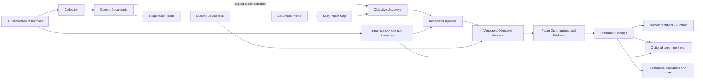
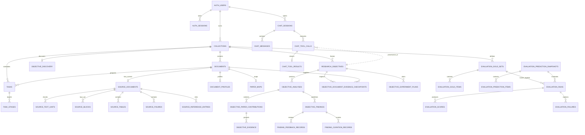

# Backend Database Reference

## Purpose and Scope

This is the current PostgreSQL database reference for the backend. It groups
the schema by the research flows and code modules that own each decision, so a
reader can follow data from a paper upload to a source-grounded comparison and
its optional review or experiment plan.

The reference describes the schema represented by the SQLAlchemy models in
[`infra/persistence/postgres/models/__init__.py`](../../infra/persistence/postgres/models/__init__.py)
and the Alembic head `20260907_0042`. The identity and fingerprint rules are
defined in [`persistence-model.md`](persistence-model.md); this page adds the
flow-oriented table and repository map. The HTTP shapes remain owned by
[`specs/api.md`](../specs/api.md).

The current ORM metadata contains 41 application tables. A deployed database
also contains Alembic's `alembic_version` bookkeeping table.

## End-to-End Data Flow

The database supports one concrete research cycle: a researcher frames a
question, prepares a selected paper set, inspects source evidence, compares
compatible results, and decides whether the evidence is sufficient or whether
another experiment is needed.



The database preserves two different kinds of state:

- **Scientific state** describes what the researcher can conclude: document
  readiness, Objective identity, evidence disposition, comparability, Finding
  publication, and review status. Most scientific payloads are kept in
  JSON/JSONB columns behind relational identities.
- **Technical state** describes whether work can be executed or retried:
  task stages, provider failures, progress, analysis status, and chat tool-call
  status. Technical failure is never converted into a scientific absence or
  conclusion.

## Persistence Boundaries

| Boundary | Authority | Database implication |
| --- | --- | --- |
| Structured product state | PostgreSQL | Repositories read and write current records and analysis history. |
| Uploaded PDFs and extracted figure bytes | Object storage | Tables keep a storage key, SHA-256, media type, and size; bytes are not stored in PostgreSQL. |
| Parser, model, and pipeline scratch | Local runtime paths | Disposable cache/output paths are not product read authorities. |
| Schema changes | Alembic | Startup does not create, probe, or infer tables. |
| Test-only alternatives | Memory repositories | They implement ports for isolated tests and are not production storage. |

The runtime composes one `AsyncEngine` and one `async_sessionmaker` in
`main.py`. Each repository operation uses a short task-local `AsyncSession`;
writes use an explicit transaction. Repositories are direct adapters for one
domain boundary; there is no generic repository, storage selector, dual write,
or compatibility read.

## Flow and Module Map

The table catalog below is the quick route from a logic flow to its owning
module and PostgreSQL tables. A table name is the SQL name; the implementation
class is in `infra/persistence/postgres/models`.

| Logic flow | Owning backend modules | Tables | What the rows mean |
| --- | --- | --- | --- |
| Authenticate and authorize | `application/auth`, `controllers/auth.py` | `auth_users`, `auth_sessions` | Normalized user identity and revocable browser sessions. |
| Create a collection and add papers | `application/source`, `controllers/source/collections.py` | `collections`, `documents` | Collection membership and the current paper/file metadata. |
| Prepare documents and expose progress | `application/source`, `application/pipeline`, `controllers/source/tasks.py` | `tasks`, `task_stages` | Observable technical execution history, admission, and stage telemetry. |
| Parse and navigate a paper | `infra/source`, `application/source` | `source_documents`, `source_text_units`, `source_blocks`, `source_block_text_units`, `source_tables`, `source_table_rows`, `source_table_cells`, `source_figures`, `source_reference_entries`, `source_reference_mentions`, `source_reference_resolutions`, `source_reference_candidates` | The current Source tree and reference navigation needed for exact evidence traceback. |
| Triage papers and discover Objectives | `application/core/document_profiles`, `application/core/objectives/discovery`, `application/core/objectives` | `document_profiles`, `paper_maps`, `objective_discovery`, `research_objectives` | Current paper triage, bounded navigation maps, selected discovery inputs, and Objective candidates. |
| Inspect evidence and compare papers | `application/core/objectives`, `application/core/paper_facts` | `objective_analyses`, `objective_document_evidence_checkpoints`, `objective_paper_contributions`, `objective_evidence`, `objective_findings` | Frozen analysis versions, resumable per-document inspection, Source-backed evidence, and Findings. `paper_facts` is an extraction helper, not a separate persisted aggregate. |
| Run collection-bound Agent Chat | `application/chat`, `domain/chat` | `chat_sessions`, `chat_messages`, `chat_tool_calls`, `chat_tool_results` | Auditable conversation, capability calls, approval decisions, structured results, and selected Source context. |
| Plan a follow-up experiment | `application/goal`, `controllers/goal` | `objective_experiment_plans` | Objective-scoped plan revisions with Source/Finding links and author provenance. |
| Review and evaluate outputs | `application/evaluation`, `controllers/core/finding_review` | `finding_feedback_records`, `finding_curation_records`, `evaluation_gold_sets`, `evaluation_gold_items`, `evaluation_prediction_snapshots`, `evaluation_prediction_items`, `evaluation_runs`, `evaluation_scores`, `evaluation_failures` | Human review of exact Finding versions and reproducible prediction/gold evaluation lineage. |

## Schema by Main Logic Flow

### 1. Authentication

`AuthSessionService` owns the access boundary.

| Table | Primary identity | Important columns and constraints |
| --- | --- | --- |
| `auth_users` | `user_id` | Lowercase unique `email`, display name, password hash, creation time. A check constraint enforces normalized email. |
| `auth_sessions` | `session_id` | `user_id` cascades from the user; unique lowercase SHA-256 `token_hash`; creation, expiry, and optional revocation timestamps. Expiry must be after creation. |

Session tokens are hashed before persistence. Raw credentials and session
tokens are not database fields and must not appear in logs or documentation.

### 2. Collection Intake and Current Documents

`CollectionService` owns the collection aggregate and the current Document
membership used by every downstream flow.

| Table | Primary identity | Important columns and constraints |
| --- | --- | --- |
| `collections` | `collection_id` | `owner_user_id` (`RESTRICT` on user deletion), name/description, status, paper count, and timestamps. `paper_count` is non-negative. |
| `documents` | `document_id` | Direct `collection_id` membership, original/stored names, object-store `storage_key`, SHA-256, media type, byte size, order, preparation status, parser/profile versions, and source/profile/preparation fingerprints. |

The database has no public collection-membership join object and no
`DocumentVersion` aggregate. A Document is the current paper in its
Collection. Uniqueness is enforced per collection for content
(`collection_id, sha256`) and display order (`collection_id, document_order`);
the storage key is globally unique.

The object store writes immutable input bytes before the Document is exposed as
ready. PostgreSQL records their identity and integrity metadata. Collection
deletion is coordinated by `CollectionService`: it removes the collection
directory/object files and deletes the PostgreSQL aggregate, allowing database
cascades to remove dependent rows.

### 3. Preparation Tasks and Pipeline Stages

`TaskService` and `DocumentPreparationService` report technical progress while
the source and profile pipeline runs.

| Table | Primary identity | Important columns and constraints |
| --- | --- | --- |
| `tasks` | `task_id` | Collection and optional Document ownership, `task_type`, mode, input fingerprint, status, current stage, progress, nested `details`, warnings/errors, and timestamps. |
| `task_stages` | `stage_id` | Task ownership, stable `stage_kind` and `stage_order`, stage status, dependencies, statistics, output summary, warnings/errors, and timestamps. |

Task status is limited to `queued`, `running`, `completed`,
`partial_success`, and `failed`. Stage status is limited to `queued`,
`running`, `succeeded`, `failed`, and `skipped`. A partial unique index permits
at most one queued or running task for a `(document_id, task_type)` pair.
Task-specific admission values, such as Objective discovery's exact selected
Document IDs, stay under `details`; tasks do not own scientific artifacts or
filesystem output paths.

### 4. Current Source and Traceable Paper Structure

`PostgresSourceArtifactRepository` persists the parser's current Source
aggregate. All Source children are keyed by `source_document_id`, which is the
same identity as the owning `documents.document_id`.

| Table family | Tables | Stored structure |
| --- | --- | --- |
| Source root | `source_documents` | Title, full text, document order, creation date, and parser metadata. It references both the current Document and Collection. |
| Text navigation | `source_text_units`, `source_blocks`, `source_block_text_units` | Ordered chunks, layout/heading blocks, and the many-to-many association between blocks and text units. Child identities are composite with `source_document_id`. |
| Tables | `source_tables`, `source_table_rows`, `source_table_cells` | Captions, headings, headers, matrix data, row/cell coordinates, spans, page numbers, and unit hints. Rows and cells use composite Source/table identities. |
| Figures | `source_figures` | Figure order, labels/captions, page and heading location, optional object-store image key, MIME type, dimensions, SHA-256, size, and metadata. A check constraint requires all image-object fields together or all absent. |
| References | `source_reference_entries`, `source_reference_mentions` | Bibliographic entries and in-text citation mentions with local Source locations and confidence. |
| Reference enrichment | `source_reference_resolutions`, `source_reference_candidates` | Provider resolution attempts and ranked cited-paper candidates. `reference_id` and `cited_by_document_id` are logical links owned by the reference workflow; these tables intentionally do not declare cross-table foreign keys. |

Source replacement is document-scoped and transactional. A successful retry
replaces the current Source tree; its new fingerprint is written back to
`documents`. Source rows are not a scientific conclusion: they are the exact
material that later Objective analysis may inspect.

### 5. Document Triage and Objective Discovery

The core application uses profiles and maps to decide which papers deserve
deeper inspection. They are navigation inputs, not Evidence.

| Table | Primary identity | Important columns and constraints |
| --- | --- | --- |
| `document_profiles` | `document_id` | One current profile per Document, with collection ownership, title/source filename, document type, parser warnings, and confidence in `[0, 1]`. |
| `paper_maps` | `document_id` | One optional lazy map per Document, collection ownership, and a bounded JSON payload containing navigation signals and Source references. |
| `objective_discovery` | `collection_id` | The current discovery result for the selected scope: readiness flag, ordered `document_inputs`, Objective IDs, study dispositions, and update time. |
| `research_objectives` | `(collection_id, objective_id)` | Ranked current Objective payload, origin (`system_discovered` or `chat_assisted`), optional Chat tool-call provenance, and timestamps. |

Discovery requires an explicit non-empty set of ready Document IDs. Each
`document_inputs` item freezes the pair `{document_id,
preparation_fingerprint}`. Replacing discovery changes the current candidates
for that Collection; it does not create a Collection snapshot or duplicate the
Source/Profile/PaperMap rows.

The Objective payload carries confirmation and published/active analysis
version pointers. The composite identity keeps Objectives from different
Collections from colliding. `created_by_tool_call_id` is a uniqueness-checked
provenance value; the Chat trajectory remains the authority for the call
record.

### 6. Objective Analysis, Evidence, and Findings

`ResearchObjectiveService` and its analysis stages implement the evidence-first
comparison flow: frame each selected paper, route exact Sources, extract and
ground facts, reconstruct within-paper experiments, compare only compatible
results, and publish a reviewable Finding set.

| Table | Primary identity | Important columns and constraints |
| --- | --- | --- |
| `objective_analyses` | `(collection_id, objective_id, analysis_version)` | One versioned analysis attempt per positive version, status, analysis payload, and timestamps. It has a composite FK to `research_objectives`. |
| `objective_document_evidence_checkpoints` | `(collection_id, objective_id, document_id, input_fingerprint)` | Private resumable inspection for one Objective/Document input. Status is `running`, `succeeded`, or `failed`; the payload stores the completed per-paper artifacts. Objective and Document ownership cascade. |
| `objective_paper_contributions` | `(collection_id, objective_id, analysis_version, source_document_id)` | One paper's contribution to an analysis version and its payload. It cascades with the parent analysis. |
| `objective_evidence` | `(collection_id, objective_id, analysis_version, evidence_id)` | Source-document-bound Evidence payload. Composite FKs require both the analysis and its paper contribution. |
| `objective_findings` | `(collection_id, objective_id, analysis_version, finding_id)` | Display-ranked Finding payload. Relations, context, and the complete scientific statement remain inside the versioned payload. |

Analysis identity always includes the selected preparation state. Before Source
reads begin, the service verifies every frozen Document ID and fingerprint. A
mismatch is stale input and blocks the run; it cannot mix Source generations.

Retries allocate a new `analysis_version`. A failed or interrupted attempt does
not replace the Objective's published pointer. Only a complete succeeded
version is atomically published after contributions, Evidence, and Findings
are written. A succeeded checkpoint with zero routable/comparable Evidence is
valid scientific work and is reusable; provider or parsing failures remain
retryable technical work.

Checkpoint fingerprints cover the Objective intent, Document preparation
fingerprint, extraction version, model identity, and the six analysis stages.
When a checkpoint is reused for a new analysis version, its internal producing
version is rebound during publication; the checkpoint is not itself a public
Finding or Evidence child.

### 7. Collection-Bound Agent Chat

`ChatSessionService`, `ResearchAgentRunner`, and the Chat capability registry
persist an auditable trajectory. Chat references Core records; it does not
create a parallel paper-fact model.

| Table | Primary identity | Important columns and constraints |
| --- | --- | --- |
| `chat_sessions` | `session_id` | Authenticated user and Collection ownership, creation/update timestamps, and monotonic timestamp check. |
| `chat_messages` | `message_id` | Session ownership, non-negative ordered `position`, role (`user`, `assistant`, `tool`), content, optional tool metadata, and persisted selected `source_contexts`. `(session_id, position)` is unique. |
| `chat_tool_calls` | `tool_call_id` | Session and assistant-message ownership, capability name/arguments, argument digest, risk (`unknown`, `read`, `draft`, `write`), approval/execution status, timing, and decision-user provenance. One call is allowed per assistant message. |
| `chat_tool_results` | `tool_call_id` | One result per call with status (`succeeded`, `queued`, `failed`), structured data, resource references, warnings, and optional error details. |

Tool approval is an explicit state transition recorded with the exact argument
digest and authenticated decision user. Source context on a message is a
selected, source-digest-bound navigation snapshot; it does not prove that the
Agent read a complete Source unless the corresponding Source operation is
recorded in the trajectory.

### 8. Objective-Scoped Experiment Plans

`ExperimentPlanService` stores an optional downstream decision artifact after a
researcher has reviewed the evidence. It is not the primary Lens v1 workflow.

| Table | Primary identity | Important columns and constraints |
| --- | --- | --- |
| `objective_experiment_plans` | `plan_id` | Composite Objective ownership, title/content/status, Source links and metadata, optional originating Chat message, structured plan, author/updater IDs, timestamps, and revision fields. |

Plan revisions are immutable rows linked by `parent_plan_id`. A unique
constraint permits only one successor per parent. The first revision is version
1 with no parent; later revisions require a parent and `updated_by`. The source
Chat message is `RESTRICT`-protected so its provenance cannot disappear while a
plan depends on it. Author identities use `SET NULL` when a user is removed.

### 9. Finding Review and Evaluation

Review and evaluation consume already-persisted Core outputs. They never
prepare Source or rerun Objective analysis.

#### Finding review

`finding_feedback_records` and `finding_curation_records` both use the exact
Finding identity `(collection_id, objective_id, analysis_version, finding_id)`
as a composite foreign key to `objective_findings`, with `CASCADE` on Finding
deletion.

- `finding_feedback_records` records a review status, issue type, note,
  reviewer, and creation time. Multiple feedback events are retained.
- `finding_curation_records` stores one complete canonical `curated_finding`
  payload, curated status, note, reviewer, and update time. Partial corrections
  or alternate conclusion IDs are not valid records.

#### Evaluation lineage

| Table | Identity and role |
| --- | --- |
| `evaluation_gold_sets` | `gold_id`; versioned collection gold metadata, target layer, and metric profile. |
| `evaluation_gold_items` | `gold_item_id`; expected item payload, family/key, document ID, Evidence references, and metadata. Cascades from its gold set. |
| `evaluation_prediction_snapshots` | `snapshot_id`; frozen collection prediction context, source label, artifact counts, and creation time. |
| `evaluation_prediction_items` | `(snapshot_id, item_id)`; prediction payload, Source references, family/key, document ID, and optional confidence. |
| `evaluation_runs` | `evaluation_run_id`; joins one gold set and one prediction snapshot, preserving target layer, metric profile, status, and summary. Gold/snapshot links are `RESTRICT`-protected. |
| `evaluation_scores` | `score_id`; per-run metric values and optional numerator/denominator, optionally per document. |
| `evaluation_failures` | `failure_id`; per-run failure type, likely layer, severity, matched gold/prediction IDs, reason, and Source references. |

Evaluation payloads retain the exact evidence and prediction snapshots used for
the score. Document IDs and Source references inside gold/prediction items are
logical lineage values; the evaluation schema does not silently rewrite them
when a later Document preparation occurs.

## Relationship Backbone

The full Source tree has many composite child keys, so this diagram shows the
aggregate-level foreign-key backbone. A logical link is shown as a dotted edge
where the models intentionally store an ID without declaring a foreign key.



`SOURCE_BLOCK_TEXT_UNITS`, `SOURCE_TABLE_ROWS`, and `SOURCE_TABLE_CELLS` use
composite Source/table keys and are omitted from the high-level diagram for
readability. `source_reference_resolutions` and
`source_reference_candidates` also use logical reference IDs rather than
foreign keys; their association is validated by the reference workflow.

## Fingerprints, Versions, and Reuse

Document preparation is a dependency chain, not one opaque cache key:

```text
Source fingerprint
  = SHA-256(document SHA-256 + parser version)

Profile fingerprint
  = SHA-256(Source fingerprint + profile version)

Preparation fingerprint
  = Profile fingerprint
```

Paper Maps add their own policy/prompt input fingerprint while reusing the
current preparation fingerprint. Objective analysis adds a frozen list of
`document_id + preparation_fingerprint` inputs and a versioned analysis
identity. Changing document bytes or parser logic invalidates every dependent
preparation stage; changing profile logic can reuse Source; changing Paper Map
logic does not require reparsing Source or rebuilding profiles.

The database therefore supports these observable outcomes:

1. Uploading or retrying one Document does not rebuild unrelated Documents.
2. A stale Objective input fails before Source reads instead of mixing
   generations.
3. A failed analysis leaves the last published version readable.
4. A matching succeeded per-document checkpoint can be reused on an analysis
   retry, including a valid scientific absence of comparable Evidence.
5. A technical interruption remains retryable and is not reported as a
   scientific conclusion.

## Deletion and Replacement Rules

- Deleting a Collection cascades its Documents, current Source/Profile/Paper
  Map rows, Tasks, Objectives, analyses, Findings, review records, Chat
  sessions, plans, and collection-owned evaluation inputs. Evaluation Runs
  protect their gold-set and prediction-snapshot inputs with `RESTRICT`, so a
  Collection deletion is blocked while those run dependencies exist. The same
  rule applies to any other `RESTRICT` provenance edge encountered during the
  cascade.
- Deleting an Auth User cascades sessions and Chat sessions but is restricted
  while the user still owns Collections or is recorded as a tool-call decision
  user. Plan author fields are nullable and use `SET NULL`.
- Deleting a Document cascades preparation Tasks, current Source children,
  Profile, Paper Map, and per-document Evidence checkpoints. Published
  Objective analysis rows are retained only while their parent Collection and
  Objective remain; a later analysis must select currently ready Documents.
- Re-preparing a Document replaces its current Source and Profile only after
  the owning step succeeds. Task history remains observable and old published
  analyses remain readable as historical snapshots.
- Evaluation Runs retain their referenced gold set and prediction snapshot by
  `RESTRICT`; those inputs cannot be deleted underneath a completed run.
- The current-model cutover in migration `20260827_0038` intentionally removed
  retired collection-build, document-version, paper-fact, comparison, and
  workspace-projection tables. There is no backfill, compatibility read, or
  runtime schema fallback for those names.

## Migration and Change Rules

Alembic is the only schema authority. The maintained head is
`20260907_0042`, which adds immutable experiment-plan revision fields. The
current ORM metadata and migration head are checked together by
`tests/integration/persistence/test_migrations.py`.

When a persisted contract changes, update these surfaces together:

1. The owning domain record and its invariants.
2. The PostgreSQL model and explicit repository.
3. The application service and controller schema when the behavior is public.
4. An Alembic migration, including a deliberate downgrade policy.
5. Focused persistence/integration tests and the owning docs.

Do not add a generic storage abstraction, compatibility table, runtime table
probe, JSON fallback, or dual read/write path. Keep technical retry metadata
out of scientific payloads, and keep Source provenance in the exact Source
identity used by the Evidence or Finding.

## Repository Ownership Map

| Repository | Tables owned |
| --- | --- |
| `PostgresAuthRepository` | `auth_users`, `auth_sessions` |
| `PostgresCollectionRepository` | `collections`, `documents` |
| `PostgresTaskRepository` | `tasks`, `task_stages` |
| `PostgresSourceArtifactRepository` | All `source_*` tables |
| `PostgresDocumentProfileRepository` | `document_profiles` |
| `PostgresPaperMapRepository` | `paper_maps` |
| `PostgresObjectiveRepository` | `objective_discovery`, `research_objectives`, `objective_analyses`, `objective_document_evidence_checkpoints`, `objective_paper_contributions`, `objective_evidence`, `objective_findings` |
| `PostgresChatRepository` | `chat_sessions`, `chat_messages`, `chat_tool_calls`, `chat_tool_results` |
| `PostgresExperimentPlanRepository` | `objective_experiment_plans` |
| `PostgresFindingReviewRepository` | `finding_feedback_records`, `finding_curation_records` |
| `PostgresEvaluationRepository` | All `evaluation_*` tables |

The composition root in `main.py` injects these repositories into application
services. Memory repositories mirror selected ports only for isolated tests;
they do not define production schema or behavior.

## Related Authorities

- [`persistence-model.md`](persistence-model.md): current identities,
  fingerprints, versioning, and deletion semantics.
- [`overview.md`](overview.md): backend ownership, real-world chain, runtime
  boundaries, concurrency, and restart recovery.
- [`../specs/api.md`](../specs/api.md): browser and Agent HTTP contracts.
- [`../../infra/persistence/README.md`](../../infra/persistence/README.md):
  persistence adapter boundary and repository ownership.
- [`../../application/source/README.md`](../../application/source/README.md):
  collection and preparation flow.
- [`../../application/core/README.md`](../../application/core/README.md):
  profiles, Paper Maps, Objective discovery, and analysis.
- [`../../application/evaluation/README.md`](../../application/evaluation/README.md):
  review and evaluation lineage.
- [`../../application/goal/README.md`](../../application/goal/README.md):
  Objective-scoped experiment plans.

## Appendix: Complete Field Catalog

The catalog below lists every field in the current ORM, grouped by the main
logic flow (41 application tables and 371 fields).
Field names, types, and nullability follow `backend/infra/persistence/postgres/models/*.py`;
descriptions explain each field's business role in the Lens research chain. `JSONB` means the ORM uses
`JSON().with_variant(JSONB(), "postgresql")`, so PostgreSQL stores the value as
`JSONB`. `PK` means primary key, `FK` foreign key, `UQ` unique constraint, and `IDX` index;
`NN` means `NOT NULL`.

### Contents

- [Authentication and access](#authentication-and-access)
- [Collections, documents, and tasks](#collections-documents-and-tasks)
- [Source parsing structure](#source-parsing-structure)
- [Document Profiles and Objectives](#document-profiles-and-objectives)
- [Agent Chat](#agent-chat)
- [Experiment plans](#experiment-plans)
- [Finding review and evaluation](#finding-review-and-evaluation)
- [Alembic version table](#alembic-version-table)

### Field Conventions

- `VARCHAR(n)`, `TEXT`, `INTEGER`, `BIGINT`, `FLOAT`, and
  `TIMESTAMP WITH TIME ZONE` are the actual PostgreSQL types.
- Status fields are constrained jointly by domain constants and ORM `CheckConstraint`; the constraints column
  lists values explicitly restricted by the current code. A string field without listed values is still validated by its application service
  and must not be treated as accepting arbitrary strings.
- JSON/JSONB fields store a domain object, list, or stage statistics. They are not free-form interfaces that bypass domain
  validation; writes still pass through the owning domain record and repository.
- Composite primary and foreign keys are listed column by column; each table note states the complete identity tuple.
- This catalog does not provide a MySQL `CREATE TABLE` substitute: production
  uses PostgreSQL, and schema changes must run through an Alembic migration
  (`backend/.venv/bin/alembic upgrade head`). For manual creation or
  cross-database migration, validate against ORM metadata and the migration
  head instead of applying MySQL dialect SQL directly.

### Authentication and access

#### `auth_users` — User accounts

| Field | Type | Nullable | Key / constraints | Description |
| :--- | :--- | :---: | :--- | :--- |
| `user_id` | `VARCHAR(64)` | No | PK | Stable identifier for the authenticated user. |
| `email` | `VARCHAR(320)` | No | UQ; `email = lower(email)` | Login email address; stored normalized to lowercase. |
| `display_name` | `TEXT` | Yes | — | Optional name shown in the browser and Agent interface. |
| `password_hash` | `TEXT` | No | — | Password hash; plaintext passwords are never stored. |
| `created_at` | `TIMESTAMP WITH TIME ZONE` | No | — | Created timestamp. |

#### `auth_sessions` — Browser sessions

| Field | Type | Nullable | Key / constraints | Description |
| :--- | :--- | :---: | :--- | :--- |
| `session_id` | `VARCHAR(64)` | No | PK | Stable identifier of the browser session. |
| `user_id` | `VARCHAR(64)` | No | FK -> `auth_users.user_id`; IDX; `ON DELETE CASCADE` | Stable identifier for the authenticated user. |
| `token_hash` | `VARCHAR(64)` | No | UQ; length 64; lowercase | SHA-256 hash of the browser session token; the raw token is not stored. |
| `created_at` | `TIMESTAMP WITH TIME ZONE` | No | — | Created timestamp. |
| `expires_at` | `TIMESTAMP WITH TIME ZONE` | No | `expires_at > created_at` | Expires timestamp. |
| `revoked_at` | `TIMESTAMP WITH TIME ZONE` | Yes | — | Revoked timestamp. |

### Collections, documents, and tasks

#### `collections` — Paper collections

| Field | Type | Nullable | Key / constraints | Description |
| :--- | :--- | :---: | :--- | :--- |
| `collection_id` | `VARCHAR(64)` | No | PK | Identifier of the owning research collection. |
| `owner_user_id` | `VARCHAR(64)` | No | FK -> `auth_users.user_id`; IDX; `ON DELETE RESTRICT` | User who owns the collection; the user cannot be deleted while the collection remains. |
| `name` | `TEXT` | No | — | Human-readable collection name. |
| `description` | `TEXT` | Yes | — | Optional research purpose or background for the collection. |
| `status` | `VARCHAR(64)` | No | — | Current collection lifecycle state, maintained by `CollectionService`. |
| `paper_count` | `INTEGER` | No | `>= 0` | Number of current Documents in the collection. |
| `created_at` | `TIMESTAMP WITH TIME ZONE` | No | — | Created timestamp. |
| `updated_at` | `TIMESTAMP WITH TIME ZONE` | No | `updated_at >= created_at` | Updated timestamp. |

#### `documents` — Current collection documents

Document is the paper identity in the current model, not a publicly queryable version aggregate.

| Field | Type | Nullable | Key / constraints | Description |
| :--- | :--- | :---: | :--- | :--- |
| `document_id` | `VARCHAR(64)` | No | PK | Stable identifier of the current Document. |
| `collection_id` | `VARCHAR(64)` | No | FK -> `collections.collection_id`; IDX; `ON DELETE CASCADE` | Identifier of the owning research collection. |
| `original_filename` | `TEXT` | No | — | Filename supplied by the user at upload time. |
| `stored_filename` | `TEXT` | No | — | Sanitized filename used by object storage. |
| `storage_key` | `TEXT` | No | UQ | Globally unique object-storage key for the immutable input bytes; the bytes are not stored in PostgreSQL. |
| `sha256` | `VARCHAR(64)` | No | length 64; lowercase; per collection UQ | SHA-256 digest of the input bytes, used for deduplication and preparation fingerprints. |
| `media_type` | `VARCHAR(255)` | Yes | — | MIME type of the uploaded file, such as `application/pdf`. |
| `status` | `VARCHAR(64)` | No | — | Current document preparation state, maintained by the Source application layer. |
| `size_bytes` | `BIGINT` | No | `>= 0` | Size of the original file in bytes. |
| `document_order` | `INTEGER` | No | `>= 0`; per collection UQ | Stable display and processing position within the collection. |
| `parser_version` | `VARCHAR(128)` | Yes | — | Parser version that produced the current Source tree. |
| `document_analysis_version` | `VARCHAR(128)` | Yes | — | Analysis version that produced the current Document Profile. |
| `source_fingerprint` | `VARCHAR(64)` | Yes | — | Fingerprint of the current Source representation. |
| `profile_fingerprint` | `VARCHAR(64)` | Yes | — | Fingerprint of the current Document Profile. |
| `preparation_fingerprint` | `VARCHAR(64)` | Yes | — | Complete preparation fingerprint consumed by Objective analysis; currently equal to the profile fingerprint. |
| `created_at` | `TIMESTAMP WITH TIME ZONE` | No | — | Created timestamp. |
| `updated_at` | `TIMESTAMP WITH TIME ZONE` | No | — | Updated timestamp. |

#### `tasks` — Observable execution tasks

Task rows record technical execution history, do not own scientific Artifacts, and do not store the retired
`output_path`.

| Field | Type | Nullable | Key / constraints | Description |
| :--- | :--- | :---: | :--- | :--- |
| `task_id` | `VARCHAR(64)` | No | PK | Stable identifier of the execution task. |
| `collection_id` | `VARCHAR(64)` | No | FK -> `collections.collection_id`; IDX; `ON DELETE CASCADE` | Identifier of the owning research collection. |
| `task_type` | `VARCHAR(64)` | No | — | Technical task kind, such as `document_preparation` or Objective discovery. |
| `document_id` | `VARCHAR(64)` | Yes | FK -> `documents.document_id`; IDX; `ON DELETE CASCADE` | Stable identifier of the current Document. |
| `mode` | `VARCHAR(64)` | No | — | Execution or entry mode selected for the task. |
| `input_fingerprint` | `VARCHAR(64)` | Yes | — | Fingerprint of the input state consumed by the task, used for reuse decisions. |
| `status` | `VARCHAR(32)` | No | `queued` / `running` / `completed` / `partial_success` / `failed` | Lifecycle or execution status for the tasks record. |
| `current_stage` | `VARCHAR(128)` | No | NOT NULL | Name of the stage currently being executed. |
| `progress_percent` | `INTEGER` | No | `0..100` | Overall browser-facing progress percentage. |
| `progress_detail` | `JSONB` | Yes | — | Fine-grained progress for the current stage. |
| `errors` | `JSONB` | No | — | Structured list of technical errors for display or diagnosis. |
| `warnings` | `JSONB` | No | — | Structured list of non-blocking warnings. |
| `details` | `JSONB` | No | — | Task-specific admission and runtime metadata. |
| `created_at` | `TIMESTAMP WITH TIME ZONE` | No | — | Created timestamp. |
| `updated_at` | `TIMESTAMP WITH TIME ZONE` | No | `updated_at >= created_at` | Updated timestamp. |
| `started_at` | `TIMESTAMP WITH TIME ZONE` | Yes | `started_at >= created_at` | Started timestamp. |
| `finished_at` | `TIMESTAMP WITH TIME ZONE` | Yes | `finished_at >= created_at` | Finished timestamp. |

The partial unique index `uq_tasks_active_document_type` ensures that one
`(document_id, task_type)` pair has at most one `queued` or `running` task.

#### `task_stages` — Task stage telemetry

| Field | Type | Nullable | Key / constraints | Description |
| :--- | :--- | :---: | :--- | :--- |
| `stage_id` | `VARCHAR(64)` | No | PK | Stable identifier of the task stage. |
| `task_id` | `VARCHAR(64)` | No | FK -> `tasks.task_id`; IDX; `ON DELETE CASCADE` | Stable identifier of the execution task. |
| `stage_kind` | `VARCHAR(128)` | No | NOT NULL; per task UQ | Stable stage type or pipeline node name. |
| `stage_order` | `INTEGER` | No | `>= 0`; per task UQ | Stable ordering or ranking value for stage order. |
| `status` | `VARCHAR(32)` | No | `queued` / `running` / `succeeded` / `failed` / `skipped` | Lifecycle or execution status for the task stages record. |
| `started_at` | `TIMESTAMP WITH TIME ZONE` | Yes | — | Started timestamp. |
| `finished_at` | `TIMESTAMP WITH TIME ZONE` | Yes | — | Finished timestamp. |
| `errors` | `JSONB` | No | — | Structured list of technical errors for display or diagnosis. |
| `warnings` | `JSONB` | No | — | Structured list of non-blocking warnings. |
| `dependencies` | `JSONB` | No | — | Declared prerequisite stages or inputs. |
| `stats` | `JSONB` | No | — | Stage telemetry such as counts, duration, and model usage. |
| `output_summary` | `JSONB` | No | — | Stage output summary; complete scientific objects are persisted by their owning repository. |

### Source parsing structure

Source is the locatable text, layout, tables, figures, and references for each current Document.
It records where the original text is; it does not itself represent a scientific conclusion.

#### `source_documents` — Source root documents

| Field | Type | Nullable | Key / constraints | Description |
| :--- | :--- | :---: | :--- | :--- |
| `source_document_id` | `VARCHAR(128)` | No | PK; FK -> `documents.document_id`; `ON DELETE CASCADE` | Identifier of the current Source document. |
| `collection_id` | `VARCHAR(64)` | No | FK -> `collections.collection_id`; IDX; `ON DELETE CASCADE` | Identifier of the owning research collection. |
| `document_order` | `INTEGER` | No | `>= 0` | Stable position of the Source document within its collection. |
| `title` | `TEXT` | No | — | Parsed or user-facing title. |
| `text` | `TEXT` | No | — | Parsed or stored text content. |
| `creation_date` | `TEXT` | Yes | — | Parser-provided document creation date, retained in its original string form. |
| `metadata_json` | `JSONB` | No | — | Parser, provider, annotation, or display metadata. |

#### `source_text_units` — Source text units

| Field | Type | Nullable | Key / constraints | Description |
| :--- | :--- | :---: | :--- | :--- |
| `source_document_id` | `VARCHAR(128)` | No | PK; FK -> `source_documents.source_document_id`; `ON DELETE CASCADE` | Identifier of the current Source document. |
| `text_unit_id` | `VARCHAR(128)` | No | PK (composite with `source_document_id`) | Stable identifier of the Source text unit. |
| `text_unit_order` | `INTEGER` | No | `>= 0` | Position of the text unit in the Source reading order. |
| `text` | `TEXT` | No | — | Parsed or stored text content. |
| `n_tokens` | `INTEGER` | Yes | `>= 0` when non-NULL | Estimated token count used for read windows and model budgets. |

#### `source_blocks` — Layout and heading blocks

| Field | Type | Nullable | Key / constraints | Description |
| :--- | :--- | :---: | :--- | :--- |
| `source_document_id` | `VARCHAR(128)` | No | PK; FK -> `source_documents.source_document_id`; `ON DELETE CASCADE` | Identifier of the current Source document. |
| `block_id` | `VARCHAR` | No | PK (composite with `source_document_id`) | Stable identifier of the layout block. |
| `block_type` | `VARCHAR(64)` | No | — | Layout type such as paragraph, heading, list, or caption. |
| `text` | `TEXT` | No | — | Parsed or stored text content. |
| `block_order` | `INTEGER` | No | `>= 0` | Stable ordering or ranking value for block order. |
| `page` | `INTEGER` | Yes | `>= 0` when non-NULL | Page containing the block, when known. |
| `heading_path` | `TEXT` | Yes | — | Hierarchical heading path containing the block. |
| `heading_level` | `INTEGER` | Yes | — | Heading depth; NULL for ordinary text blocks. |

#### `source_block_text_units` — Block/text-unit associations

| Field | Type | Nullable | Key / constraints | Description |
| :--- | :--- | :---: | :--- | :--- |
| `source_document_id` | `VARCHAR(128)` | No | PK; composite FK -> `source_blocks`, `source_text_units` | Identifier of the current Source document. |
| `block_id` | `VARCHAR` | No | PK; FK -> `source_blocks.(source_document_id, block_id)`; `ON DELETE CASCADE` | Layout block linked to this association. |
| `text_unit_id` | `VARCHAR(128)` | No | PK; FK -> `source_text_units.(source_document_id, text_unit_id)`; `ON DELETE CASCADE` | Text unit linked to this block; one block may cover multiple units. |

#### `source_tables` — Parsed tables

| Field | Type | Nullable | Key / constraints | Description |
| :--- | :--- | :---: | :--- | :--- |
| `source_document_id` | `VARCHAR(128)` | No | PK; FK -> `source_documents.source_document_id`; `ON DELETE CASCADE` | Identifier of the current Source document. |
| `table_id` | `VARCHAR` | No | PK (composite with `source_document_id`) | Stable identifier of the parsed table. |
| `table_order` | `INTEGER` | No | `>= 0` | Position of the table in the document. |
| `caption_text` | `TEXT` | Yes | — | Table caption or nearby caption text. |
| `caption_block_id` | `VARCHAR` | Yes | — | Source block containing the table caption, when linked. |
| `page` | `INTEGER` | Yes | `>= 0` when non-NULL | Page containing the table, when known. |
| `heading_path` | `TEXT` | Yes | — | Hierarchical heading path containing the table. |
| `header_row_count` | `INTEGER` | No | `>= 0` | Number of header rows in the parsed table. |
| `column_headers` | `JSONB` | No | — | Ordered list of parsed column headers. |
| `table_matrix` | `JSONB` | No | — | Parsed two-dimensional cell matrix used for reading and evidence location. |
| `metadata_json` | `JSONB` | No | — | Parser, provider, annotation, or display metadata. |

#### `source_table_rows` — Table rows

| Field | Type | Nullable | Key / constraints | Description |
| :--- | :--- | :---: | :--- | :--- |
| `source_document_id` | `VARCHAR(128)` | No | PK; composite FK -> `source_tables`; ON DELETE CASCADE | Identifier of the current Source document. |
| `row_id` | `VARCHAR` | No | PK (composite with `source_document_id`) | Stable identifier of the table row. |
| `table_id` | `VARCHAR` | No | FK -> `source_tables.(source_document_id, table_id)`; `ON DELETE CASCADE` | Parsed table containing this row. |
| `row_index` | `INTEGER` | No | `>= 0` | Zero-based row position within the table. |
| `row_text` | `TEXT` | No | — | Normalized text for the complete table row. |
| `page` | `INTEGER` | Yes | `>= 0` when non-NULL | Page containing the row, when known. |
| `heading_path` | `TEXT` | Yes | — | Hierarchical heading path containing the row. |

#### `source_table_cells` — Table cells

| Field | Type | Nullable | Key / constraints | Description |
| :--- | :--- | :---: | :--- | :--- |
| `source_document_id` | `VARCHAR(128)` | No | PK; composite FK -> `source_tables`; ON DELETE CASCADE | Identifier of the current Source document. |
| `cell_id` | `VARCHAR(128)` | No | PK (composite with `source_document_id`) | Stable identifier of the table cell. |
| `table_id` | `VARCHAR` | No | FK -> `source_tables.(source_document_id, table_id)`; `ON DELETE CASCADE` | Parsed table containing this cell. |
| `row_index` | `INTEGER` | No | `>= 0` | Zero-based starting row for the cell. |
| `col_index` | `INTEGER` | No | `>= 0` | Zero-based starting column for the cell. |
| `cell_text` | `TEXT` | No | — | Original text extracted for the cell. |
| `row_span` | `INTEGER` | No | `>= 1` | Number of rows covered by the cell. |
| `col_span` | `INTEGER` | No | `>= 1` | Number of columns covered by the cell. |
| `column_header` | `BOOLEAN` | No | — | Whether the cell is a column header. |
| `row_header` | `BOOLEAN` | No | — | Whether the cell is a row header. |
| `row_section` | `BOOLEAN` | No | — | Whether the cell labels a row section. |
| `header_path` | `TEXT` | Yes | — | Hierarchical table-header path inherited by the cell. |
| `page` | `INTEGER` | Yes | `>= 0` when non-NULL | Page containing the cell, when known. |
| `unit_hint` | `TEXT` | Yes | — | Parser-inferred unit hint, such as `%` or `MPa`. |

#### `source_figures` — Figures and image objects

| Field | Type | Nullable | Key / constraints | Description |
| :--- | :--- | :---: | :--- | :--- |
| `source_document_id` | `VARCHAR(128)` | No | PK; FK -> `source_documents.source_document_id`; `ON DELETE CASCADE` | Identifier of the current Source document. |
| `figure_id` | `VARCHAR(128)` | No | PK (composite with `source_document_id`) | Stable identifier of the figure. |
| `figure_order` | `INTEGER` | No | `>= 0` | Position of the figure in the document. |
| `figure_label` | `TEXT` | Yes | — | Figure number or label, for example `Figure 2`. |
| `caption_text` | `TEXT` | Yes | — | Original figure caption text. |
| `caption_block_id` | `VARCHAR` | Yes | — | Source block containing the figure caption, when linked. |
| `page` | `INTEGER` | Yes | `>= 0` when non-NULL | Page containing the figure, when known. |
| `heading_path` | `TEXT` | Yes | — | Hierarchical heading path containing the figure. |
| `image_storage_key` | `TEXT` | Yes | must be present together with `asset_sha256` and `image_size_bytes`, or all NULL | Object-storage key for the extracted image; a caption may exist without a usable bitmap. |
| `image_mime_type` | `VARCHAR(255)` | Yes | — | MIME type of the extracted image object. |
| `image_width` | `INTEGER` | Yes | `>= 0` when non-NULL | Image width in pixels. |
| `image_height` | `INTEGER` | Yes | `>= 0` when non-NULL | Image height in pixels. |
| `asset_sha256` | `VARCHAR(64)` | Yes | grouped with image-object fields | SHA-256 digest of the extracted image object. |
| `image_size_bytes` | `INTEGER` | Yes | `>= 0`; grouped with image-object fields | Extracted image object size in bytes. |
| `metadata_json` | `JSONB` | No | — | Parser, provider, annotation, or display metadata. |

#### `source_reference_entries` — Reference entries

| Field | Type | Nullable | Key / constraints | Description |
| :--- | :--- | :---: | :--- | :--- |
| `source_document_id` | `VARCHAR(128)` | No | PK; FK -> `source_documents.source_document_id`; `ON DELETE CASCADE` | Identifier of the current Source document. |
| `reference_id` | `VARCHAR` | No | PK (composite with `source_document_id`) | Stable identifier of the reference within the Source document. |
| `raw_reference` | `TEXT` | No | — | Original reference-list text. |
| `reference_index` | `VARCHAR(64)` | Yes | — | Citation number or index, such as `[12]`. |
| `title` | `TEXT` | Yes | — | Parsed or user-facing title. |
| `authors_text` | `TEXT` | Yes | — | Authors as parsed from the reference text. |
| `year` | `INTEGER` | Yes | `>= 0` when non-NULL | Publication year parsed from the reference. |
| `doi` | `TEXT` | Yes | — | DOI parsed from the reference, when available. |
| `source_block_id` | `VARCHAR` | Yes | — | Source block containing the reference entry. |
| `page` | `INTEGER` | Yes | `>= 0` when non-NULL | Page containing the reference entry, when known. |
| `confidence` | `FLOAT` | No | `0 <= confidence <= 1` | Confidence score in the range [0, 1]. |
| `metadata_json` | `JSONB` | No | — | Parser, provider, annotation, or display metadata. |

#### `source_reference_mentions` — In-text citation mentions

| Field | Type | Nullable | Key / constraints | Description |
| :--- | :--- | :---: | :--- | :--- |
| `source_document_id` | `VARCHAR(128)` | No | PK; FK -> `source_documents.source_document_id`; `ON DELETE CASCADE` | Identifier of the current Source document. |
| `mention_id` | `VARCHAR` | No | PK (composite with `source_document_id`) | Stable identifier of the in-text citation mention. |
| `reference_id` | `VARCHAR` | Yes | — | Matched reference-entry ID; NULL when the marker cannot be matched. |
| `citation_marker` | `TEXT` | No | — | Citation marker in the body text, such as `[12]`. |
| `context_text` | `TEXT` | No | — | Original text surrounding the citation marker. |
| `source_block_id` | `VARCHAR` | Yes | — | Source block containing the citation mention. |
| `page` | `INTEGER` | Yes | `>= 0` when non-NULL | Page containing the citation mention, when known. |
| `confidence` | `FLOAT` | No | `0 <= confidence <= 1` | Confidence score in the range [0, 1]. |
| `metadata_json` | `JSONB` | No | — | Parser, provider, annotation, or display metadata. |

#### `source_reference_resolutions` — External reference resolutions

| Field | Type | Nullable | Key / constraints | Description |
| :--- | :--- | :---: | :--- | :--- |
| `resolution_id` | `VARCHAR(128)` | No | PK | Stable identifier of one external resolution attempt. |
| `reference_id` | `VARCHAR` | No | IDX; logical link `source_reference_entries.reference_id` | Reference ID being resolved; no cross-document FK is declared. |
| `provider` | `VARCHAR(128)` | No | — | External provider used for resolution. |
| `status` | `VARCHAR(64)` | No | — | Resolution outcome, such as `resolved`, `partial`, or `unresolved`. |
| `resolved_title` | `TEXT` | Yes | — | Title returned by the external provider. |
| `resolved_authors_text` | `TEXT` | Yes | — | Authors returned by the external provider. |
| `resolved_year` | `INTEGER` | Yes | `>= 0` when non-NULL | Publication year returned by the external resolver. |
| `resolved_venue` | `TEXT` | Yes | — | Journal, conference, or publisher venue returned by the provider. |
| `resolved_doi` | `TEXT` | Yes | — | DOI returned by the external resolver. |
| `resolved_url` | `TEXT` | Yes | — | URL of the resolved external record. |
| `open_access_url` | `TEXT` | Yes | — | Public full-text URL, when available. |
| `confidence` | `FLOAT` | No | `0 <= confidence <= 1` | Confidence score in the range [0, 1]. |
| `metadata_json` | `JSONB` | No | — | Parser, provider, annotation, or display metadata. |

#### `source_reference_candidates` — Cited-paper candidates

| Field | Type | Nullable | Key / constraints | Description |
| :--- | :--- | :---: | :--- | :--- |
| `candidate_id` | `VARCHAR` | No | PK | Stable identifier of a cited-paper candidate. |
| `reference_id` | `VARCHAR` | No | IDX; logical link | Reference ID from which the candidate was derived. |
| `status` | `VARCHAR(64)` | No | — | Candidate state, such as `pending`, `accepted`, or `rejected`. |
| `relevance_score` | `FLOAT` | No | `0 <= relevance_score <= 1` | Relevance score for the current research Objective. |
| `relevance_reason` | `TEXT` | Yes | — | Explanation for the relevance assessment. |
| `cited_by_document_id` | `VARCHAR(128)` | Yes | logical link `documents.document_id` | Current Document that cites the reference. |
| `mention_count` | `INTEGER` | No | `>= 0` | Number of times the reference appears in the source collection. |
| `representative_context` | `TEXT` | Yes | — | Representative citation context for the candidate. |
| `resolved_doi` | `TEXT` | Yes | — | Snapshot of the resolved DOI. |
| `resolved_url` | `TEXT` | Yes | — | Snapshot of the resolved record URL. |
| `open_access_url` | `TEXT` | Yes | — | Snapshot of the resolved open-access URL. |
| `metadata_json` | `JSONB` | No | — | Parser, provider, annotation, or display metadata. |

### Document Profiles and Objectives

These tables carry the `document preparation -> research Objective -> evidence comparison` flow. Profiles and Paper Maps
are navigation and candidate-formation inputs; only the
Evidence and Findings produced after Objective analysis reads exact Source material are scientific Artifacts in the conclusion chain.

#### `document_profiles` — Document type and preparation profile

| Field | Type | Nullable | Key / constraints | Description |
| :--- | :--- | :---: | :--- | :--- |
| `document_id` | `VARCHAR(128)` | No | PK; FK -> `documents.document_id`; `ON DELETE CASCADE` | Stable identifier of the current Document. |
| `collection_id` | `VARCHAR(64)` | No | FK -> `collections.collection_id`; IDX; `ON DELETE CASCADE` | Identifier of the owning research collection. |
| `title` | `TEXT` | Yes | — | Parsed or user-facing title. |
| `source_filename` | `TEXT` | Yes | — | Filename presented to the profile stage as Source input. |
| `doc_type` | `VARCHAR(32)` | No | — | Classified document type, such as `experimental`, `review`, `modeling`, or `mixed`. |
| `parsing_warnings` | `JSONB` | No | — | Parser warnings that a researcher should inspect. |
| `confidence` | `FLOAT` | No | `0 <= confidence <= 1` | Confidence score in the range [0, 1]. |

#### `paper_maps` — Lazy paper navigation maps

| Field | Type | Nullable | Key / constraints | Description |
| :--- | :--- | :---: | :--- | :--- |
| `document_id` | `VARCHAR(128)` | No | PK; FK -> `documents.document_id`; `ON DELETE CASCADE` | Stable identifier of the current Document. |
| `collection_id` | `VARCHAR(64)` | No | FK -> `collections.collection_id`; IDX; `ON DELETE CASCADE` | Identifier of the owning research collection. |
| `payload` | `JSONB` | No | — | Structured domain payload for the paper maps record. |

#### `objective_discovery` — Current Objective discovery result

This table stores the current discovery result per `collection_id`; replacing it does not create a collection snapshot.

| Field | Type | Nullable | Key / constraints | Description |
| :--- | :--- | :---: | :--- | :--- |
| `collection_id` | `VARCHAR(64)` | No | PK | Identifier of the owning research collection. |
| `research_objectives_ready` | `BOOLEAN` | No | — | Whether the discovery result is ready for user review or confirmation. |
| `document_inputs` | `JSONB` | No | — | Exact selected inputs, including each `document_id` and `preparation_fingerprint`. |
| `objective_ids` | `JSONB` | No | — | Ordered Objective IDs generated by discovery. |
| `study_dispositions` | `JSONB` | No | — | Per-document study role, inclusion/exclusion, and uncertainty. |
| `updated_at` | `TIMESTAMP WITH TIME ZONE` | No | — | Updated timestamp. |

#### `research_objectives` — Research Objectives

The database identity of an Objective is `(collection_id, objective_id)`. Its complete scientific intent
is stored in `payload` rather than split into a wide table detached from the domain model.

| Field | Type | Nullable | Key / constraints | Description |
| :--- | :--- | :---: | :--- | :--- |
| `collection_id` | `VARCHAR(64)` | No | PK (composite); database FK is not declared by the current model | Identifier of the owning research collection. |
| `objective_id` | `VARCHAR(128)` | No | PK (composite) | Stable identifier of the research Objective. |
| `rank` | `INTEGER` | No | — | Candidate order in the discovery result. |
| `origin` | `VARCHAR(32)` | No | `system_discovered` / `chat_assisted` | Whether the Objective came from system discovery or Chat-assisted creation. |
| `created_by_tool_call_id` | `VARCHAR(128)` | Yes | UQ | Chat capability call that created this Objective; one call cannot create multiple Objectives. |
| `payload` | `JSONB` | No | — | Complete Objective intent: question, scope, variables, outcomes, conditions, confirmation, and provenance. |
| `created_at` | `TIMESTAMP WITH TIME ZONE` | No | — | Created timestamp. |
| `updated_at` | `TIMESTAMP WITH TIME ZONE` | No | — | Updated timestamp. |

#### `objective_analyses` — Objective analysis versions

The complete identity is `(collection_id, objective_id, analysis_version)` and links to
`research_objectives` through a composite foreign key.

| Field | Type | Nullable | Key / constraints | Description |
| :--- | :--- | :---: | :--- | :--- |
| `collection_id` | `VARCHAR(64)` | No | PK (composite); composite FK -> `research_objectives`; `ON DELETE CASCADE` | Identifier of the owning research collection. |
| `objective_id` | `VARCHAR(128)` | No | PK (composite); composite FK -> `research_objectives` | Stable identifier of the research Objective. |
| `analysis_version` | `INTEGER` | No | PK (composite); positive integer | Positive analysis version; retries create a new version. |
| `status` | `VARCHAR(16)` | No | `queued` / `running` / `succeeded` / `failed`; IDX | Lifecycle or execution status for the objective analyses record. |
| `payload` | `JSONB` | No | — | Frozen document inputs, stage versions, statistics, source coverage, and analysis summary. |
| `created_at` | `TIMESTAMP WITH TIME ZONE` | No | — | Created timestamp. |
| `updated_at` | `TIMESTAMP WITH TIME ZONE` | No | — | Updated timestamp. |

#### `objective_document_evidence_checkpoints` — Per-document Evidence checkpoints

A checkpoint is a private, reusable technical/scientific intermediate; it is not directly a child record of the public Evidence API.
Its complete identity is `(collection_id, objective_id, document_id, input_fingerprint)`.

| Field | Type | Nullable | Key / constraints | Description |
| :--- | :--- | :---: | :--- | :--- |
| `collection_id` | `VARCHAR(64)` | No | PK (composite); composite FK -> `research_objectives`; `ON DELETE CASCADE` | Identifier of the owning research collection. |
| `objective_id` | `VARCHAR(128)` | No | PK (composite); composite FK -> `research_objectives` | Stable identifier of the research Objective. |
| `document_id` | `VARCHAR(64)` | No | PK (composite); FK -> `documents.document_id`; `ON DELETE CASCADE` | Stable identifier of the current Document. |
| `input_fingerprint` | `VARCHAR(64)` | No | PK (composite) | Combined fingerprint of Objective intent, preparation state, model identity, and analysis-stage versions. |
| `status` | `VARCHAR(16)` | No | `running` / `succeeded` / `failed`; IDX | Lifecycle or execution status for the objective document evidence checkpoints record. |
| `payload` | `JSONB` | No | — | Completed per-paper framing, Source routing, extraction, grounding, experiment reconstruction, and Evidence materialization. |
| `created_at` | `TIMESTAMP WITH TIME ZONE` | No | — | Created timestamp. |
| `updated_at` | `TIMESTAMP WITH TIME ZONE` | No | — | Updated timestamp. |

#### `objective_paper_contributions` — Per-paper analysis contributions

| Field | Type | Nullable | Key / constraints | Description |
| :--- | :--- | :---: | :--- | :--- |
| `collection_id` | `VARCHAR(64)` | No | PK (composite); composite FK -> `objective_analyses`; `ON DELETE CASCADE` | Identifier of the owning research collection. |
| `objective_id` | `VARCHAR(128)` | No | PK (composite); composite FK -> `objective_analyses` | Stable identifier of the research Objective. |
| `analysis_version` | `INTEGER` | No | PK (composite); composite FK -> `objective_analyses` | Positive analysis version; retries create a new version. |
| `source_document_id` | `VARCHAR(128)` | No | PK (composite) | Identifier of the current Source document. |
| `payload` | `JSONB` | No | — | Per-paper inclusion/exclusion, experiment reconstruction, Evidence disposition, and Source references. |

#### `objective_evidence` — Source-backed Objective Evidence

| Field | Type | Nullable | Key / constraints | Description |
| :--- | :--- | :---: | :--- | :--- |
| `collection_id` | `VARCHAR(64)` | No | PK (composite); composite FK -> `objective_analyses`, `objective_paper_contributions`; `ON DELETE CASCADE` | Identifier of the owning research collection. |
| `objective_id` | `VARCHAR(128)` | No | PK (composite); composite FK -> `objective_analyses`, `objective_paper_contributions` | Stable identifier of the research Objective. |
| `analysis_version` | `INTEGER` | No | PK (composite); composite FK -> `objective_analyses`, `objective_paper_contributions` | Positive analysis version; retries create a new version. |
| `evidence_id` | `VARCHAR(128)` | No | PK (composite) | Stable identifier of the Evidence item within the analysis version. |
| `source_document_id` | `VARCHAR(128)` | No | FK -> `objective_paper_contributions.source_document_id` (composite association) | Source Document that produced the Evidence. |
| `payload` | `JSONB` | No | — | Variables, conditions, results, comparison relations, attribution scope, Evidence status, exact Source locator, and excerpt. |

#### `objective_findings` — Cross-paper Findings

| Field | Type | Nullable | Key / constraints | Description |
| :--- | :--- | :---: | :--- | :--- |
| `collection_id` | `VARCHAR(64)` | No | PK (composite); composite FK -> `objective_analyses`; `ON DELETE CASCADE` | Identifier of the owning research collection. |
| `objective_id` | `VARCHAR(128)` | No | PK (composite); composite FK -> `objective_analyses` | Stable identifier of the research Objective. |
| `analysis_version` | `INTEGER` | No | PK (composite); composite FK -> `objective_analyses` | Positive analysis version; retries create a new version. |
| `finding_id` | `VARCHAR(128)` | No | PK (composite) | Stable identifier of the Finding within the analysis version. |
| `display_rank` | `INTEGER` | No | — | Stable ordering or ranking value for display rank. |
| `payload` | `JSONB` | No | — | Complete cross-paper conclusion, support/contradiction/limitation, Evidence bindings, and Source traceback. |

### Agent Chat

Chat is an auditable Collection-bound Agent trajectory. It records user-visible messages, model
capability requests, approval decisions, and structured results; it references Core Artifacts instead of creating a parallel
paper-fact model.

#### `chat_sessions` — Chat sessions

| Field | Type | Nullable | Key / constraints | Description |
| :--- | :--- | :---: | :--- | :--- |
| `session_id` | `VARCHAR(128)` | No | PK | Stable identifier of the Chat session. |
| `user_id` | `VARCHAR(64)` | No | FK -> `auth_users.user_id`; IDX; `ON DELETE CASCADE` | Stable identifier for the authenticated user. |
| `collection_id` | `VARCHAR(64)` | No | FK -> `collections.collection_id`; IDX; `ON DELETE CASCADE` | Collection bound to the session; capability calls cannot cross this boundary. |
| `created_at` | `TIMESTAMP WITH TIME ZONE` | No | — | Created timestamp. |
| `updated_at` | `TIMESTAMP WITH TIME ZONE` | No | `updated_at >= created_at` | Updated timestamp. |

#### `chat_messages` — Ordered chat messages

| Field | Type | Nullable | Key / constraints | Description |
| :--- | :--- | :---: | :--- | :--- |
| `message_id` | `VARCHAR(128)` | No | PK | Stable identifier of the Chat message. |
| `session_id` | `VARCHAR(128)` | No | FK -> `chat_sessions.session_id`; IDX; `ON DELETE CASCADE` | Stable identifier of the Chat session. |
| `position` | `INTEGER` | No | `>= 0`; UQ per session | Strict message order within the Chat session. |
| `role` | `VARCHAR(16)` | No | `user` / `assistant` / `tool` | Message role: user, assistant, or tool. |
| `content` | `TEXT` | No | — | Human- or system-readable text content. |
| `tool_call_id` | `VARCHAR(128)` | Yes | — | Stable identifier of the capability call. |
| `tool_name` | `VARCHAR(128)` | Yes | — | Snapshot of the capability name requested by the assistant. |
| `tool_arguments` | `JSONB` | Yes | — | Snapshot of the arguments requested by the assistant. |
| `source_contexts` | `JSONB` | No | default `[]` | User-selected, Source-digest-bound navigation contexts attached to the message. |
| `created_at` | `TIMESTAMP WITH TIME ZONE` | No | — | Created timestamp. |

#### `chat_tool_calls` — Capability calls and approvals

| Field | Type | Nullable | Key / constraints | Description |
| :--- | :--- | :---: | :--- | :--- |
| `tool_call_id` | `VARCHAR(128)` | No | PK | Stable identifier of the capability call. |
| `session_id` | `VARCHAR(128)` | No | FK -> `chat_sessions.session_id`; IDX; `ON DELETE CASCADE` | Stable identifier of the Chat session. |
| `assistant_message_id` | `VARCHAR(128)` | No | FK -> `chat_messages.message_id`; UQ; `ON DELETE CASCADE` | Assistant message that triggered this call; at most one call per assistant message. |
| `name` | `VARCHAR(128)` | No | — | Capability name requested by the Agent. |
| `arguments` | `JSONB` | No | — | Schema-validated capability arguments. |
| `arguments_digest` | `VARCHAR(64)` | No | — | Normalized argument digest used to verify exact approval. |
| `risk` | `VARCHAR(16)` | No | `unknown` / `read` / `draft` / `write` | Capability risk classification. |
| `status` | `VARCHAR(32)` | No | `requested` / `approval_required` / `approved` / `running` / `succeeded` / `failed` / `rejected` | Technical state from request through approval, execution, and terminal result. |
| `started_at` | `TIMESTAMP WITH TIME ZONE` | Yes | — | Started timestamp. |
| `finished_at` | `TIMESTAMP WITH TIME ZONE` | Yes | — | Finished timestamp. |
| `error_code` | `VARCHAR(128)` | Yes | — | Machine-readable technical failure or rejection code. |
| `decision_user_id` | `VARCHAR(64)` | Yes | FK -> `auth_users.user_id`; `ON DELETE RESTRICT` | Authenticated user who approved or rejected the call. |
| `decision_arguments_digest` | `VARCHAR(64)` | Yes | — | Digest confirmed at approval; must match `arguments_digest`. |
| `decided_at` | `TIMESTAMP WITH TIME ZONE` | Yes | — | Decided timestamp. |

#### `chat_tool_results` — Capability results

| Field | Type | Nullable | Key / constraints | Description |
| :--- | :--- | :---: | :--- | :--- |
| `tool_call_id` | `VARCHAR(128)` | No | PK; FK -> `chat_tool_calls.tool_call_id`; `ON DELETE CASCADE` | Stable identifier of the capability call. |
| `status` | `VARCHAR(32)` | No | `succeeded` / `queued` / `failed` | Lifecycle or execution status for the chat tool results record. |
| `data` | `JSONB` | No | — | Structured data returned by the capability. |
| `resource_refs` | `JSONB` | No | — | Navigable references to Objectives, Findings, Sources, or other result resources. |
| `warnings` | `JSONB` | No | — | Structured list of non-blocking warnings. |
| `error_code` | `VARCHAR(128)` | Yes | — | Machine-readable failure code returned by the capability. |
| `error_message` | `TEXT` | Yes | — | Human-readable failure explanation returned by the capability. |

### Experiment plans

#### `objective_experiment_plans` — Objective-scoped experiment plan revisions

An experiment plan is an optional downstream decision artifact after Evidence/Findings. Each revision is
an immutable row; new revisions form a one-way chain through `parent_plan_id`.

| Field | Type | Nullable | Key / constraints | Description |
| :--- | :--- | :---: | :--- | :--- |
| `plan_id` | `VARCHAR(128)` | No | PK | Stable identifier of this experiment-plan revision. |
| `collection_id` | `VARCHAR(64)` | No | IDX; composite FK -> `research_objectives`; ON DELETE CASCADE | Identifier of the owning research collection. |
| `objective_id` | `VARCHAR(128)` | No | IDX; composite FK -> `research_objectives` | Stable identifier of the research Objective. |
| `title` | `TEXT` | No | — | Parsed or user-facing title. |
| `content` | `TEXT` | No | — | Human- or system-readable text content. |
| `status` | `VARCHAR(64)` | No | `draft` / `ready_for_review` / `archived` | Lifecycle or execution status for the objective experiment plans record. |
| `source_message_id` | `VARCHAR(128)` | Yes | FK -> `chat_messages.message_id`; `ON DELETE RESTRICT` | Chat message that originated the plan; its provenance is retained. |
| `source_links` | `JSONB` | No | — | Structured references to the supporting Source, Evidence, Finding, or related resource. |
| `metadata_json` | `JSONB` | No | — | Parser, provider, annotation, or display metadata. |
| `plan_version` | `INTEGER` | No | default 1; positive integer | Revision number within the plan chain. |
| `parent_plan_id` | `VARCHAR(128)` | Yes | self FK; version 1 must be NULL; UQ | Identifier of the immediately preceding plan revision; each parent has at most one successor. |
| `structured_plan` | `JSONB` | Yes | — | Optional structured design containing variables, levels, controls, measurements, and risks. |
| `created_by` | `VARCHAR(64)` | Yes | FK -> `auth_users.user_id`; `ON DELETE SET NULL` | User who created the plan chain. |
| `updated_by` | `VARCHAR(64)` | Yes | FK -> `auth_users.user_id`; `ON DELETE SET NULL` | User who created the current successor revision. |
| `created_at` | `TIMESTAMP WITH TIME ZONE` | No | — | Created timestamp. |
| `updated_at` | `TIMESTAMP WITH TIME ZONE` | No | — | Updated timestamp. |

### Finding review and evaluation

These tables consume persisted Core output; they do not prepare Source or rerun Objective
analysis. Review records always bind to the exact Finding version.

#### `finding_feedback_records` — Finding feedback events

| Field | Type | Nullable | Key / constraints | Description |
| :--- | :--- | :---: | :--- | :--- |
| `feedback_id` | `VARCHAR(128)` | No | PK | Stable identifier of a Finding feedback event. |
| `collection_id` | `VARCHAR(64)` | No | IDX; composite FK -> `objective_findings`; ON DELETE CASCADE | Identifier of the owning research collection. |
| `objective_id` | `VARCHAR(128)` | No | IDX; composite FK -> `objective_findings` | Stable identifier of the research Objective. |
| `analysis_version` | `INTEGER` | No | composite FK -> `objective_findings` | Positive analysis version; retries create a new version. |
| `finding_id` | `VARCHAR(128)` | No | composite FK -> `objective_findings` | Stable identifier of the Finding within the analysis version. |
| `review_status` | `VARCHAR(64)` | No | `correct` / `incorrect` / `partial` / `unclear` | Reviewer's judgment of Finding correctness. |
| `issue_type` | `VARCHAR(64)` | No | constrained by domain review constants | Review issue category, such as `evidence_not_grounded`, `wrong_context`, or `overclaim`. |
| `note` | `TEXT` | Yes | — | Reviewer's additional explanation. |
| `reviewer` | `VARCHAR(255)` | Yes | — | Reviewer name or external identifier. |
| `created_at` | `TIMESTAMP WITH TIME ZONE` | No | — | Created timestamp. |

#### `finding_curation_records` — Current Finding curation

| Field | Type | Nullable | Key / constraints | Description |
| :--- | :--- | :---: | :--- | :--- |
| `curation_id` | `VARCHAR(128)` | No | PK | Stable identifier of the current Finding curation record. |
| `collection_id` | `VARCHAR(64)` | No | IDX; composite FK -> `objective_findings`; ON DELETE CASCADE | Identifier of the owning research collection. |
| `objective_id` | `VARCHAR(128)` | No | IDX; composite FK -> `objective_findings` | Stable identifier of the research Objective. |
| `analysis_version` | `INTEGER` | No | composite FK -> `objective_findings` | Positive analysis version; retries create a new version. |
| `finding_id` | `VARCHAR(128)` | No | composite FK -> `objective_findings` | Stable identifier of the Finding within the analysis version. |
| `curated_status` | `VARCHAR(64)` | No | `supported` / `limited` / `conflicted` / `unsupported` | Expert's final support classification for the Finding. |
| `curated_finding` | `JSONB` | No | — | Complete canonical Finding object; partial field-only corrections are not valid. |
| `note` | `TEXT` | Yes | — | Curation rationale. |
| `reviewer` | `VARCHAR(255)` | Yes | — | Curator name or external identifier. |
| `updated_at` | `TIMESTAMP WITH TIME ZONE` | No | — | Updated timestamp. |

#### `evaluation_gold_sets` — Evaluation gold sets

| Field | Type | Nullable | Key / constraints | Description |
| :--- | :--- | :---: | :--- | :--- |
| `gold_id` | `VARCHAR(128)` | No | PK | Stable identifier of a versioned evaluation gold set. |
| `collection_id` | `VARCHAR(64)` | No | FK -> `collections.collection_id`; IDX; `ON DELETE CASCADE` | Identifier of the owning research collection. |
| `version` | `VARCHAR(64)` | No | — | Version label for the gold-set content. |
| `target_layer` | `VARCHAR(32)` | No | `core` / `goal` | System layer evaluated by the gold set. |
| `metric_profile` | `VARCHAR(128)` | No | — | Metric configuration used for evaluation. |
| `description` | `TEXT` | Yes | — | Optional purpose or annotation note for the gold set. |
| `metadata_json` | `JSONB` | No | — | Parser, provider, annotation, or display metadata. |
| `updated_at` | `TIMESTAMP WITH TIME ZONE` | No | — | Updated timestamp. |

#### `evaluation_gold_items` — Evaluation gold items

| Field | Type | Nullable | Key / constraints | Description |
| :--- | :--- | :---: | :--- | :--- |
| `gold_item_id` | `VARCHAR(128)` | No | PK | Stable identifier of one expected evaluation item. |
| `gold_id` | `VARCHAR(128)` | No | FK -> `evaluation_gold_sets.gold_id`; `ON DELETE CASCADE`; IDX(`gold_id`,`family`,`document_id`) | Gold set containing this item. |
| `document_id` | `TEXT` | No | — | Document ID associated with the expected item; external or historical IDs are allowed. |
| `family` | `VARCHAR(128)` | No | — | Artifact family for the expected item. |
| `item_key` | `TEXT` | No | — | Stable comparison key within the Artifact family. |
| `payload` | `JSONB` | No | — | Expected fact, conclusion, or structured value. |
| `evidence_refs` | `JSONB` | No | — | Structured references to the supporting Source, Evidence, Finding, or related resource. |
| `metadata_json` | `JSONB` | No | — | Parser, provider, annotation, or display metadata. |

#### `evaluation_prediction_snapshots` — Prediction snapshots

| Field | Type | Nullable | Key / constraints | Description |
| :--- | :--- | :---: | :--- | :--- |
| `snapshot_id` | `VARCHAR(128)` | No | PK | Stable identifier of one frozen prediction input snapshot. |
| `collection_id` | `VARCHAR(64)` | No | FK -> `collections.collection_id`; IDX(`collection_id`,`fact_source`); `ON DELETE CASCADE` | Identifier of the owning research collection. |
| `target_layer` | `VARCHAR(32)` | No | `core` / `goal` | System layer represented by the snapshot. |
| `fact_source` | `VARCHAR(64)` | No | — | Label for the fact source used to produce predictions. |
| `system_context` | `JSONB` | No | — | Structured system context captured for this record. |
| `artifact_counts` | `JSONB` | No | — | Counts of each Artifact family included in the snapshot. |
| `created_at` | `TIMESTAMP WITH TIME ZONE` | No | — | Created timestamp. |

#### `evaluation_prediction_items` — Prediction items

| Field | Type | Nullable | Key / constraints | Description |
| :--- | :--- | :---: | :--- | :--- |
| `snapshot_id` | `VARCHAR(128)` | No | PK (composite); FK -> `evaluation_prediction_snapshots.snapshot_id`; `ON DELETE CASCADE`; IDX(`snapshot_id`,`family`,`document_id`) | Identifier of the owning prediction snapshot. |
| `item_id` | `VARCHAR(128)` | No | PK (composite) | Stable identifier of the prediction item within the snapshot. |
| `document_id` | `TEXT` | No | — | Stable identifier of the current Document. |
| `family` | `VARCHAR(128)` | No | — | Artifact family predicted by the system. |
| `item_key` | `TEXT` | No | — | Stable comparison key within the Artifact family. |
| `payload` | `JSONB` | No | — | System prediction content. |
| `source_refs` | `JSONB` | No | — | Structured references to the supporting Source, Evidence, Finding, or related resource. |
| `confidence` | `FLOAT` | Yes | — | Confidence score in the range [0, 1]. |

#### `evaluation_runs` — Evaluation runs

| Field | Type | Nullable | Key / constraints | Description |
| :--- | :--- | :---: | :--- | :--- |
| `evaluation_run_id` | `VARCHAR(128)` | No | PK; IDX(`collection_id`,`created_at`) | Stable identifier of one complete evaluation run. |
| `collection_id` | `VARCHAR(64)` | No | FK -> `collections.collection_id`; ON DELETE CASCADE | Identifier of the owning research collection. |
| `gold_id` | `VARCHAR(128)` | No | FK -> `evaluation_gold_sets.gold_id`; `ON DELETE RESTRICT` | Gold set used by the run; it cannot be deleted underneath the run. |
| `prediction_snapshot_id` | `VARCHAR(128)` | No | FK -> `evaluation_prediction_snapshots.snapshot_id`; `ON DELETE RESTRICT` | Prediction snapshot evaluated by the run. |
| `target_layer` | `VARCHAR(32)` | No | `core` / `goal` | System layer evaluated by the run. |
| `fact_source` | `VARCHAR(64)` | No | — | Snapshot of the fact-source label used for predictions. |
| `metric_profile` | `VARCHAR(128)` | No | — | Metric configuration executed by the run. |
| `status` | `VARCHAR(64)` | No | — | Evaluation run lifecycle state. |
| `summary` | `JSONB` | No | — | Overall scores, counts, and run summary. |
| `created_at` | `TIMESTAMP WITH TIME ZONE` | No | — | Created timestamp. |

#### `evaluation_scores` — Evaluation scores

| Field | Type | Nullable | Key / constraints | Description |
| :--- | :--- | :---: | :--- | :--- |
| `score_id` | `VARCHAR(128)` | No | PK | Stable identifier of one metric score. |
| `evaluation_run_id` | `VARCHAR(128)` | No | FK -> `evaluation_runs.evaluation_run_id`; IDX; `ON DELETE CASCADE` | Evaluation run containing the score. |
| `document_id` | `TEXT` | Yes | — | Document for a document-level score; NULL for the overall score. |
| `family` | `VARCHAR(128)` | No | — | Artifact family scored. |
| `metric` | `VARCHAR(128)` | No | — | Metric name. |
| `value` | `FLOAT` | No | — | Calculated metric value. |
| `numerator` | `FLOAT` | Yes | — | Optional numerator retained to make the metric calculation auditable. |
| `denominator` | `FLOAT` | Yes | — | Optional denominator retained to make the metric calculation auditable. |

#### `evaluation_failures` — Evaluation failure details

| Field | Type | Nullable | Key / constraints | Description |
| :--- | :--- | :---: | :--- | :--- |
| `failure_id` | `VARCHAR(128)` | No | PK | Stable identifier of one evaluation failure detail. |
| `evaluation_run_id` | `VARCHAR(128)` | No | FK -> `evaluation_runs.evaluation_run_id`; IDX(`evaluation_run_id`,`family`,`failure_type`); `ON DELETE CASCADE` | Evaluation run containing the failure. |
| `document_id` | `TEXT` | No | — | Document associated with the failure. |
| `family` | `VARCHAR(128)` | No | — | Artifact family in which the failure occurred. |
| `failure_type` | `VARCHAR(64)` | No | domain failure type | Failure category, such as `missing_gold_item`, `numeric_value_mismatch`, or `evidence_not_grounded`. |
| `likely_layer` | `VARCHAR(64)` | No | domain layer | Suspected layer, such as `source`, `core_extraction`, or `goal`. |
| `severity` | `VARCHAR(32)` | No | — | Severity assigned to the failure. |
| `gold_item_id` | `VARCHAR(128)` | Yes | — | Matched gold item ID, when available. |
| `prediction_item_id` | `VARCHAR(128)` | Yes | — | Matched prediction item ID, when available. |
| `gold` | `JSONB` | Yes | — | Gold content snapshot captured when the failure occurred. |
| `prediction` | `JSONB` | Yes | — | Prediction content snapshot captured when the failure occurred. |
| `reason` | `TEXT` | Yes | — | Diagnostic explanation of the failure. |
| `source_refs` | `JSONB` | No | — | Structured references to the supporting Source, Evidence, Finding, or related resource. |

### Alembic version table

#### `alembic_version` — Migration position

This table is managed by Alembic rather than the application ORM domain model, but appears in the deployed database
to ensure each migration is applied once.

| Field | Type | Nullable | Key / constraints | Description |
| :--- | :--- | :---: | :--- | :--- |
| `version_num` | `VARCHAR(32)` | No | PK | Alembic revision currently applied to the database, for example `20260907_0042`. |
