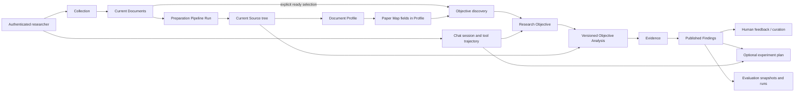
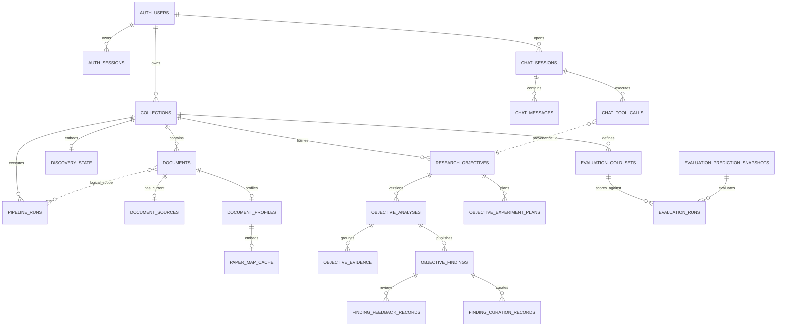

# Backend Database Reference

## Purpose and Scope

This is the current PostgreSQL database reference for the backend. It groups
the schema by the research flows and code modules that own each decision, so a
reader can follow data from a paper upload to a source-grounded comparison and
its optional review or experiment plan.

The reference describes the schema represented by the SQLAlchemy models in
[`infra/persistence/postgres/models/__init__.py`](../../infra/persistence/postgres/models/__init__.py)
and the Alembic head `20260908_0055`. The identity and fingerprint rules are
defined in [`persistence-model.md`](persistence-model.md); this page adds the
flow-oriented table and repository map. The HTTP shapes remain owned by
[`specs/api.md`](../specs/api.md).

The current ORM metadata contains 17 application tables and 170 mapped fields. A
deployed database also contains Alembic's `alembic_version` bookkeeping table.

## End-to-End Data Flow

The database supports one concrete research cycle: a researcher frames a
question, prepares a selected paper set, inspects source evidence, compares
compatible results, and decides whether the evidence is sufficient or whether
another experiment is needed.



The database preserves two different kinds of state:

- **Scientific state** describes what the researcher can conclude: document
  readiness, Objective identity, evidence disposition, comparability, Finding
  publication, and review status. Most scientific payloads are kept in
  JSON/JSONB columns behind relational identities.
- **Technical state** describes whether work can be executed or retried:
  pipeline-run nodes, provider failures, progress, analysis status, and Chat
  tool-call status. Technical failure is never converted into a scientific
  absence or conclusion.

## Persistence Boundaries

| Boundary | Authority | Database implication |
| --- | --- | --- |
| Structured product state | PostgreSQL | Repositories read and write current records and analysis history. |
| Uploaded source files and extracted figure bytes | Object storage | Tables keep a storage key, SHA-256, media type, and size; bytes are not stored in PostgreSQL. |
| Parser, model, and pipeline scratch | Local runtime paths | Disposable cache/output paths are not product read authorities. |
| Schema changes | Alembic | Startup does not create, probe, or infer tables. |
| Test-only alternatives | Memory repositories | They implement ports for isolated tests and are not production storage. |

The runtime composes one `AsyncEngine` and one `async_sessionmaker` in
`main.py`. Each repository operation uses a short task-local `AsyncSession`;
writes use an explicit transaction. Repositories are direct adapters for one
domain boundary; there is no generic repository, storage selector, dual write,
or compatibility read.

## Flow and Module Map

The table catalog below is the quick route from a logic flow to its owning
module and PostgreSQL tables. A table name is the SQL name; the implementation
class is in `infra/persistence/postgres/models`.

| Logic flow | Owning backend modules | Tables | What the rows mean |
| --- | --- | --- | --- |
| Authenticate and authorize | `application/auth`, `controllers/auth.py` | `auth_users`, `auth_sessions` | Normalized user identity and revocable browser sessions. |
| Create a collection and add papers | `application/source`, `controllers/source/collections.py` | `collections`, `documents` | Collection membership and the current paper/file metadata. |
| Execute preparation and discovery pipelines | `application/source`, `application/pipeline`, `application/core/objectives`, `controllers/source/pipeline_runs.py` | `pipeline_runs` | One observable technical run snapshot per pipeline invocation, including nested node telemetry. |
| Parse and analyze a paper | `infra/source`, `application/source`, `application/core/document_profiles` | `document_preparations` | One document-keyed preparation aggregate containing Source, Profile, Paper Map, and the provenance for each generated section. |
| Triage papers and discover Objectives | `application/core/document_profiles`, `application/core/objectives/discovery`, `application/core/objectives` | `collections`, `document_preparations`, `research_objectives` | Collection-owned discovery state, current paper triage, embedded navigation-map cache, selected inputs, and Objective candidates. |
| Inspect evidence and compare papers | `application/core/objectives`, `application/core/paper_facts` | `objective_analyses` | One versioned analysis row contains private checkpoints, paper contributions, public Evidence, and Findings. `paper_facts` is an extraction helper, not a separate persisted aggregate. |
| Run collection-bound Agent Chat | `application/chat`, `domain/chat` | `chat_sessions`, `chat_messages`, `chat_tool_calls` | Auditable conversation, capability calls, approval decisions, embedded structured results, and selected Source context. |
| Plan a follow-up experiment | `application/goal`, `controllers/goal` | `objective_experiment_plans` | Objective-scoped plan revisions with Source/Finding links and author provenance. |
| Review and evaluate outputs | `application/evaluation`, `controllers/core/finding_review` | `finding_feedback_records`, `finding_curation_records`, `evaluation_gold_sets`, `evaluation_prediction_snapshots`, `evaluation_runs` | Human review of exact Finding versions and reproducible prediction/gold evaluation lineage. Evaluation items, scores, and failures remain inside their aggregate payloads. |

### Why the remaining tables stay separate

The simplification rule is lifecycle ownership, not the smallest possible table
count. The remaining tables are separate for these concrete reasons:

| Group | Why it remains relationally separate |
| --- | --- |
| `auth_users`, `auth_sessions` | One user has many independently revocable sessions; session expiry and revocation are not user metadata. |
| `chat_sessions`, `chat_messages`, `chat_tool_calls` | A session contains ordered messages, and each assistant turn can contain ordered capability calls with approval and execution state. These are different cardinalities and audit events. Tool results are already embedded in their call. |
| `collections`, `documents`, `document_preparations` | Collection ownership, file identity, and generated preparation have different replacement and deletion semantics. A preparation is one current child per document. |
| `pipeline_runs` | Technical retry/progress history must remain observable without being confused with scientific artifacts. |
| `research_objectives`, `objective_analyses` | One Objective can have multiple immutable analysis attempts; the analysis version is the scientific result boundary. |
| `objective_experiment_plans` | Plan revisions form an immutable successor chain and are optional downstream decisions, not analysis output. |
| `finding_feedback_records`, `finding_curation_records` | Feedback is append-only judgment history; curation is one replaceable canonical state. They intentionally have different cardinality and update semantics. |
| `evaluation_gold_sets`, `evaluation_prediction_snapshots`, `evaluation_runs` | Gold data and prediction snapshots are reusable immutable inputs; runs reference both and retain reproducible scores/failures. |

Only lifecycle-local children that are always read and replaced with their
owner are embedded in JSON aggregates. This keeps the relational schema small
without weakening identity, versioning, or audit boundaries.

## Schema by Main Logic Flow

### 1. Authentication

`AuthSessionService` owns the access boundary.

| Table | Primary identity | Important columns and constraints |
| --- | --- | --- |
| `auth_users` | `user_id` | Lowercase unique `email`, display name, password hash, creation time. A check constraint enforces normalized email. |
| `auth_sessions` | `session_id` | `user_id` cascades from the user; unique lowercase SHA-256 `token_hash`; creation, expiry, and optional revocation timestamps. Expiry must be after creation. |

Session tokens are hashed before persistence. Raw credentials and session
tokens are not database fields and must not appear in logs or documentation.

### 2. Collection Intake and Current Documents

`CollectionService` owns the collection aggregate and the current Document
membership used by every downstream flow.

| Table | Primary identity | Important columns and constraints |
| --- | --- | --- |
| `collections` | `collection_id` | `owner_user_id` (`RESTRICT` on user deletion), name/description, status, discovery state, and timestamps. The document count is derived from current `documents` rows. |
| `documents` | `document_id` | Direct `collection_id` membership, original/stored names, object-store `storage_key`, SHA-256, media type, byte size, display order, and current preparation status. |

The database has no public collection-membership join object and no
`DocumentVersion` aggregate. A Document is the current paper in its
Collection. Uniqueness is enforced per collection for content
(`collection_id, sha256`) and display order (`collection_id, document_order`);
the storage key is globally unique.

The object store writes immutable input bytes before the Document is exposed as
ready. PostgreSQL records their identity and integrity metadata. Collection
deletion is coordinated by `CollectionService`: it removes the collection
directory/object files and deletes the PostgreSQL aggregate, allowing database
cascades to remove dependent rows.

### 3. Pipeline Execution and Progress

`PipelineRunService` records technical execution while
`DocumentPreparationService` and Objective discovery write their scientific
results to the owning Source, Profile, Collection, and Objective tables.

| Table | Primary identity | Important columns and constraints |
| --- | --- | --- |
| `pipeline_runs` | `run_id` | Collection ownership, pipeline and polymorphic scope, input fingerprint, status, searchable timestamps, and one typed JSON snapshot containing progress and node telemetry. |

Run status is limited to `queued`, `running`, `completed`,
`partial_success`, and `failed`. Nested node status is limited to `queued`,
`running`, `succeeded`, `failed`, and `skipped`. A partial unique index permits
at most one queued or running run for a
`(pipeline_name, scope_type, scope_id)` tuple. Pipeline-specific admission
values, such as Objective discovery's selected Document IDs, stay under
`record_json.context`. A run does not own scientific artifacts or filesystem
output paths.

### 4. Current Document Preparation Aggregate

`PostgresSourceArtifactRepository`, `PostgresDocumentProfileRepository`, and
`PostgresPaperMapRepository` persist one `document_preparations` row per current
Document. The row keeps named Source, Profile, and Paper Map sections so each
producer can replace its own result without creating parallel current tables.

| Table family | Table | Stored structure |
| --- | --- | --- |
| Preparation aggregate | `document_preparations` | One document-keyed row with parser metadata, Source artifact JSON, Profile JSON, and optional Paper Map JSON. The Source artifact contains document metadata, text units, blocks, tables/rows/cells, figures, and reference entries/mentions/resolutions/candidates. |

Source replacement is document-scoped and transactional. A successful retry
replaces the Source section of the current preparation row; its new fingerprint
remains beside the Source artifact and is copied into the dependent Profile
result. The Source section is not a scientific conclusion: it is the exact
material that later Objective analysis may inspect.

The top-level `source_fingerprint` belongs only to the Source producer.
`profile_json.source_fingerprint` records the Source actually used to generate
that Profile; the two can differ while a new Source awaits profile regeneration.
Profile writes and Collection status changes preserve that difference. A row
containing only a Profile must not be returned as an empty parsed Source, and
a Source-only row does not yet satisfy the Paper Map's Profile prerequisite.

### 5. Document Triage and Objective Discovery

The core application uses profiles and maps to decide which papers deserve
deeper inspection. They are navigation inputs, not Evidence.

| Table | Primary identity | Important columns and constraints |
| --- | --- | --- |
| `document_preparations` | `document_id` | One current preparation row. `profile_json` contains triage fields and `paper_map_payload` contains the optional lazy navigation map. |
| `collections` | `collection_id` | Current discovery state: readiness flag, ordered `document_inputs`, Objective IDs, study dispositions, and update time. |
| `research_objectives` | `(collection_id, objective_id)` | Ranked current Objective payload, origin (`system_discovered` or `chat_assisted`), optional Chat tool-call provenance, and timestamps. |

Discovery requires an explicit non-empty set of ready Document IDs. Each
`document_inputs` item freezes the pair `{document_id,
preparation_fingerprint}`. Replacing discovery changes the current candidates
for that Collection; it does not create a Collection snapshot or duplicate the
Source/Profile aggregates. Paper Map data is a navigation cache inside the
preparation row, not a second artifact identity.

The Objective payload carries confirmation and published/active analysis
version pointers. The composite identity keeps Objectives from different
Collections from colliding. `created_by_tool_call_id` is a uniqueness-checked
provenance value; the Chat trajectory remains the authority for the call
record.

### 6. Objective Analysis, Evidence, and Findings

`ResearchObjectiveService` and its analysis stages implement the evidence-first
comparison flow: frame each selected paper, route exact Sources, extract and
ground facts, reconstruct within-paper experiments, compare only compatible
results, and publish a reviewable Finding set.

| Table | Primary identity | Important columns and constraints |
| --- | --- | --- |
| `objective_analyses` | `(collection_id, objective_id, analysis_version)` | One versioned analysis attempt. Its payload stores private checkpoints, paper contributions, public Evidence records, and public Findings produced by that exact analysis. |

Analysis identity always includes the selected preparation state. Before Source
reads begin, the service verifies every frozen Document ID and fingerprint. A
mismatch is stale input and blocks the run; it cannot mix Source generations.

Retries allocate a new `analysis_version`. A failed or interrupted attempt does
not replace the Objective's published pointer. Only a complete succeeded
version is atomically published after contributions, Evidence, and Findings
are written. A succeeded checkpoint with zero routable/comparable Evidence is
valid scientific work and is reusable; provider or parsing failures remain
retryable technical work.

Checkpoint fingerprints cover the Objective intent, Document preparation
fingerprint, extraction version, model identity, and the six analysis stages.
When a checkpoint is reused for a new analysis version, its internal producing
version is rebound during publication; the checkpoint is not itself a public
Finding or Evidence child.

### 7. Collection-Bound Agent Chat

`ChatSessionService`, `ResearchAgentRunner`, and the Chat capability registry
persist an auditable trajectory. Chat references Core records; it does not
create a parallel paper-fact model.

| Table | Primary identity | Important columns and constraints |
| --- | --- | --- |
| `chat_sessions` | `session_id` | Authenticated user and Collection ownership, creation/update timestamps, and monotonic timestamp check. |
| `chat_messages` | `message_id` | Session ownership, non-negative ordered `position`, role (`user`, `assistant`, `tool`), content, optional tool metadata, and persisted selected `source_contexts`. `(session_id, position)` is unique. |
| `chat_tool_calls` | `tool_call_id` | Session and assistant-message ownership, capability name/arguments, argument digest, risk (`unknown`, `read`, `draft`, `write`), approval/execution status, timing, decision-user provenance, and the optional structured result. One call is allowed per assistant message. |

Tool approval is an explicit state transition recorded with the exact argument
digest and authenticated decision user. Source context on a message is a
selected, source-digest-bound navigation snapshot; it does not prove that the
Agent read a complete Source unless the corresponding Source operation is
recorded in the trajectory.

### 8. Objective-Scoped Experiment Plans

`ExperimentPlanService` stores an optional downstream decision artifact after a
researcher has reviewed the evidence. It is not the primary Lens v1 workflow.

| Table | Primary identity | Important columns and constraints |
| --- | --- | --- |
| `objective_experiment_plans` | `plan_id` | Composite Objective ownership, title/content/status, Source links and metadata, optional originating Chat message, structured plan, author/updater IDs, timestamps, and revision fields. |

Plan revisions are immutable rows linked by `parent_plan_id`. A unique
constraint permits only one successor per parent. The first revision is version
1 with no parent; later revisions require a parent and `updated_by`. The source
Chat message is `RESTRICT`-protected so its provenance cannot disappear while a
plan depends on it. Author identities use `SET NULL` when a user is removed.

### 9. Finding Review and Evaluation

Review and evaluation consume already-persisted Core outputs. They never
prepare Source or rerun Objective analysis.

#### Finding review

`finding_feedback_records` and `finding_curation_records` both use the exact
Finding identity `(collection_id, objective_id, analysis_version, finding_id)`.
The review repository validates that identity against the `findings` array in
the corresponding `objective_analyses.payload`; there is no separate Finding
table after migration `20260908_0055`.

- `finding_feedback_records` records a review status, issue type, note,
  reviewer, and creation time. Multiple feedback events are retained.
- `finding_curation_records` stores one complete canonical `curated_finding`
  payload, curated status, note, reviewer, and update time. Partial corrections
  or alternate conclusion IDs are not valid records.

These two review tables intentionally remain separate. Feedback is an append-only
sequence of independent judgments, while curation is one replaceable canonical
record for the current reviewed Finding. Combining them would make both the
event history and the current state nullable, type-discriminated columns in one
less-readable table.

#### Evaluation lineage

| Table | Identity and role |
| --- | --- |
| `evaluation_gold_sets` | `gold_id`; versioned collection gold metadata and complete expected-item payload. |
| `evaluation_prediction_snapshots` | `snapshot_id`; frozen collection prediction context and complete prediction-item payload. |
| `evaluation_runs` | `evaluation_run_id`; gold/prediction references, summary, complete score payload, and complete failure payload. |

Evaluation payloads retain the exact evidence and prediction snapshots used for
the score. Document IDs and Source references inside gold/prediction items are
logical lineage values; the evaluation schema does not silently rewrite them
when a later Document preparation occurs.

## Relationship Backbone

The full Source tree has many composite child keys, so this diagram shows the
aggregate-level foreign-key backbone. A logical link is shown as a dotted edge
where the models intentionally store an ID without declaring a foreign key.



The Source JSON envelope replaces the former normalized `source_*` tables. The
tree projection is rebuilt from the same aggregate, so a locator is always
resolved against the exact artifact row that produced it.

The current model keeps lifecycle-local state together: the complete Source,
Profile, and Paper Map preparation result lives on `document_preparations`,
discovery state lives on `collections`, analysis checkpoints, contributions,
Evidence, and Findings live in `objective_analyses.payload`, and
capability results live on `chat_tool_calls`. These embedded values are not
independent query identities.

## Fingerprints, Versions, and Reuse

Document preparation is a dependency chain, not one opaque cache key:

```text
Source fingerprint
  = SHA-256(document SHA-256 + parser version)

Profile fingerprint
  = SHA-256(Source fingerprint + profile version)

Preparation fingerprint
  = Profile fingerprint
```

Paper Maps add their own policy/prompt input fingerprint inside that same
payload while reusing the current preparation fingerprint. Objective analysis adds a frozen list of
`document_id + preparation_fingerprint` inputs and a versioned analysis
identity. Changing document bytes or parser logic invalidates every dependent
preparation stage; changing profile logic can reuse Source; changing Paper Map
logic does not require reparsing Source or rebuilding profiles.

The database therefore supports these observable outcomes:

1. Uploading or retrying one Document does not rebuild unrelated Documents.
2. A stale Objective input fails before Source reads instead of mixing
   generations.
3. A failed analysis leaves the last published version readable.
4. A matching succeeded per-document checkpoint can be reused on an analysis
   retry, including a valid scientific absence of comparable Evidence.
5. A technical interruption remains retryable and is not reported as a
   scientific conclusion.

## Deletion and Replacement Rules

- Deleting a Collection cascades its Documents, current Source/Profile,
  Pipeline Runs, Objectives, analyses, Findings, review records, Chat
  sessions, plans, and collection-owned evaluation inputs. Evaluation Runs
  protect their gold-set and prediction-snapshot inputs with `RESTRICT`, so a
  Collection deletion is blocked while those run dependencies exist. The same
  rule applies to any other `RESTRICT` provenance edge encountered during the
  cascade.
- Deleting an Auth User cascades sessions and Chat sessions but is restricted
  while the user still owns Collections or is recorded as a tool-call decision
  user. Plan author fields are nullable and use `SET NULL`.
- Deleting a Document cascades its current Source and Profile (including the
  embedded Paper Map cache), and analysis payloads that reference it. A
  document-scoped Pipeline Run uses a
  polymorphic logical `scope_id`, so its execution history remains until the
  owning Collection is deleted. Published
  Objective analysis rows are retained only while their parent Collection and
  Objective remain; a later analysis must select currently ready Documents.
- Re-preparing a Document replaces its current Source and Profile only after
  the owning step succeeds. Pipeline Run history remains observable and old published
  analyses remain readable as historical snapshots.
- Evaluation Runs retain their referenced gold set and prediction snapshot by
  `RESTRICT`; those inputs cannot be deleted underneath a completed run.
- The current-model cutover in migration `20260827_0038` intentionally removed
  retired collection-build, document-version, paper-fact, comparison, and
  workspace-projection tables. There is no backfill, compatibility read, or
  runtime schema fallback for those names.

## Migration and Change Rules

Alembic is the only schema authority. The maintained head is
`20260908_0055`. Revisions `0044` and `0045` move preparation provenance and
Task history into artifact-owned and Pipeline Run records.
Revisions `0047`-`0053` merge Paper Maps, Chat results, Objective intermediate,
discovery, evaluation child records, and redundant Source/count storage into
their lifecycle owners. Revisions `0054` and `0055` merge current document
preparation artifacts and public Objective results. The current ORM metadata and
migration head are checked together by
`tests/integration/persistence/test_migrations.py`.

When a persisted contract changes, update these surfaces together:

1. The owning domain record and its invariants.
2. The PostgreSQL model and explicit repository.
3. The application service and controller schema when the behavior is public.
4. An Alembic migration, including a deliberate downgrade policy.
5. Focused persistence/integration tests and the owning docs.

Do not add a generic storage abstraction, compatibility table, runtime table
probe, JSON fallback, or dual read/write path. Keep technical retry metadata
out of scientific payloads, and keep Source provenance in the exact Source
identity used by the Evidence or Finding.

## Repository Ownership Map

| Repository | Tables owned |
| --- | --- |
| `PostgresAuthRepository` | `auth_users`, `auth_sessions` |
| `PostgresCollectionRepository` | `collections`, `documents` (document count derived from current rows) |
| `PostgresPipelineRunRepository` | `pipeline_runs` |
| `PostgresSourceArtifactRepository` | `document_preparations.source_*`, `document_preparations.artifact_json` |
| `PostgresDocumentProfileRepository` | `document_preparations.profile_json` |
| `PostgresPaperMapRepository` | `document_preparations.paper_map_payload` |
| `PostgresObjectiveRepository` | `collections.discovery_*`, `research_objectives`, `objective_analyses` (including checkpoints, contributions, Evidence, and Findings) |
| `PostgresChatRepository` | `chat_sessions`, `chat_messages`, `chat_tool_calls` (including embedded results) |
| `PostgresExperimentPlanRepository` | `objective_experiment_plans` |
| `PostgresFindingReviewRepository` | `finding_feedback_records`, `finding_curation_records` |
| `PostgresEvaluationRepository` | All `evaluation_*` tables |

The composition root in `main.py` injects these repositories into application
services. Memory repositories mirror selected ports only for isolated tests;
they do not define production schema or behavior.

## Related Authorities

- [`persistence-model.md`](persistence-model.md): current identities,
  fingerprints, versioning, and deletion semantics.
- [`overview.md`](overview.md): backend ownership, real-world chain, runtime
  boundaries, concurrency, and restart recovery.
- [`../specs/api.md`](../specs/api.md): browser and Agent HTTP contracts.
- [`../../infra/persistence/README.md`](../../infra/persistence/README.md):
  persistence adapter boundary and repository ownership.
- [`../../application/source/README.md`](../../application/source/README.md):
  collection and preparation flow.
- [`../../application/core/README.md`](../../application/core/README.md):
  profiles, Paper Maps, Objective discovery, and analysis.
- [`../../application/evaluation/README.md`](../../application/evaluation/README.md):
  review and evaluation lineage.
- [`../../application/goal/README.md`](../../application/goal/README.md):
  Objective-scoped experiment plans.

## Appendix: Complete Field Catalog

The catalog below lists every field in the current ORM, grouped by the main
logic flow (17 application tables and 170 mapped fields).
Field names, types, and nullability follow `backend/infra/persistence/postgres/models/*.py`;
descriptions explain each field's business role in the Lens research chain. `JSONB` means the ORM uses
`JSON().with_variant(JSONB(), "postgresql")`, so PostgreSQL stores the value as
`JSONB`. `PK` means primary key, `FK` foreign key, `UQ` unique constraint, and `IDX` index;
`NN` means `NOT NULL`.

### Contents

- [Authentication and access](#authentication-and-access)
- [Collections, documents, and pipeline runs](#collections-documents-and-pipeline-runs)
- [Source parsing structure](#source-parsing-structure)
- [Document Profiles and Objectives](#document-profiles-and-objectives)
- [Agent Chat](#agent-chat)
- [Experiment plans](#experiment-plans)
- [Finding review and evaluation](#finding-review-and-evaluation)
- [Alembic version table](#alembic-version-table)

### Field Conventions

- `VARCHAR(n)`, `TEXT`, `INTEGER`, `BIGINT`, `FLOAT`, and
  `TIMESTAMP WITH TIME ZONE` are the actual PostgreSQL types.
- Status fields are constrained jointly by domain constants and ORM `CheckConstraint`; the constraints column
  lists values explicitly restricted by the current code. A string field without listed values is still validated by its application service
  and must not be treated as accepting arbitrary strings.
- JSON/JSONB fields store a domain object, list, or stage statistics. They are not free-form interfaces that bypass domain
  validation; writes still pass through the owning domain record and repository.
- Composite primary and foreign keys are listed column by column; each table note states the complete identity tuple.
- This catalog does not provide a MySQL `CREATE TABLE` substitute: production
  uses PostgreSQL, and schema changes must run through an Alembic migration
  (`backend/.venv/bin/alembic upgrade head`). For manual creation or
  cross-database migration, validate against ORM metadata and the migration
  head instead of applying MySQL dialect SQL directly.

### Authentication and access

#### `auth_users` — User accounts

| Field | Type | Nullable | Key / constraints | Description |
| :--- | :--- | :---: | :--- | :--- |
| `user_id` | `VARCHAR(64)` | No | PK | Stable identifier for the authenticated user. |
| `email` | `VARCHAR(320)` | No | UQ; `email = lower(email)` | Login email address; stored normalized to lowercase. |
| `display_name` | `TEXT` | Yes | — | Optional name shown in the browser and Agent interface. |
| `password_hash` | `TEXT` | No | — | Password hash; plaintext passwords are never stored. |
| `created_at` | `TIMESTAMP WITH TIME ZONE` | No | — | Created timestamp. |

#### `auth_sessions` — Browser sessions

| Field | Type | Nullable | Key / constraints | Description |
| :--- | :--- | :---: | :--- | :--- |
| `session_id` | `VARCHAR(64)` | No | PK | Stable identifier of the browser session. |
| `user_id` | `VARCHAR(64)` | No | FK -> `auth_users.user_id`; IDX; `ON DELETE CASCADE` | Stable identifier for the authenticated user. |
| `token_hash` | `VARCHAR(64)` | No | UQ; length 64; lowercase | SHA-256 hash of the browser session token; the raw token is not stored. |
| `created_at` | `TIMESTAMP WITH TIME ZONE` | No | — | Created timestamp. |
| `expires_at` | `TIMESTAMP WITH TIME ZONE` | No | `expires_at > created_at` | Expires timestamp. |
| `revoked_at` | `TIMESTAMP WITH TIME ZONE` | Yes | — | Revoked timestamp. |

### Collections, documents, and pipeline runs

#### `collections` — Paper collections

| Field | Type | Nullable | Key / constraints | Description |
| :--- | :--- | :---: | :--- | :--- |
| `collection_id` | `VARCHAR(64)` | No | PK | Identifier of the owning research collection. |
| `owner_user_id` | `VARCHAR(64)` | No | FK -> `auth_users.user_id`; IDX; `ON DELETE RESTRICT` | User who owns the collection; the user cannot be deleted while the collection remains. |
| `name` | `TEXT` | No | — | Human-readable collection name. |
| `description` | `TEXT` | Yes | — | Optional research purpose or background for the collection. |
| `status` | `VARCHAR(64)` | No | — | Current collection lifecycle state, maintained by `CollectionService`. |
| `created_at` | `TIMESTAMP WITH TIME ZONE` | No | — | Created timestamp. |
| `updated_at` | `TIMESTAMP WITH TIME ZONE` | No | `updated_at >= created_at` | Updated timestamp. |
| `discovery_ready` | `BOOLEAN` | No | default `false` | Whether the current collection discovery result is ready for review or confirmation. |
| `discovery_document_inputs` | `JSONB` | No | default `[]` | Ordered selected inputs, each containing a `document_id` and preparation fingerprint. |
| `discovery_objective_ids` | `JSONB` | No | default `[]` | Ordered Objective IDs produced by the current discovery result. |
| `discovery_study_dispositions` | `JSONB` | No | default `[]` | Per-document study role, inclusion/exclusion, and uncertainty. |
| `discovery_updated_at` | `TIMESTAMP WITH TIME ZONE` | Yes | — | Timestamp of the latest discovery-state update. |

#### `documents` — Current collection documents

Document is the paper identity in the current model, not a publicly queryable version aggregate.

| Field | Type | Nullable | Key / constraints | Description |
| :--- | :--- | :---: | :--- | :--- |
| `document_id` | `VARCHAR(64)` | No | PK | Stable identifier of the current Document. |
| `collection_id` | `VARCHAR(64)` | No | FK -> `collections.collection_id`; IDX; `ON DELETE CASCADE` | Identifier of the owning research collection. |
| `original_filename` | `TEXT` | No | — | Filename supplied by the user at upload time. |
| `stored_filename` | `TEXT` | No | — | Sanitized filename used by object storage. |
| `storage_key` | `TEXT` | No | UQ | Globally unique object-storage key for the immutable input bytes; the bytes are not stored in PostgreSQL. |
| `sha256` | `VARCHAR(64)` | No | length 64; lowercase; per collection UQ | SHA-256 digest of the input bytes, used for deduplication and preparation fingerprints. |
| `media_type` | `VARCHAR(255)` | Yes | — | MIME type of the uploaded file, such as `application/pdf`. |
| `status` | `VARCHAR(64)` | No | — | Current document preparation state, maintained by the Source application layer. |
| `size_bytes` | `BIGINT` | No | `>= 0` | Size of the original file in bytes. |
| `document_order` | `INTEGER` | No | `>= 0`; per collection UQ | Stable display and processing position within the collection. |
| `created_at` | `TIMESTAMP WITH TIME ZONE` | No | — | Created timestamp. |
| `updated_at` | `TIMESTAMP WITH TIME ZONE` | No | — | Updated timestamp. |

#### `pipeline_runs` — Observable technical pipeline execution

One row represents one pipeline invocation. The indexed relational columns
support admission, reuse, polling, and collection history queries. The
`record_json` column stores the complete typed `PipelineRun` snapshot in the
same row; it replaces the former separate stage rows without becoming a store
for Source, Profile, Objective, Evidence, or Finding results.

| Field | Type | Nullable | Key / constraints | Description |
| :--- | :--- | :---: | :--- | :--- |
| `run_id` | `VARCHAR(64)` | No | PK | Stable identifier of one pipeline invocation. |
| `collection_id` | `VARCHAR(64)` | No | FK -> `collections.collection_id`; IDX; `ON DELETE CASCADE` | Collection in which the pipeline executes and the ownership boundary for run history. |
| `pipeline_name` | `VARCHAR(64)` | No | IDX; non-empty | Stable executable flow name, currently `document_preparation` or `objective_discovery`. |
| `scope_type` | `VARCHAR(32)` | No | IDX; non-empty | Kind of logical execution target, currently `document` or `collection`. |
| `scope_id` | `VARCHAR(64)` | No | IDX; non-empty | Identifier of the logical target. For document runs this is `documents.document_id`; for collection runs it equals `collection_id`. It is intentionally not a foreign key because the column is polymorphic. |
| `mode` | `VARCHAR(64)` | No | — | Execution or entry mode selected for this invocation, currently `standard` in the maintained flows. |
| `input_fingerprint` | `VARCHAR(64)` | Yes | — | Identity of the complete input state consumed by the run. Matching successful document runs may be reused; collection runs reuse only active work. |
| `status` | `VARCHAR(32)` | No | IDX; `queued` / `running` / `completed` / `partial_success` / `failed` | Current technical lifecycle state used for polling and recovery. |
| `record_json` | `JSONB` | No | — | Complete validated Pipeline Run snapshot: current node, progress, node telemetry, errors, warnings, statistics, context, timestamps, and retry lineage. |
| `created_at` | `TIMESTAMP WITH TIME ZONE` | No | — | Time the run was admitted. Also mirrored inside the typed snapshot timestamps. |
| `updated_at` | `TIMESTAMP WITH TIME ZONE` | No | `updated_at >= created_at` | Last run-state update; used to order history and detect interrupted active runs. |

The searchable identity and status values are duplicated inside `record_json`
only as part of the serialized domain snapshot. The repository writes both
representations in one transaction and overwrites those snapshot values from
the relational columns when reading, so indexed columns remain authoritative
for admission and queries while nested telemetry remains one typed aggregate.

The partial unique index `uq_pipeline_runs_active_scope` ensures that one
`(pipeline_name, scope_type, scope_id)` tuple has at most one `queued` or
`running` run.

`record_json` has the following top-level structure:

| JSON field | Shape | Description |
| :--- | :--- | :--- |
| `run_id`, `collection_id`, `pipeline_name`, `scope_type`, `scope_id`, `mode`, `input_fingerprint`, `status` | scalar values | Serialized run identity and searchable state mirrored from relational columns. |
| `current_node` | string or null | Current browser-facing phase or pipeline node. |
| `progress_percent` | integer `0..100` | Overall browser-facing completion percentage. |
| `progress_detail` | object or null | Fine-grained phase progress, such as current/total units, message, and active Document or Objective ID. |
| `nodes` | object keyed by node name | Per-node runtime state. Each node stores `name`, `dependencies`, `status`, `errors`, `warnings`, `stats`, `timestamps`, and `output_summary`. |
| `errors` | string array | Aggregated technical failures suitable for display or diagnosis. |
| `warnings` | string array | Aggregated non-blocking execution warnings. |
| `stats` | object | Aggregate duration, token usage, model usage, unreported request count, and prompt versions. |
| `timestamps` | object | ISO-8601 `created_at`, `updated_at`, `started_at`, and `finished_at` values. |
| `context` | object | Pipeline-specific admission context, such as exact discovery `document_ids`; not a scientific result store. |
| `resumed_from_run_id` | string or null | Prior failed/interrupted run that this invocation resumes, when retry lineage exists. |

Each `nodes.<name>` value uses `queued`, `running`, `succeeded`, `failed`, or
`skipped` status. `output_summary` is bounded telemetry only; complete outputs
remain in their owning artifact tables.

### Source parsing structure

Source is the locatable text, layout, tables, figures, and references for each
current Document. It is stored as one current aggregate so the API can return a
single tree-shaped artifact and evidence can always point back to the same
document-scoped Source fingerprint. It does not itself represent a scientific
conclusion.

#### `document_preparations` — Current Source, Profile, and Paper Map

| Field | Type | Nullable | Key / constraints | Description |
| :--- | :--- | :---: | :--- | :--- |
| `document_id` | `VARCHAR(64)` | No | PK; FK -> `documents.document_id`; `ON DELETE CASCADE` | Owning current Document; one preparation aggregate is stored per document. |
| `source_format` | `VARCHAR(32)` | Yes | — | Normalized input format, for example `pdf`, `docx`, or `xlsx`. |
| `parser_name` | `VARCHAR(128)` | Yes | — | Parser implementation that produced the current Source artifact. |
| `parser_version` | `VARCHAR(128)` | Yes | — | Parser version that produced the current Source representation. |
| `source_fingerprint` | `VARCHAR(64)` | Yes | — | Identity of the serialized Source artifact used for invalidation. |
| `artifact_json` | `JSONB` | Yes | — | Complete Source aggregate: `document`, `text_units`, `blocks`, `tables`, `table_rows`, `table_cells`, `figures`, and `references`. |
| `profile_json` | `JSONB` | Yes | — | Current Profile result: title, type, warnings, confidence, profile version/fingerprint, and generation time. |
| `paper_map_payload` | `JSONB` | Yes | — | Optional navigation-only Paper Map and its input fingerprint/version metadata. |
| `created_at` | `TIMESTAMP WITH TIME ZONE` | No | — | First creation timestamp for this current preparation row. |
| `updated_at` | `TIMESTAMP WITH TIME ZONE` | No | — | Timestamp of the latest Source, Profile, or Paper Map replacement. |

The JSON envelope keeps format-specific details inside typed tree nodes rather
than adding new tables for every file format. PDF pages, DOCX sections, and
XLSX sheets can therefore share the same node kinds (`document`, `heading`,
`text`, `table`, `row`, `cell`, `figure`, and `reference`) while retaining
format metadata in each node's payload. The navigation tree is rebuilt from
this canonical artifact when requested; it is not stored as a second copy.

This is a persistence capability, not a claim that every parser is currently
enabled. The maintained upload and preparation runtime currently handles PDF
and text inputs. Adding DOCX or XLSX later requires the corresponding parser
and upload-validation support, but it does not require another Source table.

### Document Profiles and Objectives

These tables carry the `document preparation -> research Objective -> evidence comparison` flow. Profiles and Paper Maps
are navigation and candidate-formation inputs; only the
Evidence and Findings produced after Objective analysis reads exact Source material are scientific Artifacts in the conclusion chain.

Profile and parser provenance belongs to the named section that produced it:
`document_preparations` owns both without making them file identity fields.
`documents` remains the authority for collection ownership, filenames, file
identity, and current preparation status. Profile queries join through
`documents.document_id` when they need collection scoping.

Paper Maps are built lazily when a ready Document is selected for Objective
work. They are stored in the same preparation row because they are derived
navigation state, not an independently addressable scientific artifact. The
cache is rebuilt when its input fingerprint or map version is stale.

Discovery state is stored in the `collections.discovery_*` fields. Replacing
that state changes the current candidates for the Collection; it does not
create a Collection snapshot or duplicate preparation aggregates.

#### `research_objectives` — Research Objectives

The database identity of an Objective is `(collection_id, objective_id)`. Its complete scientific intent
is stored in `payload` rather than split into a wide table detached from the domain model.

| Field | Type | Nullable | Key / constraints | Description |
| :--- | :--- | :---: | :--- | :--- |
| `collection_id` | `VARCHAR(64)` | No | PK (composite); FK -> `collections.collection_id`; `ON DELETE CASCADE` | Identifier of the owning research collection. |
| `objective_id` | `VARCHAR(128)` | No | PK (composite) | Stable identifier of the research Objective. |
| `rank` | `INTEGER` | No | — | Candidate order in the discovery result. |
| `origin` | `VARCHAR(32)` | No | `system_discovered` / `chat_assisted` | Whether the Objective came from system discovery or Chat-assisted creation. |
| `created_by_tool_call_id` | `VARCHAR(128)` | Yes | UQ | Chat capability call that created this Objective; one call cannot create multiple Objectives. |
| `payload` | `JSONB` | No | — | Complete Objective intent: question, scope, variables, outcomes, conditions, confirmation, and provenance. |
| `created_at` | `TIMESTAMP WITH TIME ZONE` | No | — | Created timestamp. |
| `updated_at` | `TIMESTAMP WITH TIME ZONE` | No | — | Updated timestamp. |

#### `objective_analyses` — Objective analysis versions

The complete identity is `(collection_id, objective_id, analysis_version)` and links to
`research_objectives` through a composite foreign key.

| Field | Type | Nullable | Key / constraints | Description |
| :--- | :--- | :---: | :--- | :--- |
| `collection_id` | `VARCHAR(64)` | No | PK (composite); composite FK -> `research_objectives`; `ON DELETE CASCADE` | Identifier of the owning research collection. |
| `objective_id` | `VARCHAR(128)` | No | PK (composite); composite FK -> `research_objectives` | Stable identifier of the research Objective. |
| `analysis_version` | `INTEGER` | No | PK (composite); positive integer | Positive analysis version; retries create a new version. |
| `status` | `VARCHAR(16)` | No | `queued` / `running` / `succeeded` / `failed`; IDX | Lifecycle or execution status for the objective analyses record. |
| `payload` | `JSONB` | No | — | Frozen document inputs, stage versions, statistics, source coverage, private checkpoints, paper contributions, `evidence_records`, and `findings`. |
| `created_at` | `TIMESTAMP WITH TIME ZONE` | No | — | Created timestamp. |
| `updated_at` | `TIMESTAMP WITH TIME ZONE` | No | — | Updated timestamp. |

The payload keeps checkpoint entries keyed by document and input fingerprint,
paper-contribution entries keyed by source document, and public result arrays:

```json
{
  "evidence_records": [
    {"evidence_id": "...", "document_id": "...", "source_ref": "..."}
  ],
  "findings": [
    {"finding_id": "...", "display_rank": 1, "supporting_evidence_ids": []}
  ]
}
```

The repository applies bounded application-level pagination to those arrays.
The analysis row remains the version boundary, so a published analysis cannot
mix Evidence or Findings from another run.

### Agent Chat

Chat is an auditable Collection-bound Agent trajectory. It records user-visible messages, model
capability requests, approval decisions, and structured results; it references Core Artifacts instead of creating a parallel
paper-fact model.

#### `chat_sessions` — Chat sessions

| Field | Type | Nullable | Key / constraints | Description |
| :--- | :--- | :---: | :--- | :--- |
| `session_id` | `VARCHAR(128)` | No | PK | Stable identifier of the Chat session. |
| `user_id` | `VARCHAR(64)` | No | FK -> `auth_users.user_id`; IDX; `ON DELETE CASCADE` | Stable identifier for the authenticated user. |
| `collection_id` | `VARCHAR(64)` | No | FK -> `collections.collection_id`; IDX; `ON DELETE CASCADE` | Collection bound to the session; capability calls cannot cross this boundary. |
| `created_at` | `TIMESTAMP WITH TIME ZONE` | No | — | Created timestamp. |
| `updated_at` | `TIMESTAMP WITH TIME ZONE` | No | `updated_at >= created_at` | Updated timestamp. |

#### `chat_messages` — Ordered chat messages

| Field | Type | Nullable | Key / constraints | Description |
| :--- | :--- | :---: | :--- | :--- |
| `message_id` | `VARCHAR(128)` | No | PK | Stable identifier of the Chat message. |
| `session_id` | `VARCHAR(128)` | No | FK -> `chat_sessions.session_id`; IDX; `ON DELETE CASCADE` | Stable identifier of the Chat session. |
| `position` | `INTEGER` | No | `>= 0`; UQ per session | Strict message order within the Chat session. |
| `role` | `VARCHAR(16)` | No | `user` / `assistant` / `tool` | Message role: user, assistant, or tool. |
| `content` | `TEXT` | No | — | Human- or system-readable text content. |
| `tool_call_id` | `VARCHAR(128)` | Yes | — | Stable identifier of the capability call. |
| `source_contexts` | `JSONB` | No | default `[]` | User-selected, Source-digest-bound navigation contexts attached to the message. |
| `created_at` | `TIMESTAMP WITH TIME ZONE` | No | — | Created timestamp. |

#### `chat_tool_calls` — Capability calls and approvals

| Field | Type | Nullable | Key / constraints | Description |
| :--- | :--- | :---: | :--- | :--- |
| `tool_call_id` | `VARCHAR(128)` | No | PK | Stable identifier of the capability call. |
| `session_id` | `VARCHAR(128)` | No | FK -> `chat_sessions.session_id`; IDX; `ON DELETE CASCADE` | Stable identifier of the Chat session. |
| `assistant_message_id` | `VARCHAR(128)` | No | FK -> `chat_messages.message_id`; UQ with `position`; `ON DELETE CASCADE` | Assistant message that triggered this call. Multiple ordered calls are allowed per assistant message. |
| `name` | `VARCHAR(128)` | No | — | Capability name requested by the Agent. |
| `position` | `INTEGER` | No | `>= 0`; UQ per assistant message | Order of this capability call within the assistant turn. |
| `arguments` | `JSONB` | No | — | Schema-validated capability arguments. |
| `arguments_digest` | `VARCHAR(64)` | No | — | Normalized argument digest used to verify exact approval. |
| `risk` | `VARCHAR(16)` | No | `unknown` / `read` / `draft` / `write` | Capability risk classification. |
| `status` | `VARCHAR(32)` | No | `requested` / `approval_required` / `approved` / `running` / `succeeded` / `failed` / `rejected` | Technical state from request through approval, execution, and terminal result. |
| `started_at` | `TIMESTAMP WITH TIME ZONE` | Yes | — | Started timestamp. |
| `finished_at` | `TIMESTAMP WITH TIME ZONE` | Yes | — | Finished timestamp. |
| `error_code` | `VARCHAR(128)` | Yes | — | Machine-readable technical failure or rejection code. |
| `decision_user_id` | `VARCHAR(64)` | Yes | FK -> `auth_users.user_id`; `ON DELETE RESTRICT` | Authenticated user who approved or rejected the call. |
| `decision_arguments_digest` | `VARCHAR(64)` | Yes | — | Digest confirmed at approval; must match `arguments_digest`. |
| `decided_at` | `TIMESTAMP WITH TIME ZONE` | Yes | — | Decided timestamp. |
| `result_status` | `VARCHAR(32)` | Yes | `succeeded` / `queued` / `failed` | Lifecycle status of the result returned by this call. |
| `result_data` | `JSONB` | Yes | — | Structured data returned by the capability. |
| `result_resource_refs` | `JSONB` | Yes | — | Navigable references to Objectives, Findings, Sources, or other result resources. |
| `result_warnings` | `JSONB` | Yes | — | Structured list of non-blocking warnings. |
| `result_error_code` | `VARCHAR(128)` | Yes | — | Machine-readable failure code returned by the capability. |
| `result_error_message` | `TEXT` | Yes | — | Human-readable failure explanation returned by the capability. |

The result is nullable because a call can be requested, approved, or running
before execution completes. Keeping it on the call row makes the call and its
single result one auditable lifecycle record.

### Experiment plans

#### `objective_experiment_plans` — Objective-scoped experiment plan revisions

An experiment plan is an optional downstream decision artifact after Evidence/Findings. Each revision is
an immutable row; new revisions form a one-way chain through `parent_plan_id`.

| Field | Type | Nullable | Key / constraints | Description |
| :--- | :--- | :---: | :--- | :--- |
| `plan_id` | `VARCHAR(128)` | No | PK | Stable identifier of this experiment-plan revision. |
| `collection_id` | `VARCHAR(64)` | No | IDX; composite FK -> `research_objectives`; ON DELETE CASCADE | Identifier of the owning research collection. |
| `objective_id` | `VARCHAR(128)` | No | IDX; composite FK -> `research_objectives` | Stable identifier of the research Objective. |
| `title` | `TEXT` | No | — | Parsed or user-facing title. |
| `content` | `TEXT` | No | — | Human- or system-readable text content. |
| `status` | `VARCHAR(64)` | No | `draft` / `ready_for_review` / `archived` | Lifecycle or execution status for the objective experiment plans record. |
| `source_message_id` | `VARCHAR(128)` | Yes | FK -> `chat_messages.message_id`; `ON DELETE RESTRICT` | Chat message that originated the plan; its provenance is retained. |
| `source_links` | `JSONB` | No | — | Structured references to the supporting Source, Evidence, Finding, or related resource. |
| `metadata_json` | `JSONB` | No | — | Parser, provider, annotation, or display metadata. |
| `plan_version` | `INTEGER` | No | default 1; positive integer | Revision number within the plan chain. |
| `parent_plan_id` | `VARCHAR(128)` | Yes | self FK; version 1 must be NULL; UQ | Identifier of the immediately preceding plan revision; each parent has at most one successor. |
| `structured_plan` | `JSONB` | Yes | — | Optional structured design containing variables, levels, controls, measurements, and risks. |
| `created_by` | `VARCHAR(64)` | Yes | FK -> `auth_users.user_id`; `ON DELETE SET NULL` | User who created the plan chain. |
| `updated_by` | `VARCHAR(64)` | Yes | FK -> `auth_users.user_id`; `ON DELETE SET NULL` | User who created the current successor revision. |
| `created_at` | `TIMESTAMP WITH TIME ZONE` | No | — | Created timestamp. |
| `updated_at` | `TIMESTAMP WITH TIME ZONE` | No | — | Updated timestamp. |

### Finding review and evaluation

These tables consume persisted Core output; they do not prepare Source or rerun Objective
analysis. Review records always bind to the exact Finding version.

#### `finding_feedback_records` — Finding feedback events

| Field | Type | Nullable | Key / constraints | Description |
| :--- | :--- | :---: | :--- | :--- |
| `feedback_id` | `VARCHAR(128)` | No | PK | Stable identifier of a Finding feedback event. |
| `collection_id` | `VARCHAR(64)` | No | IDX; validated against `objective_analyses.payload`; `ON DELETE` through collection ownership | Identifier of the owning research collection. |
| `objective_id` | `VARCHAR(128)` | No | IDX; validated against the analysis payload | Stable identifier of the research Objective. |
| `analysis_version` | `INTEGER` | No | validated against the analysis payload | Positive analysis version; retries create a new version. |
| `finding_id` | `VARCHAR(128)` | No | validated against the analysis payload | Stable identifier of the Finding within the analysis version. |
| `review_status` | `VARCHAR(64)` | No | `correct` / `incorrect` / `partial` / `unclear` | Reviewer's judgment of Finding correctness. |
| `issue_type` | `VARCHAR(64)` | No | constrained by domain review constants | Review issue category, such as `evidence_not_grounded`, `wrong_context`, or `overclaim`. |
| `note` | `TEXT` | Yes | — | Reviewer's additional explanation. |
| `reviewer` | `VARCHAR(255)` | Yes | — | Reviewer name or external identifier. |
| `created_at` | `TIMESTAMP WITH TIME ZONE` | No | — | Created timestamp. |

#### `finding_curation_records` — Current Finding curation

| Field | Type | Nullable | Key / constraints | Description |
| :--- | :--- | :---: | :--- | :--- |
| `curation_id` | `VARCHAR(128)` | No | PK | Stable identifier of the current Finding curation record. |
| `collection_id` | `VARCHAR(64)` | No | IDX; validated against `objective_analyses.payload` | Identifier of the owning research collection. |
| `objective_id` | `VARCHAR(128)` | No | IDX; validated against the analysis payload | Stable identifier of the research Objective. |
| `analysis_version` | `INTEGER` | No | validated against the analysis payload | Positive analysis version; retries create a new version. |
| `finding_id` | `VARCHAR(128)` | No | validated against the analysis payload | Stable identifier of the Finding within the analysis version. |
| `curated_status` | `VARCHAR(64)` | No | `supported` / `limited` / `conflicted` / `unsupported` | Expert's final support classification for the Finding. |
| `curated_finding` | `JSONB` | No | — | Complete canonical Finding object; partial field-only corrections are not valid. |
| `note` | `TEXT` | Yes | — | Curation rationale. |
| `reviewer` | `VARCHAR(255)` | Yes | — | Curator name or external identifier. |
| `updated_at` | `TIMESTAMP WITH TIME ZONE` | No | — | Updated timestamp. |

#### `evaluation_gold_sets` — Evaluation gold sets

| Field | Type | Nullable | Key / constraints | Description |
| :--- | :--- | :---: | :--- | :--- |
| `gold_id` | `VARCHAR(128)` | No | PK | Stable identifier of a versioned evaluation gold set. |
| `collection_id` | `VARCHAR(64)` | No | FK -> `collections.collection_id`; IDX; `ON DELETE CASCADE` | Identifier of the owning research collection. |
| `version` | `VARCHAR(64)` | No | — | Version label for the gold-set content. |
| `target_layer` | `VARCHAR(32)` | No | `core` / `goal` | System layer evaluated by the gold set. |
| `metric_profile` | `VARCHAR(128)` | No | — | Metric configuration used for evaluation. |
| `description` | `TEXT` | Yes | — | Optional purpose or annotation note for the gold set. |
| `metadata_json` | `JSONB` | No | — | Parser, provider, annotation, or display metadata. |
| `items` | `JSONB` | No | default `[]` | Complete expected-item array. Each item contains `gold_item_id`, `document_id`, `family`, `item_key`, `payload`, `evidence_refs`, and `metadata_json`. Items are embedded because they are always written and read as part of this immutable gold-set version. |
| `updated_at` | `TIMESTAMP WITH TIME ZONE` | No | — | Updated timestamp. |

#### `evaluation_prediction_snapshots` — Prediction snapshots

| Field | Type | Nullable | Key / constraints | Description |
| :--- | :--- | :---: | :--- | :--- |
| `snapshot_id` | `VARCHAR(128)` | No | PK | Stable identifier of one frozen prediction input snapshot. |
| `collection_id` | `VARCHAR(64)` | No | FK -> `collections.collection_id`; IDX(`collection_id`,`fact_source`); `ON DELETE CASCADE` | Identifier of the owning research collection. |
| `target_layer` | `VARCHAR(32)` | No | `core` / `goal` | System layer represented by the snapshot. |
| `fact_source` | `VARCHAR(64)` | No | — | Label for the fact source used to produce predictions. |
| `system_context` | `JSONB` | No | — | Structured system context captured for this record. |
| `artifact_counts` | `JSONB` | No | — | Counts of each Artifact family included in the snapshot. |
| `items` | `JSONB` | No | default `[]` | Complete prediction-item array. Each item contains `item_id`, `document_id`, `family`, `item_key`, `payload`, `source_refs`, and optional `confidence`. Items are embedded because they are always part of this frozen prediction snapshot. |
| `created_at` | `TIMESTAMP WITH TIME ZONE` | No | — | Created timestamp. |

#### `evaluation_runs` — Evaluation runs

| Field | Type | Nullable | Key / constraints | Description |
| :--- | :--- | :---: | :--- | :--- |
| `evaluation_run_id` | `VARCHAR(128)` | No | PK; IDX(`collection_id`,`created_at`) | Stable identifier of one complete evaluation run. |
| `collection_id` | `VARCHAR(64)` | No | FK -> `collections.collection_id`; ON DELETE CASCADE | Identifier of the owning research collection. |
| `gold_id` | `VARCHAR(128)` | No | FK -> `evaluation_gold_sets.gold_id`; `ON DELETE RESTRICT` | Gold set used by the run; it cannot be deleted underneath the run. |
| `prediction_snapshot_id` | `VARCHAR(128)` | No | FK -> `evaluation_prediction_snapshots.snapshot_id`; `ON DELETE RESTRICT` | Prediction snapshot evaluated by the run. |
| `target_layer` | `VARCHAR(32)` | No | `core` / `goal` | System layer evaluated by the run. |
| `fact_source` | `VARCHAR(64)` | No | — | Snapshot of the fact-source label used for predictions. |
| `metric_profile` | `VARCHAR(128)` | No | — | Metric configuration executed by the run. |
| `status` | `VARCHAR(64)` | No | — | Evaluation run lifecycle state. |
| `summary` | `JSONB` | No | — | Overall scores, counts, and run summary. |
| `scores` | `JSONB` | No | default `[]` | Complete score array. Each score contains `score_id`, optional `document_id`, `family`, `metric`, `value`, and optional `numerator`/`denominator`. Scores are embedded because they are produced and consumed only as part of this run. |
| `failures` | `JSONB` | No | default `[]` | Complete failure-detail array. Each failure contains `failure_id`, `document_id`, `family`, `failure_type`, `likely_layer`, `severity`, optional matched item IDs and snapshots, `reason`, and `source_refs`. Failure details remain inside the run so the run is one reproducible result snapshot. |
| `created_at` | `TIMESTAMP WITH TIME ZONE` | No | — | Created timestamp. |

### Alembic version table

#### `alembic_version` — Migration position

This table is managed by Alembic rather than the application ORM domain model, but appears in the deployed database
to ensure each migration is applied once.

| Field | Type | Nullable | Key / constraints | Description |
| :--- | :--- | :---: | :--- | :--- |
| `version_num` | `VARCHAR(32)` | No | PK | Alembic revision currently applied to the database, for example `20260908_0055`. |
