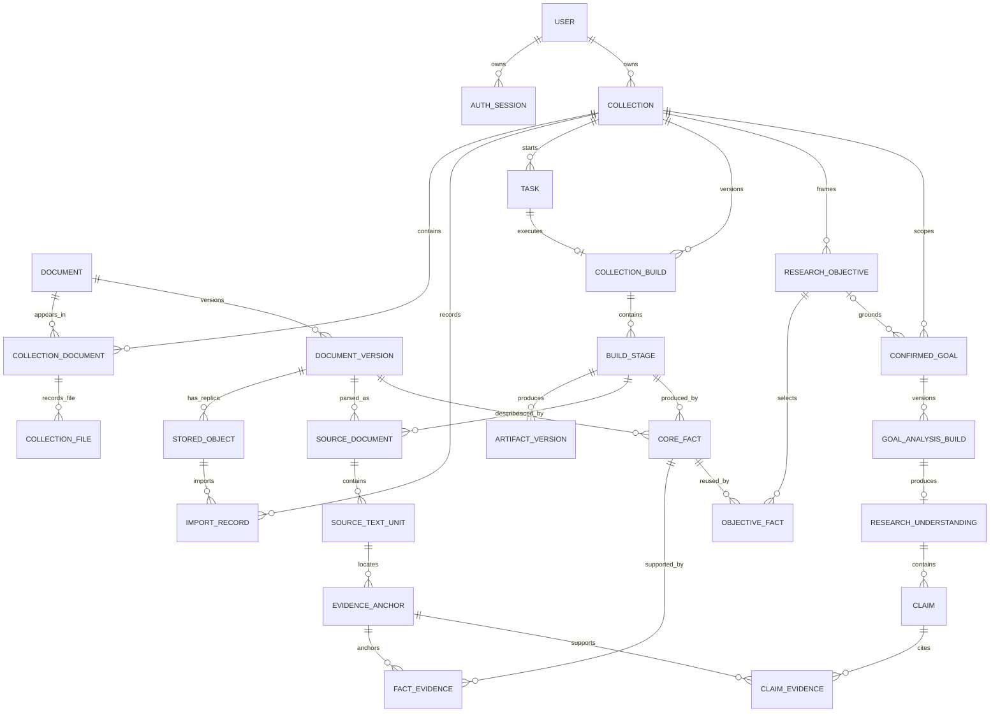

# Backend Persistence Model

## Purpose And Status

This document is the backend authority for persistence ownership, durable
identities, relationships, build lineage, and deletion boundaries.

The target model is being adopted one data family at a time. Until each family
is cut over, the current repositories described below still own its runtime behavior.
The [revision plan](../plans/backend-wide/persistence-model-revision/implementation-plan.md)
owns sequencing; this document owns the stable destination.

This revision does not change the public HTTP contract or the Lens evidence
model. In particular:

- collections remain the Lens v1 working scope
- reusable facts remain separate from collection projections
- every claim remains traceable to Source evidence
- rows, cards, graphs, reports, and exports remain downstream views

## The Storage Rule

Use the least powerful store that can own the data correctly.

| Data shape | Runtime authority | Rule |
| --- | --- | --- |
| Structured mutable state | PostgreSQL | Own identity, relationships, lifecycle, and queryable metadata. |
| Immutable binary bytes | Object storage | Address bytes by stable storage key and SHA-256, never by a domain-owned absolute path. |
| Runtime scratch | Local ephemeral files | Treat as purgeable and rebuildable; never read it as durable product state. |
| Semantic retrieval index | Optional `pgvector` in PostgreSQL | Rebuild from canonical Source text units; never treat a match as evidence. |

There is no fourth authority. JSON exports, caches, projections, and indexes
must name the authoritative records from which they can be rebuilt.

## Current Runtime Model

The current runtime is split between PostgreSQL auth, collection, canonical
document, file-provenance, and build-lineage records; uploaded and generated
files; and five handwritten SQLite repositories. This table records that split
so later migrations do not accidentally preserve it.

| Current family | Current runtime owner | Rebuildable now? | Target authority |
| --- | --- | --- | --- |
| Collection identity and metadata | PostgreSQL `collections` | No | PostgreSQL |
| Stored-object metadata and collection file membership | PostgreSQL `stored_objects` and `collection_files` | No | PostgreSQL |
| Canonical documents, immutable versions, and collection membership | PostgreSQL `documents`, `document_versions`, and `collection_documents` | No | PostgreSQL |
| Import provenance and Goal-intake handoffs | PostgreSQL `collection_imports`, `collection_import_documents`, and `collection_handoffs` | No | PostgreSQL |
| Uploaded PDF and text bytes | `collections/<id>/input/` | No | Object storage |
| Task status, progress, and errors | PostgreSQL `tasks` | No | PostgreSQL |
| Collection builds and stage state | PostgreSQL `collection_builds` and `build_stages` | No | PostgreSQL |
| Artifact readiness and active-build selection | PostgreSQL `artifact_versions` and `collection_active_builds` | No | PostgreSQL metadata; binary exports in object storage |
| Users and auth sessions | PostgreSQL `auth_users` and `auth_sessions` | No | PostgreSQL |
| Goal sessions and experiment plans | `lens.sqlite` Goal tables | No | PostgreSQL |
| Source document structure and references | `lens.sqlite` Source tables | No | PostgreSQL |
| Core facts, objectives, comparisons, goals, and understandings | `lens.sqlite` Core tables | No | PostgreSQL |
| Feedback, curation, and evaluation | `lens.sqlite` evaluation tables | No | PostgreSQL |
| Extracted images and other generated binary media | `images/` and collection output paths | Re-extractable when source bytes and parser version exist | Object storage with PostgreSQL metadata |
| Source pipeline JSON, Parquet, state, and statistics | collection and top-level `output/` paths | Yes; some files currently duplicate SQLite Source rows | Local scratch only |
| Report, GraphML, archive, and review exports | generated output paths | Yes from versioned records | Object storage; PostgreSQL stores export metadata |
| Embedding, parser, and model caches | `cache/` and runtime cache paths | Yes | Local scratch; optional accepted embeddings use `pgvector` |
| Trace payloads and logs | `traces/` and log paths | Yes for product behavior; retained only for diagnostics | Local scratch or object storage when an explicit retention rule requires it |
| Legacy document indexes, graph store, and file Goal sessions | `documents/`, `graph_store.json`, and `collections/_goal_sessions/` | Legacy residue, not a supported authority | Offline migration input or removal after approved cleanup |

The collection aggregate is now one direct relational boundary. One import
transaction creates or reuses canonical document identity and collection
membership, inserts collection-scoped stored-object and file provenance, then
records ordered imported-document links and updates collection count and
status. Identical content shares one immutable `DocumentVersion`, while each
collection retains its own object replica, storage key, and authorization
boundary. `FileCollectionWorkspace` owns collection directories and
scratch/output paths only. `FileObjectStore` owns immutable input bytes by validated
storage key and SHA-256. No maintained runtime or export path reads
`files.json`, `import_manifest.json`, or an input-directory scan as collection
authority.

The build aggregate is also direct and relational. `Task`, `CollectionBuild`,
`BuildStage`, and `ArtifactVersion` share one `BuildRepository` boundary.
Successful completion may advance `collection_active_builds`; failed builds and
older concurrent completions remain history and cannot replace a newer active
build. Task-specific artifact readiness is derived from immutable version rows,
not stored as a mutable boolean document.

### Legacy SQLite Inventory

The inspected `backend/data/lens.sqlite` contains 53 application tables. They
are grouped here by real responsibility rather than by the repository class
that happens to contain them. Its two auth tables are retained legacy data for
future offline import only; the current runtime neither reads nor writes them.

| Responsibility | Count | Current tables |
| --- | ---: | --- |
| Authentication | 2 | `auth_users`, `auth_sessions` |
| Goal sessions and plans | 3 | `goal_sessions`, `goal_messages`, `goal_experiment_plans` |
| Source | 14 | `source_artifact_builds`, `source_documents`, `source_text_units`, `source_text_unit_documents`, `source_blocks`, `source_block_text_units`, `source_tables`, `source_table_rows`, `source_table_cells`, `source_figures`, `source_reference_entries`, `source_reference_mentions`, `source_reference_resolutions`, `source_reference_candidates` |
| Core and Goal workflow state | 25 | `core_fact_collection_status`, `core_paper_skims`, `core_research_objectives`, `core_objective_contexts`, `core_objective_paper_frames`, `core_objective_evidence_routes`, `core_objective_evidence_units`, `core_objective_logic_chains`, `core_document_profiles`, `core_evidence_anchors`, `core_method_facts`, `core_sample_variants`, `core_test_conditions`, `core_baseline_references`, `core_measurement_results`, `core_characterization_observations`, `core_structure_features`, `core_comparable_results`, `core_collection_comparable_results`, `core_pairwise_comparison_relations`, `core_comparison_rows`, `core_confirmed_goals`, `core_research_understanding_artifacts`, `core_objective_report_artifacts`, `core_material_report_artifacts` |
| Evaluation and review | 9 | `evaluation_gold_sets`, `evaluation_gold_items`, `evaluation_prediction_snapshots`, `evaluation_prediction_items`, `evaluation_runs`, `evaluation_scores`, `evaluation_failures`, `research_understanding_feedback`, `research_understanding_curations` |

The table count is evidence about the current model, not a target table-count
requirement. Later migrations may combine or split tables only when an actual
identity, constraint, or query requires it.

## Target Identity Model

### Identity Rules

- Application IDs are stable, opaque identifiers. A file path, title, DOI, or
  parser-local number is never a primary key.
- `Document` is reusable bibliographic identity. `DocumentVersion` is immutable
  content identity and carries the content SHA-256.
- `CollectionDocument` is membership in a user's working scope. Removing a
  membership does not delete the reusable document while another durable
  reference remains.
- Current ingestion derives opaque internal IDs from validated content SHA-256
  and reuses one version for identical bytes. It does not merge different
  content versions by filename, DOI, or parser-local identity.
- A storage key locates bytes. PostgreSQL metadata records its SHA-256, media
  type, byte size, object kind, and creation time.
- Source and Core records identify the immutable build that produced them.
- Goal analysis records belong to one confirmed goal and one immutable analysis
  build.
- DOI and other external identifiers are deduplication signals with uniqueness
  rules appropriate to their issuer; they do not replace internal identity.

### Relationship Backbone

The diagram shows identity and ownership. Family boxes such as `CORE_FACT` mean
several concrete domain tables, not a generic fact table or generic repository.

### Required Keys And Foreign Keys

Concrete migration names may differ, but these identity rules may not.

| Family | Primary identity | Required relationships and constraints |
| --- | --- | --- |
| User and auth | `user_id`, `session_id` | Session references one user; token hash is unique; expiry is typed. |
| Collection | `collection_id` | References one owning user and at most one active successful collection build. |
| Collection membership | `collection_document_id` | References collection, document, and its exact version; the collection/document pair is unique. |
| Document and version | `document_id`, `document_version_id` | Version references document; SHA-256 is unique and immutable. |
| Stored object, collection file, and import | `object_id`, `file_id`, `import_id` | Each collection-scoped object replica references one version; each file references an object and a membership in the same collection; imported document references one import and file in that collection. |
| Task and build | `task_id`, `collection_build_id`, `build_stage_id` | Build references collection and task; stage references build; stage kind and version are unique within a build. |
| Artifact version | `artifact_version_id` | References its build stage and optional stored object; schema and content versions are typed. |
| Source records | Existing domain IDs per record family | Every record references a Source build stage and document version; join tables use declared foreign keys. |
| Evidence anchor | `anchor_id` | References document version and build stage plus exactly one supported Source locator, such as a text unit, block, table cell, or figure. |
| Reusable Core facts | Existing domain IDs per fact family | Every fact references document version and Core build stage; many-to-many evidence uses link tables. |
| Objective and collection assessment | `objective_id` and family-specific IDs | References collection; reusable fact selection and assessment use foreign-keyed links rather than copied payloads. |
| Confirmed goal | `goal_id` | References collection and, when present, the objective that established its scope. |
| Goal analysis | `goal_analysis_build_id`, `understanding_id` | Build references goal; understanding references exactly one immutable analysis build. |
| Understanding graph | `claim_id`, `relation_id`, `context_id`, `evidence_ref_id` | Child records reference understanding; claim, relation, context, and evidence associations use link tables. |
| Feedback, curation, evaluation | Existing evaluation IDs | Review records reference immutable understanding/claim or prediction identities and their version. |

No reviewable identity may exist only as an element inside an opaque JSON
payload.

## Build Lifecycle

Build output is immutable. Activation is the only mutable selection step.

1. A task creates a collection build and named stages in `building` state.
2. Each stage writes records under its own build identity. Existing active rows
   are not deleted or replaced.
3. Validation marks the build `succeeded` only when required stages and
   evidence links are complete.
4. One transaction changes the collection's active-build pointer from the old
   successful build to the new successful build.
5. A failed or cancelled build remains diagnostic history and cannot change the
   pointer.

Goal analysis follows the same rule under `ConfirmedGoal`: a new
`GoalAnalysisBuild` is written separately and becomes active only after its
understanding is complete. Readers follow the owning active pointer; they do
not search for the newest timestamp.

## JSONB Policy

Use typed columns for values that establish identity, ownership, lifecycle,
ordering, filtering, integrity, or traceability:

- primary and foreign keys
- status, kind, timestamps, ordering, and active version
- content hashes, storage metadata, model/schema version, and scores
- scientific fields that are filtered, compared, constrained, or joined

Use JSONB only for variable details that are read as one value and do not need
independent relational integrity, such as parser metadata, bounding boxes,
locators, presentation settings, model diagnostics, and domain-specific payload
fragments.

Do not store a second copy of an authoritative row in JSONB. Do not use JSONB
arrays in place of foreign keys for claims, evidence, facts, documents, goals,
or review records.

## Object And Vector Boundaries

Object storage owns PDFs, uploaded text, extracted image bytes, downloadable
reports, GraphML, archives, and retained large trace payloads. PostgreSQL owns
their metadata and relationships. The first implementation may be the local
filesystem, but only through stable storage keys; cloud storage is not part of
this revision.

No vector index is required for the relational cutover. If the retrieval gate
later proves value, `pgvector` rows must reference canonical Source text units
and record embedding model, dimensions, content hash, and build version. A
vector query returns candidate IDs; authoritative text and evidence are then
loaded from Source records.

## Repository And Model Boundaries

Keep the runtime composition direct:

- one synchronous SQLAlchemy engine and session factory at application startup
- one short session and transaction per repository operation
- no live session shared across background threads
- repositories grouped by real business aggregate and direct caller need
- no generic CRUD repository, service locator, DI framework, or compatibility
  facade

SQLAlchemy models own storage shape. Domain records own scientific meaning and
invariants. Pydantic models own HTTP input and output. A repository performs
the explicit mapping; one class must not serve all three roles.

Canonical document registration remains inside `CollectionRepository`, not a
separate document repository. Import and collection deletion must update
document identity, exact-version membership, physical replicas, provenance,
and collection count in one transaction; splitting those writes would add a
coordination layer without creating a second aggregate.

## Deletion And Recovery

| Event | Required result |
| --- | --- |
| Remove a document from a collection | Delete only the membership and collection-scoped assessments. Preserve the reusable document and facts while another durable reference exists. |
| Delete a collection | Remove collection-owned goals, tasks, builds, memberships, and projections transactionally. Reusable documents and facts become garbage-collection candidates only when no durable reference remains. |
| Replace a document | Create a new immutable document version and build. Never overwrite bytes or Source/Core rows in place. |
| Clean old builds | Never delete an active build. Delete inactive versions only after retention, rollback, and reference checks pass. |
| Delete a goal | Remove its analysis builds and mutable workspace state. Evaluation snapshots with an explicit retention purpose remain versioned records rather than dangling references. |
| Delete object bytes | Require zero durable references and an elapsed retention window; object deletion follows relational deletion, not the reverse. |
| Purge scratch | Safe at any time when no running task owns the path. Product reads must continue to work. |
| Retire SQLite or JSON state | Keep the accepted pre-cutover snapshot read-only for the rollback window. Destructive cleanup requires a separate operator approval. |

Migration is offline and one-way per accepted data family. There are no runtime
dual writes, fallback reads, or SQLite compatibility paths. If a cutover fails,
restore the accepted snapshot and application version; do not merge two live
authorities.

For the current collection aggregate, deletion validates all storage keys,
deletes collection-owned relational records, memberships, and stored-object
replicas in one transaction, then removes the collection directory. Shared
versions survive while another membership or replica exists; the final
unreferenced version and document are removed in the same transaction. A
relational failure therefore leaves bytes intact. A later filesystem cleanup
failure may leave purgeable orphan bytes, but cannot leave live metadata
pointing to missing evidence.

## Contract Summary

The model reduces the system to three durable questions:

1. Is it structured state? PostgreSQL owns it.
2. Is it immutable binary content? Object storage owns it.
3. Can it be rebuilt? It is scratch, an export, a projection, or an index and
   must point back to its authority.

Anything that cannot answer one of those questions is not ready to persist.

## Related Authorities

- [Backend architecture overview](overview.md)
- [Persistence adapter boundary](../../infra/persistence/README.md)
- [Public backend API contract](../specs/api.md)
- [Lens core artifact contracts](../../../docs/contracts/lens-core-artifact-contracts.md)
- [Comparable-result substrate direction](../../../docs/decisions/rfc-comparable-result-substrate-and-materials-database-direction.md)
- [Research-objective-first product flow](../../../docs/decisions/rfc-research-objective-first-product-flow.md)
