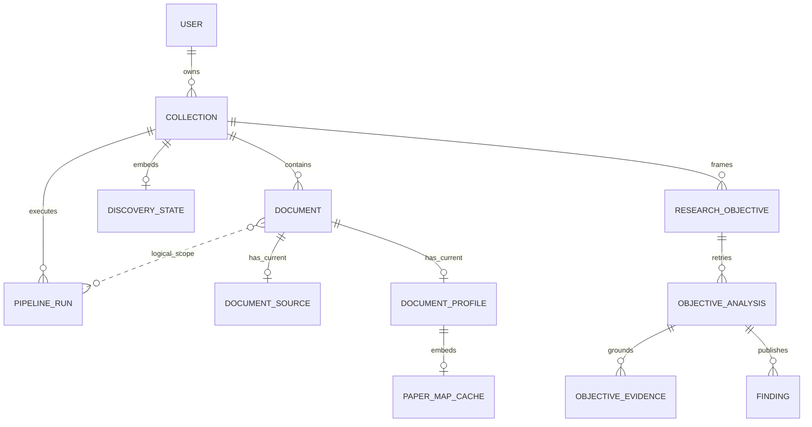

# Backend Persistence Model

## Purpose

This document defines the current maintained storage identities. The model is
intentionally current-state-first: old collection build snapshots and their data
are not migrated, read, or retained through compatibility paths.

## Storage Rule

| Data | Authority | Rule |
| --- | --- | --- |
| Structured product state | PostgreSQL | Read and write only through explicit repositories. |
| Uploaded and extracted bytes | Object storage | Store immutable bytes; PostgreSQL stores identity and integrity metadata. |
| Parser/model scratch | Local runtime paths | Disposable and never a product read authority. |
| Schema | Alembic | Startup does not create or infer tables. |

## Domain Ownership

```text
Collection
  -> Documents

Document
  -> current DocumentSource (parsed tree aggregate)
  -> current DocumentProfile
     -> optional PaperMap cache (built lazily by Objective work)

PipelineRun
  -> technical execution history for a Collection or Document scope
  -> nested node telemetry

Objective discovery
  -> current selected PreparedDocumentInputs
  -> ResearchObjectives

ResearchObjective
  -> ObjectiveAnalysis versions
     -> private checkpoints and PaperContributions in analysis payload
     -> ObjectiveEvidence
     -> Findings
```

### Collection and Document

`Collection` is identified by `collection_id` and belongs to one user. It owns
current Document membership. A Document is identified by `document_id`; its
filename, storage key, SHA-256, media type, status, size, and collection order
live on the Document record. Parser provenance and the Source fingerprint live
on the current `DocumentSource` row. Profile version, Source/profile
fingerprints, and profile generation time live on the current
`DocumentProfile` row. The domain-level preparation fingerprint is derived
from the current profile fingerprint.

There is no public CollectionDocument membership object and no DocumentVersion
aggregate. A Document is the current paper in the Collection.

The Collection row also owns the current discovery selection through
`discovery_ready`, `discovery_document_inputs`, `discovery_objective_ids`,
`discovery_study_dispositions`, and `discovery_updated_at`. This state is
replaced as one collection-local result; it is not a separate discovery
aggregate or historical snapshot.

### Document preparation

Source and Profile rows belong to one `document_id` and cascade when that
Document is deleted. The Paper Map cache is stored on the Profile row, so it
shares the Profile's identity and deletion boundary.

`DocumentSource` stores one complete format-neutral parsed artifact and its tree
projection in JSON. The envelope can represent PDF pages, DOCX sections, and
XLSX sheets without adding a new relational table family for each format.

Preparation uses a dependency chain rather than one all-or-nothing cache key:

```text
Source fingerprint
  = SHA-256(document SHA-256 + parser version)

Profile fingerprint
  = SHA-256(Source fingerprint + Profile version)

Preparation fingerprint
  = Profile fingerprint
```

Changing Paper Map logic reuses Source and Profile because Paper Maps are built
by Objective work. Changing Profile logic reuses Source; changing document bytes
or parser logic invalidates all dependent preparation stages. The preparation
fingerprint identifies the exact ready Source/Profile state used by discovery or
analysis. The Profile row stores typed Paper Map `input_fingerprint`,
`map_version`, and `generated_at` columns outside the navigation payload. The input fingerprint
contains the preparation fingerprint plus the current Paper Map policy and
prompt versions. These values are not user-visible versions and do not create a
snapshot hierarchy.

### Pipeline Run

`pipeline_runs` stores observable technical execution history in one row per
invocation. Indexed columns carry `collection_id`, `pipeline_name`,
`scope_type`, `scope_id`, `input_fingerprint`, mode, status, and searchable
timestamps. `record_json` carries the complete validated run snapshot,
including current node, progress, nested node telemetry, warnings, errors,
statistics, timestamps, context, and retry lineage. It does not own scientific
artifacts or filesystem output paths.

A partial unique index permits at most one queued or running run for one
`(pipeline_name, scope_type, scope_id)` tuple. A repeated Document preparation
request receives the active run. A completed Document run can be reused only
if its input fingerprint equals the current requested fingerprint. Objective
discovery reuses an active Collection run but a later completed discovery does
not suppress a new explicit discovery request.

### Objective discovery

The current candidate-discovery result is stored on `collections` in the
`discovery_*` fields. It includes ordered `document_inputs`, each containing:

```json
{
  "document_id": "doc_...",
  "preparation_fingerprint": "..."
}
```

Discovery replacement changes the current candidates for that Collection. It
does not create a Collection snapshot or duplicate Source/Profile rows.

### Objective analysis

Objective identity is `(collection_id, objective_id)`. Analysis identity is
that pair plus positive `analysis_version`.

Every analysis freezes its selected `document_inputs`. Before extracting
Evidence, the service verifies that every Document is still ready and still has
the same fingerprint. A mismatch is stale input and blocks the run. This prevents
one analysis from reading Source from a different preparation than it recorded.

One private checkpoint entry in `objective_analyses.payload` represents
inspection of one prepared Document for one Objective. Its logical identity is:

```text
collection_id + objective_id + document_id + input_fingerprint
```

The fingerprint covers the Objective scientific intent, the Document
`preparation_fingerprint`, the Evidence extraction version, and model identity.
Only `succeeded` checkpoint entries are reusable. A succeeded checkpoint
contains one `PaperContribution` and its zero or more `ObjectiveEvidence`
records; zero
Evidence can mean a valid scientific absence. `failed` and unfinished `running`
checkpoints are technical work and are replaced on retry.

Checkpoint artifacts retain their producing analysis version internally. When
reused, they are rebound to the new `analysis_version` before one cross-paper
Finding synthesis. They are not published children and are never read by the
Finding or Evidence APIs.

Public analysis children use the same Objective/version identity:

- ObjectiveEvidence adds `evidence_id` and references one contribution.
- Finding adds `finding_id`.
- Finding relations and context remain children of that Finding.

PaperContribution and checkpoint entries remain inside the analysis payload;
they are not independent tables because they are private, lifecycle-local
intermediates rather than public query artifacts.

Retry creates another `analysis_version`. Only a complete succeeded version may
become published. Failure leaves the prior published pointer unchanged.

## Relational Backbone


```mermaid
erDiagram
    USER ||--o{ COLLECTION : owns
    COLLECTION ||--o{ DOCUMENT : contains
    COLLECTION ||--o{ PIPELINE_RUN : executes
    DOCUMENT }o..o{ PIPELINE_RUN : logical_scope
    DOCUMENT ||--o| DOCUMENT_SOURCE : has_current
    DOCUMENT ||--o| DOCUMENT_PROFILE : has_current
    DOCUMENT_PROFILE ||--o| PAPER_MAP_CACHE : embeds
    COLLECTION ||--o| DISCOVERY_STATE : embeds
    COLLECTION ||--o{ RESEARCH_OBJECTIVE : frames
    RESEARCH_OBJECTIVE ||--o{ OBJECTIVE_ANALYSIS : retries
    OBJECTIVE_ANALYSIS ||--o{ OBJECTIVE_EVIDENCE : grounds
    OBJECTIVE_ANALYSIS ||--o{ FINDING : publishes
```

## Replacement And Deletion

- Re-preparing a Document replaces its current Source and Profile only after the
  owning step succeeds; a later Objective operation rebuilds the embedded Paper
  Map cache when its fingerprint is stale. Pipeline Run history remains observable.
- Uploading another Document adds a peer and does not touch prepared peers.
- Deleting a Collection cascades its Documents, prepared artifacts, Pipeline Runs,
  Objectives, analyses, and downstream records.
- The destructive current-model migrations drop old collection-build,
  active-build, artifact-version, workspace-projection, persisted paper-fact,
  and comparison tables before creating the current model. Migration
  `20260908_0043` backfills the consolidated Source aggregate from the retired
  normalized Source tables before dropping them; migration `20260908_0044`
  moves preparation provenance to Source/Profile ownership. Migration
  `20260908_0045` backfills the former Task history into `pipeline_runs` and
  removes `tasks` and `task_stages`; `20260908_0047`-`0052` merge lifecycle-local
  Paper Map, Chat result, analysis-intermediate, discovery, evaluation child,
  and redundant Source/count storage into their lifecycle owners.

## Implementation Boundary

Repositories map domain records directly to SQLAlchemy rows. Do not add a
generic repository, build selector, compatibility facade, dual read/write,
runtime table detection, or JSON fallback. A contract change updates the owning
domain record, repository, application caller, API schema, and tests together.

## Related Authorities

- [`overview.md`](overview.md)
- [`../specs/api.md`](../specs/api.md)
- [`../../infra/persistence/README.md`](../../infra/persistence/README.md)
- [`../../../docs/contracts/research-objective-workspace-contract.md`](../../../docs/contracts/research-objective-workspace-contract.md)
