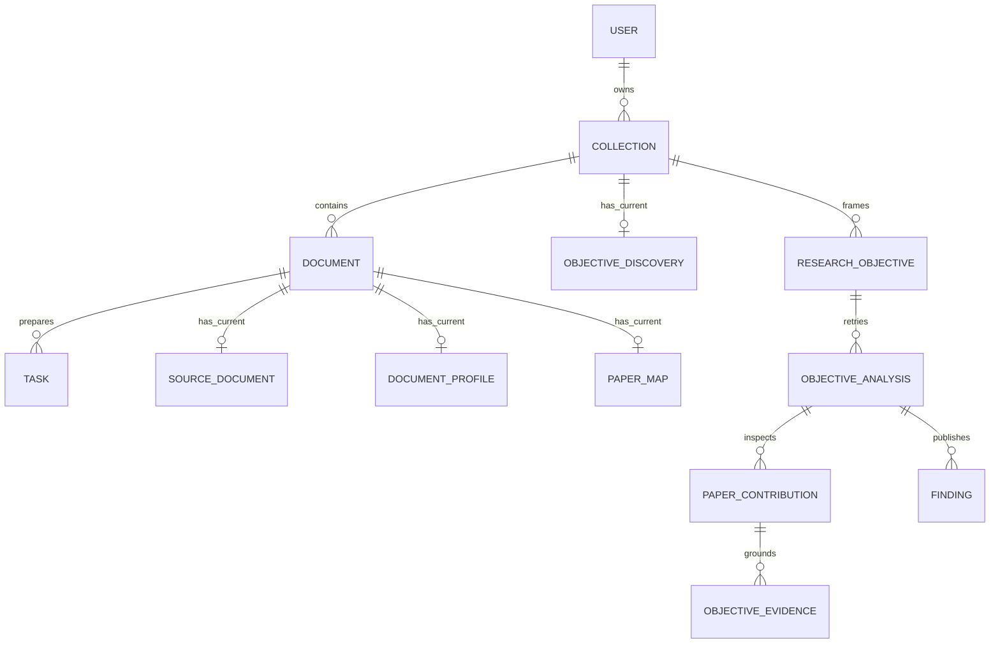

# Backend Persistence Model

## Purpose

This document defines the current maintained storage identities. The model is
intentionally current-state-first: old collection build snapshots and their data
are not migrated, read, or retained through compatibility paths.

## Storage Rule

| Data | Authority | Rule |
| --- | --- | --- |
| Structured product state | PostgreSQL | Read and write only through explicit repositories. |
| Uploaded and extracted bytes | Object storage | Store immutable bytes; PostgreSQL stores identity and integrity metadata. |
| Parser/model scratch | Local runtime paths | Disposable and never a product read authority. |
| Schema | Alembic | Startup does not create or infer tables. |

## Domain Ownership

```text
Collection
  -> Documents

Document
  -> Task history
  -> current SourceDocument
  -> current DocumentProfile
  -> current PaperMap

Objective discovery
  -> current selected PreparedDocumentInputs
  -> ResearchObjectives

ResearchObjective
  -> ObjectiveAnalysis versions
     -> PaperContributions
     -> ObjectiveEvidence
     -> Findings
```

### Collection and Document

`Collection` is identified by `collection_id` and belongs to one user. It owns
current Document membership. A Document is identified by `document_id`; its
filename, storage key, SHA-256, media type, status, parser version,
document-analysis version, and current preparation fingerprint live on the
Document record.

There is no public CollectionDocument membership object and no DocumentVersion
aggregate. A Document is the current paper in the Collection.

### Document preparation

Source, Profile, and Paper Map rows are keyed by `document_id` and cascade when
that Document is deleted. Each record also stores `collection_id` to enforce and
query ownership.

The preparation fingerprint is:

```text
SHA-256(document SHA-256 + parser version + document-analysis version)
```

It identifies the exact prepared state used by discovery or analysis. It is not
a user-visible version and does not create a snapshot hierarchy.

### Task

`tasks` stores observable execution history. A document-preparation task carries
`collection_id`, `document_id`, `task_type`, `input_fingerprint`, mode, status,
progress, warnings, errors, and timestamps. A partial unique index permits at
most one queued or running task for one `(document_id, task_type)`.

Active task reuse is based on Document ownership: a second request receives the
existing queued or running task. A completed task can be reused only if its
fingerprint equals the current requested fingerprint.

### Objective discovery

`objective_discovery` stores the current candidate-discovery result for a
Collection. It includes ordered `document_inputs`, each containing:

```json
{
  "document_id": "doc_...",
  "preparation_fingerprint": "..."
}
```

Discovery replacement changes the current candidates for that Collection. It
does not create a Collection snapshot or duplicate Source/Profile/PaperMap.

### Objective analysis

Objective identity is `(collection_id, objective_id)`. Analysis identity is
that pair plus positive `analysis_version`.

Every analysis freezes its selected `document_inputs`. Before extracting
Evidence, the service verifies that every Document is still ready and still has
the same fingerprint. A mismatch is stale input and blocks the run. This prevents
one analysis from reading Source from a different preparation than it recorded.

Analysis children use the same Objective/version identity:

- PaperContribution adds `document_id`.
- ObjectiveEvidence adds `evidence_id` and references one contribution.
- Finding adds `finding_id`.
- Finding relations and context remain children of that Finding.

Retry creates another `analysis_version`. Only a complete succeeded version may
become published. Failure leaves the prior published pointer unchanged.

## Relational Backbone


```mermaid
erDiagram
    USER ||--o{ COLLECTION : owns
    COLLECTION ||--o{ DOCUMENT : contains
    DOCUMENT ||--o{ TASK : prepares
    DOCUMENT ||--o| SOURCE_DOCUMENT : has_current
    DOCUMENT ||--o| DOCUMENT_PROFILE : has_current
    DOCUMENT ||--o| PAPER_MAP : has_current
    COLLECTION ||--o| OBJECTIVE_DISCOVERY : has_current
    COLLECTION ||--o{ RESEARCH_OBJECTIVE : frames
    RESEARCH_OBJECTIVE ||--o{ OBJECTIVE_ANALYSIS : retries
    OBJECTIVE_ANALYSIS ||--o{ PAPER_CONTRIBUTION : inspects
    PAPER_CONTRIBUTION ||--o{ OBJECTIVE_EVIDENCE : grounds
    OBJECTIVE_ANALYSIS ||--o{ FINDING : publishes
```

## Replacement And Deletion

- Re-preparing a Document replaces its current Source, Profile, and Paper Map
  only after the owning step succeeds; task history remains observable.
- Uploading another Document adds a peer and does not touch prepared peers.
- Deleting a Collection cascades its Documents, prepared artifacts, tasks,
  Objectives, analyses, and downstream records.
- The destructive current-model migration drops old collection-build,
  active-build, artifact-version, workspace-projection, persisted paper-fact,
  and comparison tables before creating the current model. There is no backfill.

## Implementation Boundary

Repositories map domain records directly to SQLAlchemy rows. Do not add a
generic repository, build selector, compatibility facade, dual read/write,
runtime table detection, or JSON fallback. A contract change updates the owning
domain record, repository, application caller, API schema, and tests together.

## Related Authorities

- [`overview.md`](overview.md)
- [`../specs/api.md`](../specs/api.md)
- [`../../infra/persistence/README.md`](../../infra/persistence/README.md)
- [`../../../docs/contracts/research-objective-workspace-contract.md`](../../../docs/contracts/research-objective-workspace-contract.md)
