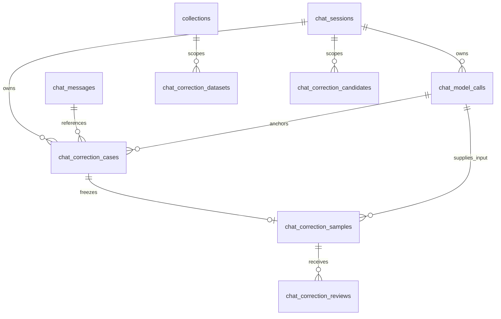

# Lens Agent 反馈与训练：数据库表结构设计

状态：P1–P6 生产数据库合同，2026-09-24。P1 的模型调用审计、分析任务、分析结果和案例表已随迁移 `20260924_0071` 落地；P3–P5 的表在对应检查点追加。本稿描述字段和约束，具体迁移以 `backend/migrations/versions/` 为准。领域语义见[核心模型](core-models-and-flow.md)，HTTP 映射见[接口设计](api-design.md)。

## 基本约定

以 PostgreSQL 为目标，字段类型依据历史提交 `6c373dc6` 的迁移和 ORM。`varchar` 中的业务 ID 是字符串，时间使用 `timestamptz`，摘要是 SHA-256 十六进制文本。JSON 对象、数组必须经过应用层结构校验；不能因为数据库接受 JSON 就认为领域对象有效。

历史迁移中调用请求使用 PostgreSQL `jsonb`，其余新增 JSON 字段采用 `json`。本稿保留该区别，不宣称已统一类型。以下未另说明的主键均非空；列表字段使用数组，空数组与未知 `null` 不混用。

当前验证阶段沿用既有登录和 Collection 访问范围，不建立 RBAC，也不按标注、审核或数据集操作区分权限。表中的 `owner_id`、`reviewer_id` 等用户字段只记录数据归属和实际操作历史，不表示已经存在的角色体系。

## 关系总览



数据集通过 manifest 固定样本和审核快照，行内 ID 是内容引用，没有逐行 SQL 外键。候选选择结果引用 case/sample，但不会产生审核接受记录。

## 推荐对象与表的对应关系

核心模型中的对象不要求一对象一表，但必须有清晰的持久化责任：

| 核心对象 | 推荐存储 | 说明 |
| --- | --- | --- |
| `FeedbackSignal` | 复用 `chat_message_feedback`，后续用读取投影合并纠正消息和工具失败 | 不立即改造既有反馈表 |
| `AnalysisJob` | `analysis_jobs` | 通用调度信封，payload 按任务类型解释 |
| `AnalysisResult` | `feedback_analysis_results` 等结果表 | 保存 AI 假设及输入/模型摘要 |
| `FeedbackCase` | 后续 `feedback_cases` | 标注工作台的聚合，引用信号和分析结果 |
| `Annotation` | 后续 `feedback_annotations` | 人工确认标签、目标、证据和数据用途 |
| `ReviewDecision` | 后续审核表；历史 `chat_correction_reviews` 是旧实现 | 追加审核，不覆盖标注 |
| `DatasetSnapshot` | 历史 `chat_correction_datasets` 的 manifest 形态 | 冻结快照，不是动态查询 |

当前验证阶段只需要先实现 `analysis_jobs`、`feedback_analysis_results` 和案例/标注的最小存储；旧 P1–P4 的 `chat_correction_*` 表结构用于说明历史方案，不能反过来规定新的工作台必须沿用“一个 correction case 一份 sample”的边界。

## 分析任务：`analysis_jobs`

这是 AI 分析的调度表，不是领域案例表。所有任务共用一张表；不同任务的输入放在 `payload`，由 `job_type` 决定结构。这样避免为不同任务建立一组大量可空的 `session_id`、`trigger_message_id` 和 `feedback_id` 列。

同一张表只统一持久化格式。验证阶段先由一个 `analysis-worker` 进程启用 `FeedbackAnalysisWorker`；代码可以在同一进程中逐步加入其他类型明确的 Worker 类。需要资源隔离或独立扩缩容时，再按类型启动独立进程：`feedback-analysis-worker` 只领取 `feedback_analysis`，`conversation-case-worker` 只领取 `conversation_case_analysis`，其余类型同理。无论进程数量多少，都通过 Repository 的类型明确方法访问同一张表。

| 字段名 | 类型 | 可空 | 作用 |
| --- | --- | --- | --- |
| `job_id` | varchar(64) | 否 | 任务主键 |
| `job_type` | varchar(64) | 否 | `feedback_analysis`、未来的 `conversation_case_analysis` 或 `tool_failure_analysis` |
| `payload_version` | integer | 否 | 当前 payload schema 版本，从 1 开始 |
| `payload` | jsonb | 否 | 按 job_type 解释的任务输入 |
| `status` | varchar(16) | 否 | pending、running、succeeded、failed、cancelled |
| `available_at` | timestamptz | 否 | 允许 Worker 执行的时间 |
| `started_at` | timestamptz | 是 | 开始执行时间 |
| `finished_at` | timestamptz | 是 | 结束执行时间 |
| `result_id` | varchar(64) | 是 | 分析结果身份 |
| `error_code` | varchar(128) | 是 | 受控技术错误码 |
| `idempotency_key` | varchar(255) | 否 | 事件去重键 |
| `created_at` | timestamptz | 否 | 创建时间 |

```text
PRIMARY KEY (job_id)
UNIQUE (idempotency_key)
INDEX (status, available_at, created_at)
CHECK payload_version >= 1
CHECK finished_at IS NULL OR started_at IS NULL OR finished_at >= started_at
```

当前唯一实现的 payload 是：

```json
{
  "payload_version": 1,
  "feedback_id": "feedback_123"
}
```

`feedback_analysis` Handler 从 `feedback_id` 反查权威的反馈、消息和会话关系，再验证 Collection 访问范围。后续任务示例为：

```json
{"payload_version": 1, "session_id": "session_123", "anchor_message_id": "message_456"}
```

```json
{"payload_version": 1, "tool_call_id": "tool_call_456"}
```

这些 payload 只是未来 schema 示例；当前不创建对应任务类型。`session_id` 不在任务表单独重复保存，避免出现 JSON 与关系列不一致的问题。关键查询通过 `payload` 过滤会比较有限，后续若某种任务成为高频查询对象，再评估拆分专用输入表或增加受控索引。

### 分层职责

```text
AnalysisJobRepository
  提供类型明确的领取方法、读取/更新任务；保存分析结果
  claim_next_feedback_analysis_job()
  claim_next_conversation_case_job()
  claim_next_tool_failure_job()

FeedbackAnalysisWorker
  只运行 feedback_analysis 进程

ConversationCaseWorker
  只运行 conversation_case_analysis 进程

ToolFailureWorker
  只运行 tool_failure_analysis 进程

FeedbackAnalysisHandler / 其他 Handler
  校验 payload，读取领域对象，调用 AI，构造结果
```

调用方只调用对应的 Worker，例如 `FeedbackAnalysisWorker.run_once()`，不需要写 `if job_type == ...`。验证阶段可以在同一个进程内依次运行这些 Worker；拆分后每个进程只运行其中一个。Repository 的三个公开方法分别固定查询一种类型；实现内部可以共享私有 SQL helper，但不把泛型领取方法暴露给业务调用方。这样每个 Worker 仍可独立配置并发数、模型、超时和优先级。

### Worker 规则

```text
FeedbackAnalysisWorker.run_once()
→ Repository 领取 pending 且 available_at <= now 的 feedback_analysis 任务
→ FeedbackAnalysisHandler 校验 payload_version 和 payload
→ Handler 读取权威业务对象和完整上下文
→ Handler 调用 AI 并校验输出 schema
→ Repository 写入 feedback_analysis_result
→ Worker 将任务标记 succeeded 或 failed
```

验证阶段只有一个 `analysis-worker` 进程，且先处理 `feedback_analysis`，因此不增加 `locked_at`、`locked_by` 和 `attempt_count`。未来启动多个类型进程时，Repository 的领取必须使用原子事务和类型过滤；如果同一类型启动多个副本，还需要数据库租约/锁或外部队列来处理进程崩溃恢复。这些是调度基础设施，不属于 `AnalysisJob` 的业务 payload。

### 部署阶段

| 阶段 | 进程 | 任务边界 | 适用条件 |
| --- | --- | --- | --- |
| 验证阶段 | 一个 `analysis-worker` | 进程内运行多个类型明确的 Worker 类 | 任务量小、共享运行环境、优先验证业务闭环 |
| 扩展阶段 | 每种任务一个进程或队列 | 每个进程只消费一种 `job_type` | 模型/硬件、耗时、并发、优先级或故障隔离出现差异 |

拆分是部署决策，不要求重写领域模型或 `analysis_jobs` 表；只需让对应 Worker 使用自己的领取方法和运行配置。

### 分析结果

任务表只保存 `result_id`；结果表按任务类型保存结构化结果。例如 `feedback_analysis_results` 保存 `message_id`、`problem_type`、`confidence`、关联消息、模型版本和输入摘要，并保存 `evidence_coverage`：requested_scope、inspected_sources、omitted_candidates、claim_support、gaps、coverage_status。结果不能直接改变 Chat，也不能直接进入训练数据集，必须进入案例池和人工标注流程。

`evidence_coverage` 是面向研究者的诊断投影，`request` 是内部审计输入；二者不能互相替代。前者说明“检查了哪些文献、哪些主张有来源”，后者用于工程复核模型实际收到了什么。

## 复用表与边界

| 表 | 复用信息 | 本方案不修改的语义 |
| --- | --- | --- |
| `auth_users` | 所有者和实际操作用户 ID | 用户管理与登录 |
| `collections`、`documents` | 集合范围、论文身份 | 文献与科研资产管理 |
| `chat_sessions` | 所有者、Collection、会话树 | 会话权限与分支 |
| `chat_messages` | 用户/助手/工具消息、Source 上下文 | 正常聊天轨迹 |
| `chat_tool_calls` 与 `chat_messages` 中的工具结果载荷 | 工具执行与来源引用 | 操作授权和结果；没有独立的 chat_tool_results 表 |
| `chat_message_feedback` | 点赞/点踩、原因、评论、回答摘要 | 可更新、可撤回的有用性反馈，不是样本审核 |

`chat_message_feedback` 的唯一业务键是 `(user_id, message_id)`；`rating` 为 `helpful/not_helpful`，撤回删除反馈记录。它不自带完整反馈事件历史，未来若导出依赖历史反馈，需要另外确定版本与撤回传播规则。

## 实际模型调用：`chat_model_calls`

每次最终 Provider 请求一条记录，不以一条用户消息或整个会话为单位。

| 字段名 | 类型 | 可空 | 作用 |
| --- | --- | --- | --- |
| `call_id` | varchar(64) | 否 | 调用主键 |
| `session_id` | varchar(128) | 否 | 所属会话 |
| `trigger_message_id` | varchar(128) | 是 | 触发消息身份 |
| `response_message_id` | varchar(128) | 是 | 对应回答身份，未产生时为空 |
| `purpose` | varchar(32) | 否 | decision、compaction、finalization |
| `model` | varchar(255) | 否 | 模型名称 |
| `request` | jsonb | 否 | 实际 SDK JSON 请求参数 |
| `request_digest` | varchar(64) | 否 | 请求摘要 |
| `status` | varchar(32) | 否 | recorded、provider_succeeded、provider_failed、response_invalid、cancelled |
| `started_at` | timestamptz | 否 | 开始记录时间 |
| `finished_at` | timestamptz | 是 | 结束时间 |
| `error_code` | varchar(128) | 是 | 受控错误码 |
| `provider_confirmed` | boolean | 否 | 是否取得 Provider 响应证据，默认 false |
| `prompt_tokens` | integer | 是 | Provider 报告的输入 token 数 |
| `completion_tokens` | integer | 是 | 输出 token 数 |
| `total_tokens` | integer | 是 | 总 token 数 |

```text
PRIMARY KEY (call_id)
FOREIGN KEY (session_id) REFERENCES chat_sessions(session_id) ON DELETE CASCADE
INDEX (session_id), (trigger_message_id), (response_message_id)
CHECK purpose、status 属于上述枚举
CHECK finished_at IS NULL OR finished_at >= started_at
CHECK length(request_digest) = 64
```

历史实现的两个 message ID 没有 SQL 外键，消息归属由应用校验，不能将它们写成数据库已保证的引用。token 用量未知为 null，不填 0 伪装已报告。

`request` 保留 messages、tools 及实际参数；不保存认证头、密钥。先持久化请求后调用 Provider，捕获失败则停止此次调用。消息落库与调用终态的一致性应在具体事务实现中验证。

## 纠错案例：`chat_correction_cases`

| 字段名 | 类型 | 可空 | 作用 |
| --- | --- | --- | --- |
| `case_id` | varchar(64) | 否 | 案例主键 |
| `session_id` | varchar(128) | 否 | 所属会话 |
| `original_message_id` | varchar(128) | 否 | 原最终回答 |
| `feedback_message_id` | varchar(128) | 否 | 用户质疑消息，不是反馈表主键 |
| `corrected_message_id` | varchar(128) | 是 | 修正最终回答 |
| `original_model_call_id` | varchar(64) | 否 | 原回答的调用 |
| `corrected_model_call_id` | varchar(64) | 是 | 修正回答的调用 |
| `status` | varchar(16) | 否 | linked 或 unresolved |
| `trace_digest` | varchar(64) | 否 | 被关联轨迹摘要 |
| `created_at` | timestamptz | 否 | 创建时间 |
| `updated_at` | timestamptz | 否 | 更新时间 |

```text
PRIMARY KEY (case_id)
UNIQUE (session_id, original_message_id, feedback_message_id, corrected_message_id)
FOREIGN KEY session_id -> chat_sessions.session_id, ON DELETE CASCADE
FOREIGN KEY 三个 message_id -> chat_messages.message_id, ON DELETE CASCADE
FOREIGN KEY 两个 model_call_id -> chat_model_calls.call_id, ON DELETE CASCADE
INDEX 每个外键列
CHECK length(trace_digest) = 64
CHECK linked 时 corrected_message_id 与 corrected_model_call_id 均非空
CHECK unresolved 时上述两个字段均为空
```

跨表外键只保证存在，不保证同一会话、消息角色和先后顺序；这些必须在服务端重新读取后校验。普通 UNIQUE 对 null 的处理允许多个 unresolved 组合，不能依靠上面一条约束保证所有未解决案例不重复。若需要该保证，应明确补充部分唯一索引；此处不冒充原实现已具备。

## 固定样本：`chat_correction_samples`

| 字段名 | 类型 | 可空 | 作用 |
| --- | --- | --- | --- |
| `sample_id` | varchar(64) | 否 | 样本主键 |
| `case_id` | varchar(64) | 否 | 来源案例，一案例一份快照 |
| `session_id` | varchar(128) | 否 | 所属会话 |
| `collection_id` | varchar(64) | 否 | 所属集合 |
| `model_call_id` | varchar(64) | 否 | 修正目标对应的实际调用 |
| `input` | json | 否 | 完整调用 request |
| `observations` | json | 否 | 审核轨迹数组，默认 [] |
| `target` | text | 否 | 修正后的最终文本 |
| `source_refs` | json | 否 | 来源引用数组，默认 [] |
| `digest` | varchar(64) | 否 | 固定内容摘要 |
| `created_at` | timestamptz | 否 | 创建时间 |
| `updated_at` | timestamptz | 否 | 记录时间，不代表允许覆盖内容 |

```text
PRIMARY KEY (sample_id)
UNIQUE (case_id)
FOREIGN KEY case_id -> chat_correction_cases.case_id, ON DELETE CASCADE
FOREIGN KEY session_id -> chat_sessions.session_id, ON DELETE CASCADE
FOREIGN KEY collection_id -> collections.collection_id, ON DELETE CASCADE
FOREIGN KEY model_call_id -> chat_model_calls.call_id, ON DELETE RESTRICT
INDEX (case_id), (session_id), (collection_id), (model_call_id), (digest)
CHECK length(digest) = 64
CHECK length(target) > 0
```

`observations` 的 kind 为 `message/tool_request/tool_observation`，保存消息 ID、对应正文或工具请求/结果。`source_refs` 区分 `message_source` 与 `tool_resource`；前者保存消息附带的文档、定位和片段，后者保存工具返回的资源引用。不可把任意工具结果误当成 Source 正文。

摘要覆盖 case/session/collection/model_call 身份及 input、observations、target、source_refs，不含样本 ID 和创建时间。原实现每个 case 只有一个 sample；修改目标后重建得到不同摘要时报告 stale，而非静默覆盖。

## 审核历史：`chat_correction_reviews`

| 字段名 | 类型 | 可空 | 作用 |
| --- | --- | --- | --- |
| `review_id` | varchar(64) | 否 | 审核主键 |
| `sample_id` | varchar(64) | 否 | 所审核样本 |
| `session_id` | varchar(128) | 否 | 所属会话 |
| `sample_digest` | varchar(64) | 否 | 决定绑定的样本内容 |
| `decision` | varchar(16) | 否 | accept、reject、insufficient、withdraw |
| `reviewer_id` | varchar(64) | 否 | 实际操作用户 |
| `reason` | text | 是 | 决定理由；部分决定应用层要求非空 |
| `support_message_ids` | json | 否 | 支持本决定的消息 ID 数组，默认 [] |
| `seq` | integer | 否 | 样本内追加序号，从 1 开始 |
| `created_at` | timestamptz | 否 | 决定时间 |

```text
PRIMARY KEY (review_id)
UNIQUE (sample_id, seq)
FOREIGN KEY sample_id -> chat_correction_samples.sample_id, ON DELETE CASCADE
FOREIGN KEY session_id -> chat_sessions.session_id, ON DELETE CASCADE
FOREIGN KEY reviewer_id -> auth_users.user_id, ON DELETE RESTRICT
INDEX (sample_id), (session_id), (reviewer_id)
CHECK seq >= 1
CHECK length(sample_digest) = 64
CHECK decision IN ('accept', 'reject', 'insufficient', 'withdraw')
```

不存独立的 accepted 布尔值。读取时重建样本，再从历史计算 pending、有效决定或 stale。审核追加必须串行分配同一样本的 seq，并在同一事务边界检查撤回；唯一约束只防序号重复，不能单独解决审核与撤回竞态。

## 冻结数据集：`chat_correction_datasets`

| 字段名 | 类型 | 可空 | 作用 |
| --- | --- | --- | --- |
| `dataset_id` | varchar(64) | 否 | 数据集主键 |
| `owner_id` | varchar(64) | 否 | 所有者 |
| `collection_id` | varchar(64) | 否 | 数据范围 |
| `dataset_type` | varchar(16) | 否 | `evaluation`、`sft` 或 `preference` |
| `manifest` | json | 否 | 完整冻结清单 |
| `manifest_digest` | varchar(64) | 否 | 清单摘要；HTTP 字段名为 digest |
| `provenance_digest` | varchar(64) | 否 | 来源及选择快照摘要 |
| `row_count` | integer | 否 | 可导出行数，默认 0 |
| `excluded_count` | integer | 否 | 排除条数，默认 0 |
| `created_at` | timestamptz | 否 | 冻结时间 |

```text
PRIMARY KEY (dataset_id)
UNIQUE (owner_id, manifest_digest)
FOREIGN KEY owner_id -> auth_users.user_id, ON DELETE CASCADE
FOREIGN KEY collection_id -> collections.collection_id, ON DELETE CASCADE
INDEX (owner_id), (collection_id), (manifest_digest), (provenance_digest)
CHECK 两个 digest 长度均为 64
CHECK row_count >= 0 AND excluded_count >= 0
CHECK dataset_type IN ('evaluation', 'sft', 'preference')
```

### manifest 内容

| 字段 | 类型 | 说明 |
| --- | --- | --- |
| `schema_version` | string | 导出协议版本；消费者严格校验 |
| `dataset_id/owner_id/collection_id` | string | 清单身份与范围 |
| `dataset_type` | string | 本快照只能是 evaluation、sft 或 preference 之一 |
| `provenance` | object | 所选样本、审核材料和论文家族映射等冻结依据 |
| `provenance_digest` | string | 上述依据的摘要 |
| `rows` | object[] | 每行含样本/案例/会话/调用 ID、input、observations、target、review_id、review_digest、source_refs、paper_families、session_tree_id、split、content_digest、row_id |
| `exclusions` | object[] | sample_id、session_id、case_id、reason、detail |
| `digest` | string | 清单摘要 |
| `created_at` | datetime | 冻结时间 |

`row_count/excluded_count` 是持久化及响应中的计数，必须与数组一致。原实现行字段 `review_digest` 实际保存审核所绑定的 `sample_digest`，不是整条审核记录的哈希；审核身份另由 `review_id` 表达。重新设计时宜消除此命名歧义。

### 三种导出行

同一内部案例不直接等于训练行，导出器根据 `dataset_type` 转换：

```json
{"record_type":"evaluation","input":"...","reference":"...","evidence":["source_ref_8"],"criteria":["不把未报告信息当成差异"]}
```

```json
{"record_type":"sft","messages":[{"role":"user","content":"..."}],"target":"...","source_refs":["source_ref_8"]}
```

```json
{"record_type":"preference","prompt":[{"role":"user","content":"..."}],"chosen":"...","rejected":"...","source_refs":["source_ref_8"]}
```

`evaluation` 不要求 target；`sft` 必须有明确 target 和支持来源；`preference` 必须有同一输入下的 chosen/rejected。不能因为同一案例已经审核通过，就自动允许三种类型全部导出。

行、审核引用和 provenance 一起冻结；不能只保存样本 ID，下载时再连接最新消息。撤回影响新清单，不就地修改旧清单。若业务要求撤回阻止旧文件下载/训练，需要另行确定失效机制。

## 候选提议：`chat_correction_candidates`

| 字段名 | 类型 | 可空 | 作用 |
| --- | --- | --- | --- |
| `candidate_id` | varchar(64) | 否 | 候选主键 |
| `owner_id` | varchar(64) | 否 | 所有者 |
| `collection_id` | varchar(64) | 否 | 集合 |
| `session_id` | varchar(128) | 否 | 会话 |
| `challenge_message_id` | varchar(128) | 是 | 请求中限定的质疑消息 |
| `answer_message_id` | varchar(128) | 是 | 请求中限定的回答消息 |
| `event_ids` | json | 否 | 本次材料的事件 ID 数组，默认 [] |
| `model_call_ids` | json | 否 | 可追溯调用 ID 数组，默认 [] |
| `status` | varchar(32) | 否 | needs_review、ambiguous、no_candidate、invalid_proposal、provider_failed |
| `proposal` | json | 是 | 模型提议；失败或无候选可为空 |
| `request` | json | 否 | 提议请求快照 |
| `raw_response` | text | 是 | 原始返回 |
| `finish_reason` | varchar(32) | 是 | Provider 结束原因 |
| `error_code` | varchar(128) | 是 | 错误码 |
| `selected_case_id` | varchar(64) | 是 | 选择后生成/关联的案例 |
| `selected_sample_id` | varchar(64) | 是 | 选择后生成/关联的样本 |
| `digest` | varchar(64) | 否 | 候选内容摘要 |
| `created_at/updated_at` | timestamptz | 否 | 创建和更新时间 |

```text
PRIMARY KEY (candidate_id)
FOREIGN KEY owner_id -> auth_users.user_id, ON DELETE CASCADE
FOREIGN KEY collection_id -> collections.collection_id, ON DELETE CASCADE
FOREIGN KEY session_id -> chat_sessions.session_id, ON DELETE CASCADE
FOREIGN KEY selected_case_id -> chat_correction_cases.case_id, ON DELETE SET NULL
FOREIGN KEY selected_sample_id -> chat_correction_samples.sample_id, ON DELETE SET NULL
INDEX (owner_id), (collection_id), (session_id), (status), (digest)
CHECK status 属于上述枚举
CHECK length(digest) = 64
CHECK updated_at >= created_at
```

选择状态通过 selected 引用表达，不新增 accepted 状态。选择候选本身不会把修正标成科学正确。

## 一致性、保留与实施前检查

| 操作 | 一致性要求 |
| --- | --- |
| 记录请求 | 请求写入成功后才发起对应 Provider 调用 |
| 关联案例 | 消息角色、顺序、会话、调用成功及身份一致 |
| 冻结样本 | input/target/observations/source_refs 一起取样、一起计算摘要 |
| 追加审核 | 对固定内容决定；分配 seq、检查撤回和写入不可分离 |
| 冻结清单 | 同一批样本/审核依据参与校验与持久化；不能混入校验后的变更 |
| 选择候选 | 重试不得重复导入；案例与样本引用不能留下伪成功 |
| 删除会话/集合 | SQL 级联不等于敏感快照已清除；dataset manifest 中的复制内容需明确保留政策 |

原数据库设计不足以单独保证全部跨表不变量，必须结合应用校验和并发测试。特别是反馈自动汇集、审核客户端版本检查、数据授权、撤回后的历史导出失效，目前没有完整表设计。

P6 的权重、tokenizer、训练报告留在独立实验目录，不新增在线训练任务表。未来需要任务调度时再从真实操作与恢复要求定义，不预建平台。

历史 `0060`–`0064` 用于追溯，清理迁移 `0065` 已删除六张表。重建时需要新的设计决策和向前迁移，不能删除既有迁移、回填虚假调用或通过 stamp 假装已完成结构变更。
